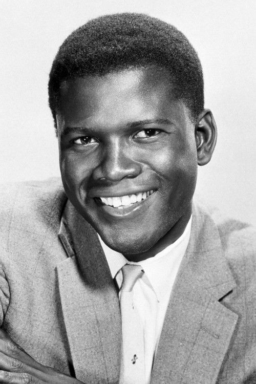
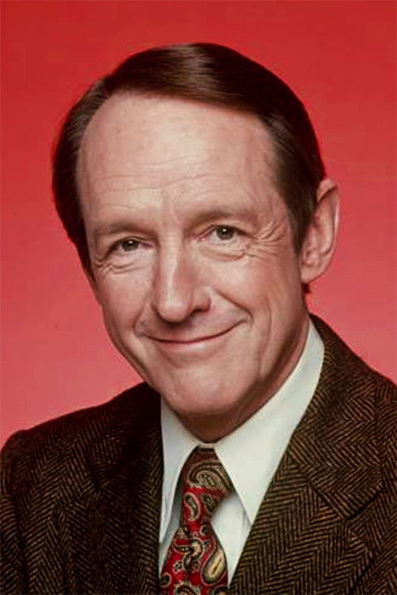



<nav class="films">
  

    <a href="../purple-noon-1960"><i class="fa-solid fa-chevron-left fa-xs"></i> Previous</a>
  

  

    <a class="simple" href="../">7 / 100</a>
  

  

    <a href="../2001-a-space-odyssey-1968">Next <i class="fa-solid fa-chevron-right fa-xs"></i></a>
  

  

    
      Previous film:
      Purple Noon
    
    
      Next film:
      2001: A Space Odyssey
    
  

</nav>

<article class="film slug-in-the-heat-of-the-night-1967">
  

    
    
  

  <h1>{{ film.title }} ({{ film | filmYear }})</h1>

  

    Language: {{ film.language }}.
    
  

  

    Directed by <strong>{{ film | directors }}</strong>
  

  
    <blockquote>
      {{ films.reviews[slug] | safe }} <em>—&nbsp;<a href="/bill">Bill</a></em>
    </blockquote>
  

  <section class="cast-grid">
  

    

  
  

    Sidney Poitier
    Virgil Tibbs
  

    

  
  

    Rod Steiger
    Police Chief Bill Gillespie
  

    

  
  

    Warren Oates
    Deputy Sam Wood
  

    

  
  

    Peter Whitney
    Deputy Courtney
  

    

  
  

    Lee Grant
    Mrs. Leslie Colbert
  

    

  
  

    Anthony James
    Ralph
  

    

  
  

    William Schallert
    Mayor Schubert
  

    

  
  

    Scott Wilson
    Harvey Oberst
  

    

  
  

    Larry Gates
    Eric Endicott
  

    

  
  

    James Patterson
    Mr. Purdy
  

    

  
  

    Quentin Dean
    Delores Purdy
  

    

  
<i class="fa-solid fa-user"></i>

  

    Kermit Murdock
    Henderson
  

  

</section>

  <section class="film-detail">
    

      

        

          <i class="fa-solid fa-masks-theater"></i>
          Cast
        

        <ul>
          
            <li>
              {{ cast.name }} as <em>{{ cast.character }}</em>
            </li>
          
        </ul>
      

      

        

          <i class="fa-solid fa-clapperboard"></i>
          Crew
        

        <ul>
          
            <li>
              {{ crew.name }} &mdash; <em>{{ crew.job }}</em>
            </li>
          
        </ul>
      

    

  </section>

  <section class="related-films">
  <h2>Related films</h2>
  <ul>
    <li><a href="../the-sting-1973">The Sting</a> because of Larry D. Mann</li>
  </ul>
</section>

</article>
