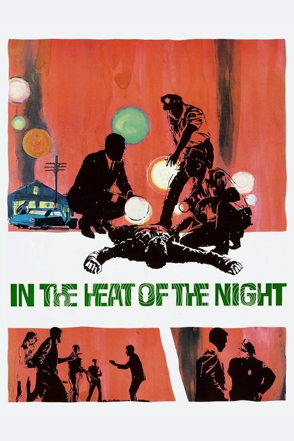
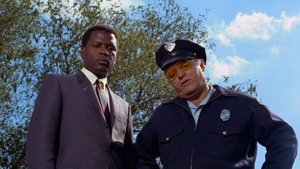

<nav class="films">
  <a class="prev" href="../barefoot-in-the-park">Previous</a>
  <a href="../">Film list</a>
  <a class="next" href="../2001-a-space-odyssey">Next</a>
</nav>

10 / 100

<article class="film">
  

    
    
  

  <h1>In the Heat of the Night (1967)</h1>

  

    Directed by <strong>Norman Jewison</strong>
  

  <h2>
    Cast
  </h2>
  <ul>
    <li><strong>Sidney Poitier</strong> as <em>Virgil Tibbs</em></li>
<li><strong>Rod Steiger</strong> as <em>Police Chief Bill Gillespie</em></li>
<li><strong>Warren Oates</strong> as <em>Deputy Sam Wood</em></li>
<li><strong>Peter Whitney</strong> as <em>Deputy Courtney</em></li>
<li><strong>Lee Grant</strong> as <em>Mrs. Leslie Colbert</em></li>
<li><strong>Anthony James</strong> as <em>Ralph</em></li>
<li><strong>William Schallert</strong> as <em>Mayor Schubert</em></li>
<li><strong>Scott Wilson</strong> as <em>Harvey Oberst</em></li>
<li><strong>Larry Gates</strong> as <em>Eric Endicott</em></li>
<li><strong>James Patterson</strong> as <em>Mr. Purdy</em></li>
<li><strong>Quentin Dean</strong> as <em>Delores Purdy</em></li>
<li><strong>Kermit Murdock</strong> as <em>Henderson</em></li>
<li><strong>Larry D. Mann</strong> as <em>Watkins</em></li>
<li><strong>Matt Clark</strong> as <em>Packy</em></li>
<li><strong>Beah Richards</strong> as <em>Mama Caleba</em></li>
<li><strong>Arthur Malet</strong> as <em>Ulam</em></li>
<li><strong>Fred Stewart</strong> as <em>Dr. Stuart</em></li>
<li><strong>Timothy Scott</strong> as <em>Shagbag</em></li>
<li><strong>William Watson</strong> as <em>McNeil</em></li>
<li><strong>Eldon Quick</strong> as <em>Charles Hawthorne</em></li>
<li><strong>Jester Hairston</strong> as <em>Endicott's Butler</em></li>
<li><strong>Stuart Nisbet</strong> as <em>Shuie</em></li>
<li><strong>Khalil Bezaleel</strong> as <em>Jess</em></li>
<li><strong>Peter Masterson</strong> as <em>Fryer</em></li>
<li><strong>Phil Adams</strong> as <em>1st Tough</em></li>
<li><strong>Nikita Knatz</strong> as <em>2nd Tough</em></li>
<li><strong>Sam Reese</strong> as <em>Clerk</em></li>
<li><strong>Jack Teter</strong> as <em>Philip Colbert (uncredited)</em></li>
<li><strong>Alan Oppenheimer</strong> as <em>Ted Appleton (uncredited)</em></li>
<li><strong>Clegg Hoyt</strong> as <em>Deputy (uncredited)</em></li>
<li><strong>Buzz Barton</strong> as <em>Conductor (uncredited)</em></li>
  </ul>
</article>
<footer>
  <a href="../about">About this list</a>
</footer>
