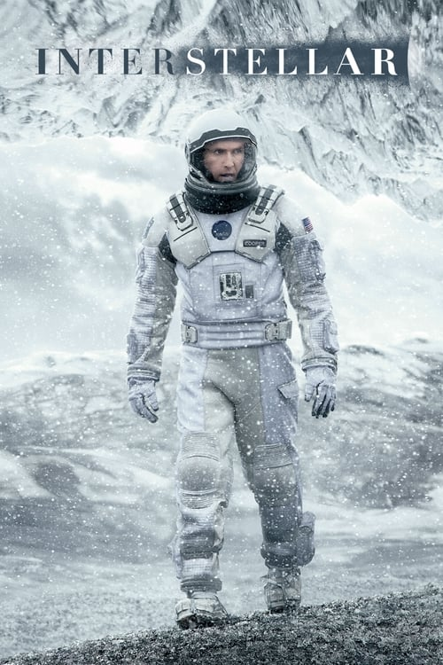
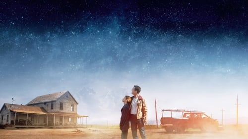

<nav class="films">
  <a class="prev" href="../mr-turner">Previous</a>
  <a href="../">Film list</a>
  <a class="next" href="../the-handmaiden">Next</a>
</nav>

65 / 100

<article class="film">
  

    
    
  

  <h1>Interstellar (2014)</h1>

  

    Directed by <strong>Christopher Nolan</strong>
  

  <h2>
    Cast
  </h2>
  <ul>
    <li><strong>Matthew McConaughey</strong> as <em>Cooper</em></li>
<li><strong>Anne Hathaway</strong> as <em>Brand</em></li>
<li><strong>Michael Caine</strong> as <em>Professor Brand</em></li>
<li><strong>Jessica Chastain</strong> as <em>Murph</em></li>
<li><strong>Casey Affleck</strong> as <em>Tom</em></li>
<li><strong>Wes Bentley</strong> as <em>Doyle</em></li>
<li><strong>Topher Grace</strong> as <em>Getty</em></li>
<li><strong>Mackenzie Foy</strong> as <em>Murph (10 Yrs.)</em></li>
<li><strong>Ellen Burstyn</strong> as <em>Murph (older)</em></li>
<li><strong>John Lithgow</strong> as <em>Donald</em></li>
<li><strong>Bill Irwin</strong> as <em>TARS (voice)</em></li>
<li><strong>David Gyasi</strong> as <em>Romilly</em></li>
<li><strong>Timothée Chalamet</strong> as <em>Tom (15 Yrs.)</em></li>
<li><strong>Matt Damon</strong> as <em>Mann</em></li>
<li><strong>Josh Stewart</strong> as <em>CASE (voice)</em></li>
<li><strong>Leah Cairns</strong> as <em>Lois</em></li>
<li><strong>Liam Dickinson</strong> as <em>Coop</em></li>
<li><strong>Francis X. McCarthy</strong> as <em>Boots</em></li>
<li><strong>William Devane</strong> as <em>Williams</em></li>
<li><strong>Andrew Borba</strong> as <em>Smith</em></li>
<li><strong>Elyes Gabel</strong> as <em>Administrator</em></li>
<li><strong>David Oyelowo</strong> as <em>School Principal</em></li>
<li><strong>Collette Wolfe</strong> as <em>Ms. Hanley</em></li>
<li><strong>Jeff Hephner</strong> as <em>Doctor</em></li>
<li><strong>Russ Fega</strong> as <em>Crew Chief</em></li>
<li><strong>Lena Georgas</strong> as <em>Nurse Practitioner</em></li>
<li><strong>Brooke Smith</strong> as <em>Nurse</em></li>
<li><strong>Flora Nolan</strong> as <em>Girl on Truck</em></li>
<li><strong>Griffen Fraser</strong> as <em>Boy on Truck</em></li>
<li><strong>Kristian Van der Heyden</strong> as <em>Scientist (uncredited)</em></li>
<li><strong>William Patrick Brown</strong> as <em>NASA Employee (uncredited)</em></li>
<li><strong>Benjamin Hardy</strong> as <em>NASA Scientist (uncredited)</em></li>
<li><strong>Joseph Oliveira</strong> as <em>Astronaut (uncredited)</em></li>
<li><strong>Alexander Michael Helisek</strong> as <em>Construction Boss (uncredited)</em></li>
  </ul>
</article>
<footer>
  <a href="../about">About this list</a>
</footer>
