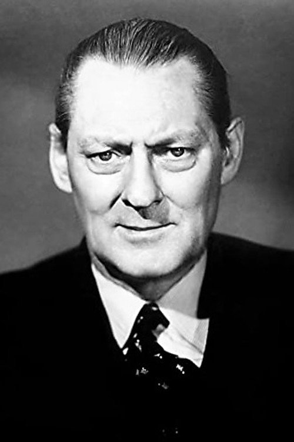
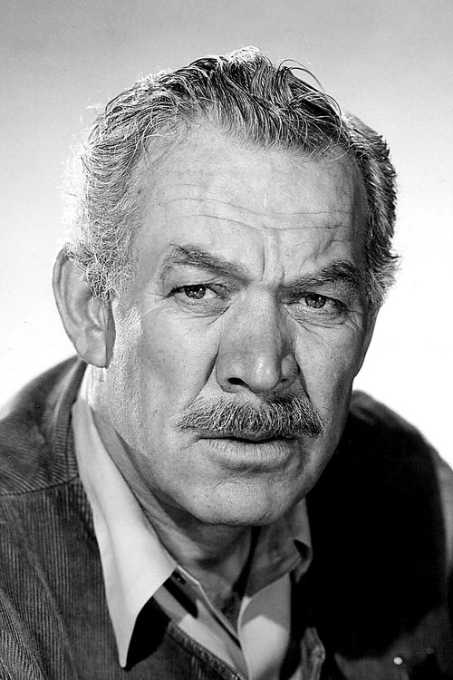



<nav class="films">
  

    <i class="fa-solid fa-chevron-left fa-xs"></i> Previous
  

  

    <a class="simple" href="../">1 / 100</a>
  

  

    <a href="../la-strada-1954">Next <i class="fa-solid fa-chevron-right fa-xs"></i></a>
  

  

    
      Previous film:
      Start of list
    
    
      Next film:
      La Strada
    
  

</nav>

<article class="film slug-its-a-wonderful-life-1946">
  

    
    
  

  <h1>{{ film.title }} ({{ film | filmYear }})</h1>

  

    Language: {{ film.language }}.
    
  

  

    Directed by <strong>{{ film | directors }}</strong>
  

  
    <blockquote>
      {{ films.reviews[slug] | safe }} <em>—&nbsp;<a href="/bill">Bill</a></em>
    </blockquote>
  

  <section class="cast-grid">
  

    

  
  

    James Stewart
    George Bailey
  

    

  
  

    Donna Reed
    Mary Hatch
  

    

  
  

    Lionel Barrymore
    Mr. Potter
  

    

  
  

    Thomas Mitchell
    Uncle Billy
  

    

  
  

    Henry Travers
    Clarence
  

    

  
  

    Beulah Bondi
    Mrs. Bailey
  

    

  
  

    Frank Faylen
    Ernie
  

    

  
  

    Ward Bond
    Bert
  

    

  
  

    Gloria Grahame
    Violet
  

    

  
  

    H.B. Warner
    Mr. Gower
  

    

  
  

    Frank Albertson
    Sam Wainwright
  

    

  
<i class="fa-solid fa-user"></i>

  

    Todd Karns
    Harry Bailey
  

  

</section>

  <section class="film-detail">
    

      

        

          <i class="fa-solid fa-masks-theater"></i>
          Cast
        

        <ul>
          
            <li>
              {{ cast.name }} as <em>{{ cast.character }}</em>
            </li>
          
        </ul>
      

      

        

          <i class="fa-solid fa-clapperboard"></i>
          Crew
        

        <ul>
          
            <li>
              {{ crew.name }} &mdash; <em>{{ crew.job }}</em>
            </li>
          
        </ul>
      

    

  </section>

  <section class="related-films">
  <h2>Related films</h2>
  <ul>
    <li><a href="../rear-window-1954">Rear Window</a> because of James Stewart</li>
  </ul>
</section>

</article>
