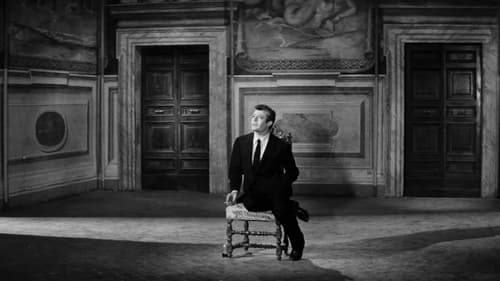



<nav class="films">
  <a class="prev" href="../im-all-right-jack-1959">Previous</a>
  <a href="../">Film list</a>
  <a class="next" href="../purple-noon-1960">Next</a>
</nav>

6 / 100

<article class="film">
  

    
    
  

  <h1>La Dolce Vita ({{ film | filmYear }})</h1>

  

    Directed by <strong>{{ film | directors }}</strong>
  

  <h2>
    Cast
  </h2>
  <ul>
            <li><strong>Marcello Mastroianni</strong> as <em>Marcello Rubini</em></li>
        <li><strong>Anita Ekberg</strong> as <em>Sylvia</em></li>
        <li><strong>Anouk Aimée</strong> as <em>Maddalena</em></li>
        <li><strong>Yvonne Furneaux</strong> as <em>Emma</em></li>
        <li><strong>Magali Noël</strong> as <em>Fanny</em></li>
        <li><strong>Alain Cuny</strong> as <em>Steiner</em></li>
        <li><strong>Annibale Ninchi</strong> as <em>Marcello's father</em></li>
        <li><strong>Walter Santesso</strong> as <em>Paparazzo</em></li>
        <li><strong>Valeria Ciangottini</strong> as <em>Paola</em></li>
        <li><strong>Riccardo Garrone</strong> as <em>Riccardo</em></li>
        <li><strong>Ida Galli</strong> as <em>Debutante of the year</em></li>
        <li><strong>Audrey McDonald</strong> as <em>Jane</em></li>
        <li><strong>Polidor</strong> as <em>Pagliaccio</em></li>
        <li><strong>Alain Dijon</strong> as <em>Frankie Stout</em></li>
        <li><strong>Mino Doro</strong> as <em>Lover of Nadia</em></li>
        <li><strong>Giulio Girola</strong> as <em>Police commissioner</em></li>
        <li><strong>Laura Betti</strong> as <em>Laura</em></li>
        <li><strong>Nico</strong> as <em>Nico</em></li>
        <li><strong>Domino</strong> as <em></em></li>
        <li><strong>Carlo Musto</strong> as <em>Transvestite</em></li>
        <li><strong>Enzo Cerusico</strong> as <em>Photographer</em></li>
        <li><strong>Giulio Paradisi</strong> as <em>Photographer</em></li>
        <li><strong>Enzo Doria</strong> as <em>Photographer</em></li>
        <li><strong>Enrico Glori</strong> as <em>Admirer of Nadia</em></li>
        <li><strong>Adriana Moneta</strong> as <em>Ninni</em></li>
        <li><strong>Massimo Busetti</strong> as <em>Miracle child</em></li>
        <li><strong>Lex Barker</strong> as <em>Robert - Sylvia's husband</em></li>
        <li><strong>Jacques Sernas</strong> as <em>The star</em></li>
        <li><strong>Nadia Gray</strong> as <em>Nadia</em></li>
        <li><strong>Giuseppe Addobbati</strong> as <em>(uncredited)</em></li>
        <li><strong>Conte Brunoro Serego Aligheri</strong> as <em>Young Man with Mink Coat (uncredited)</em></li>
        <li><strong>Gabriella Andreini</strong> as <em>Woman at Nadia's Party (uncredited)</em></li>
        <li><strong>Federika André</strong> as <em>Tenant in Steiner's House (uncredited)</em></li>
        <li><strong>Armando Annuale</strong> as <em>(uncredited)</em></li>
        <li><strong>Joan Antequera</strong> as <em>Woman at Castle (uncredited)</em></li>
        <li><strong>Juan Antequero</strong> as <em>Spanish Gentleman with Eyepatch at Castle (uncredited)</em></li>
        <li><strong>Gianni Baghino</strong> as <em>(uncredited)</em></li>
        <li><strong>Nadia Balabine</strong> as <em>Reporter (uncredited)</em></li>
        <li><strong>Ignazio Balsamo</strong> as <em>(uncredited)</em></li>
        <li><strong>Remo Benedetti</strong> as <em>(uncredited)</em></li>
        <li><strong>Andrea Bianchi</strong> as <em>Man at Nadia's Party (uncredited)</em></li>
        <li><strong>Lars Bloch</strong> as <em>Party Guest (uncredited)</em></li>
        <li><strong>Leonardo Botta</strong> as <em>Doctor (uncredited)</em></li>
        <li><strong>Ida Bracci Dorati</strong> as <em>(uncredited)</em></li>
        <li><strong>Ferdinando Brofferio</strong> as <em>Maddalena's Lover (uncredited)</em></li>
        <li><strong>Giovanna Busetti</strong> as <em>Lying Child of The Miracle (uncredited)</em></li>
        <li><strong>Tito Buzzo</strong> as <em>Muscle Man (uncredited)</em></li>
        <li><strong>Daniela Calvino</strong> as <em>Daniela (uncredited)</em></li>
        <li><strong>Tony Campanino</strong> as <em>Man at Nightclub (uncredited)</em></li>
        <li><strong>Fabrizio Capucci</strong> as <em>Photographer at Press Conference (uncredited)</em></li>
        <li><strong>Donato Castellaneta</strong> as <em>Reporter (uncredited)</em></li>
        <li><strong>Adriano Celentano</strong> as <em>Self (uncredited)</em></li>
        <li><strong>Elisabetta Cini</strong> as <em>Sleeping Duchess (uncredited)</em></li>
        <li><strong>Giulio Citti</strong> as <em>Man at Nightclub (uncredited)</em></li>
        <li><strong>Leo Coleman</strong> as <em>Negro Dancer (uncredited)</em></li>
        <li><strong>Nani Colombo</strong> as <em>Woman at the Mirror (uncredited)</em></li>
        <li><strong>Mario Conocchia</strong> as <em>Lawyer with Nadia's Bra (uncredited)</em></li>
        <li><strong>Francesco Consalvo</strong> as <em>Scalise's Assistant (uncredited)</em></li>
        <li><strong>Tiziano Cortini</strong> as <em>Movie News Cameraman (uncredited)</em></li>
        <li><strong>Decimo Cristiani</strong> as <em>Young Man That Doesn't Talk (uncredited)</em></li>
        <li><strong>Mario De Grenet</strong> as <em>Man at Castle That Dislikes Dog's Smell (uncredited)</em></li>
        <li><strong>Andrea De Pino</strong> as <em>(uncredited)</em></li>
        <li><strong>Adele De Rossi</strong> as <em>(uncredited)</em></li>
        <li><strong>Donatella Della Nora</strong> as <em>Reporter (uncredited)</em></li>
        <li><strong>Christine Denise</strong> as <em>Woman Eating a Chicken (uncredited)</em></li>
        <li><strong>Katherine Denise</strong> as <em>(uncredited)</em></li>
        <li><strong>Carlo Di Maggio</strong> as <em>Toto Scalise (uncredited)</em></li>
        <li><strong>François Dieudonné</strong> as <em>Reporter (uncredited)</em></li>
        <li><strong>Venceslao Dobrzensky</strong> as <em>Giovanni (uncredited)</em></li>
        <li><strong>Donatella Esparmer</strong> as <em>Lady with the Irritated Man (uncredited)</em></li>
        <li><strong>Paolo Fadda</strong> as <em>Assistant Police Inspector (uncredited)</em></li>
        <li><strong>Umberto Felici</strong> as <em>Reporter (uncredited)</em></li>
        <li><strong>Oretta Fiume</strong> as <em>Lisa (uncredited)</em></li>
        <li><strong>Rina Franchetti</strong> as <em>Mother of the Miracle Children (uncredited)</em></li>
        <li><strong>Giacomo Gabrielli</strong> as <em>Maddalena's Father (uncredited)</em></li>
        <li><strong>Franco Giacobini</strong> as <em>Journalist at the Telephone (uncredited)</em></li>
        <li><strong>Angela Giavalisco</strong> as <em>Woman at Airport (uncredited)</em></li>
        <li><strong>Romolo Giordani</strong> as <em>Man at Castle (uncredited)</em></li>
        <li><strong>Christine Graefeck</strong> as <em>(uncredited)</em></li>
        <li><strong>Lily Granado</strong> as <em>Lucy (uncredited)</em></li>
        <li><strong>Libero Grandi</strong> as <em>(uncredited)</em></li>
        <li><strong>Maurizio Guelfi</strong> as <em>Reporter (uncredited)</em></li>
        <li><strong>Gloria Hendy</strong> as <em>Woman in Via Veneto (uncredited)</em></li>
        <li><strong>April Hennessy</strong> as <em>Woman in Via Veneto (uncredited)</em></li>
        <li><strong>Nina Hohenlohe</strong> as <em>Woman at Castle (uncredited)</em></li>
        <li><strong>Antonio Jacono</strong> as <em>Transvestite (uncredited)</em></li>
        <li><strong>Gloria Jones</strong> as <em>Gloria (uncredited)</em></li>
        <li><strong>Carlo Kechler</strong> as <em>Man with Clock (uncredited)</em></li>
        <li><strong>Else Knorr</strong> as <em>(uncredited)</em></li>
        <li><strong>Paolo Labia</strong> as <em>Servant in Maddalena's Household (uncredited)</em></li>
        <li><strong>John Francis Lane</strong> as <em>Reporter (uncredited)</em></li>
        <li><strong>Sondra Lee</strong> as <em>Ballerina in Spoleto (uncredited)</em></li>
        <li><strong>Marianne Leibl</strong> as <em>Yvonne's Companion in Miracle Sequence (uncredited)</em></li>
        <li><strong>Guglielmo Leoncini</strong> as <em>Scalise's Secretary (uncredited)</em></li>
        <li><strong>Giuliana Lojodice</strong> as <em>Servant at Steiner's House (uncredited)</em></li>
        <li><strong>Renée Longarini</strong> as <em>Miss Steiner (uncredited)</em></li>
        <li><strong>Francisco Lori</strong> as <em>Man in Miracle Sequence (uncredited)</em></li>
        <li><strong>Francesco Luzi</strong> as <em>Radioreporter (uncredited)</em></li>
        <li><strong>Mario Mallarno</strong> as <em>Reporter (uncredited)</em></li>
        <li><strong>Renato Mambor</strong> as <em>A Tall Young Man (uncredited)</em></li>
        <li><strong>Vittorio Manfrino</strong> as <em>Tabarin Director (uncredited)</em></li>
        <li><strong>Maria Marigliano</strong> as <em>Massamilla (uncredited)</em></li>
        <li><strong>Carlo Mariotti</strong> as <em>Male Nurse (uncredited)</em></li>
        <li><strong>Gino Marturano</strong> as <em>Pimp (uncredited)</em></li>
        <li><strong>Maria Mazzanti</strong> as <em>Woman at Airport (uncredited)</em></li>
        <li><strong>Harriet Medin</strong> as <em>Sylvia's Secretary (uncredited)</em></li>
        <li><strong>Marta Melocco</strong> as <em>(uncredited)</em></li>
        <li><strong>Nello Meniconi</strong> as <em>Man on Via Veneto (uncredited)</em></li>
        <li><strong>Alex Messoyedoff</strong> as <em>Priest at the Miracle Site (uncredited)</em></li>
        <li><strong>Gianfranco Mingozzi</strong> as <em>Priest That Lets Steiner Play Organ (uncredited)</em></li>
        <li><strong>Lucia Modigliani</strong> as <em>(uncredited)</em></li>
        <li><strong>Maite Morand</strong> as <em>Reporter (uncredited)</em></li>
        <li><strong>Aurelio Nardi</strong> as <em>Uncle of Lying Children of The Miracle (uncredited)</em></li>
        <li><strong>Desmond O'Grady</strong> as <em>Steiner's Guest (uncredited)</em></li>
        <li><strong>Liana Orfei</strong> as <em>(uncredited)</em></li>
        <li><strong>Umberto Orsini</strong> as <em>Man in Sunglasses That Helps Nadia Strip (uncredited)</em></li>
        <li><strong>Contessa Cristina Paolozzi</strong> as <em>Laughing Girl at Seance (uncredited)</em></li>
        <li><strong>Ada Passeri</strong> as <em>Woman in Miracle Sequence (uncredited)</em></li>
        <li><strong>Franca Pasut</strong> as <em>Girl Covered with Feathers (uncredited)</em></li>
        <li><strong>Loretta Pepi</strong> as <em>(uncredited)</em></li>
        <li><strong>Paola Petrini</strong> as <em>(uncredited)</em></li>
        <li><strong>Cesarino Miceli Picardi</strong> as <em>Irate Man in Nightclub (uncredited)</em></li>
        <li><strong>Princess Doris Pignatelli</strong> as <em>Lady in White Coat at Castle (uncredited)</em></li>
        <li><strong>Alberto Plebani</strong> as <em>Doctor (uncredited)</em></li>
        <li><strong>Oliviero Prunas</strong> as <em>Oliviero - Son of Prince (uncredited)</em></li>
        <li><strong>Giovanni Querrel</strong> as <em>Man at Nightclub (uncredited)</em></li>
        <li><strong>Giulio Questi</strong> as <em>Don Giulio (uncredited)</em></li>
        <li><strong>Concetta Ragusa</strong> as <em>Reporter (uncredited)</em></li>
        <li><strong>Loretta Ramaciotti</strong> as <em>Woman in Seance (uncredited)</em></li>
        <li><strong>Leonida Repaci</strong> as <em>Steiner's Guest (uncredited)</em></li>
        <li><strong>Alfredo Rizzo</strong> as <em>Television Director (uncredited)</em></li>
        <li><strong>Rosemary Rennel Rodd</strong> as <em>English Medium (uncredited)</em></li>
        <li><strong>Giancarlo Romani</strong> as <em>Policeman (uncredited)</em></li>
        <li><strong>Franco Rossellini</strong> as <em>The Beautiful Horseman (uncredited)</em></li>
        <li><strong>Prince Eugenio Ruspoli di Poggio Suasa</strong> as <em>Don Eugenio Mascalchi (uncredited)</em></li>
        <li><strong>Margherita Russo</strong> as <em>Steiner's Guest (uncredited)</em></li>
        <li><strong>Anna Maria Salerno</strong> as <em>Prostitute's Friend (uncredited)</em></li>
        <li><strong>Anna Salvatore</strong> as <em>Steiner's Guest (uncredited)</em></li>
        <li><strong>Archie Savage</strong> as <em>Negro Dancer (uncredited)</em></li>
        <li><strong>Lisa Schneider</strong> as <em>Woman in Miracle Sequence (uncredited)</em></li>
        <li><strong>Maria Pia Serafini</strong> as <em>Second Lady with the Irritated Man (uncredited)</em></li>
        <li><strong>Noel Sheldon</strong> as <em>Man in Via Veneto (uncredited)</em></li>
        <li><strong>Isabella Soldani</strong> as <em>(uncredited)</em></li>
        <li><strong>Letizia Spadini</strong> as <em>Steiner's Guest (uncredited)</em></li>
        <li><strong>Giò Stajano</strong> as <em>Pierone (uncredited)</em></li>
        <li><strong>Gino Talamo</strong> as <em>(uncredited)</em></li>
        <li><strong>Sandra Tesi</strong> as <em>Young Girl Living Nearby (uncredited)</em></li>
        <li><strong>Henry Thody</strong> as <em>Reporter (uncredited)</em></li>
        <li><strong>Tomás Torres</strong> as <em>Gianelli (uncredited)</em></li>
        <li><strong>Iris Tree</strong> as <em>Poetess at Steiner's Party (uncredited)</em></li>
        <li><strong>Vando Tress</strong> as <em>Police Inspector (uncredited)</em></li>
        <li><strong>Gondrano Trucchi</strong> as <em>Servant at Caracalla's (uncredited)</em></li>
        <li><strong>Teresa Tsao</strong> as <em>Woman in Nightclub (uncredited)</em></li>
        <li><strong>Winie Vagliani</strong> as <em>The Lady Who sings at Steiner's (uncredited)</em></li>
        <li><strong>Leontine Van Strein</strong> as <em>Matinee Idol's Girl Friend (uncredited)</em></li>
        <li><strong>Aldo Vasco</strong> as <em>Man in Miracle Sequence (uncredited)</em></li>
        <li><strong>Lucia Vasilicò</strong> as <em>Young Woman Making Confession at Nadia's Party (uncredited)</em></li>
        <li><strong>Maria Teresa Vianello</strong> as <em>Woman at Airport (uncredited)</em></li>
        <li><strong>Sandy von Normand</strong> as <em>Interpreter at the Press Conference (uncredited)</em></li>
        <li><strong>Antoinette Weynen</strong> as <em>(uncredited)</em></li>
        <li><strong>Angela Wilson</strong> as <em>Woman in Via Veneto (uncredited)</em></li>
        <li><strong>Vadim Wolkonsky</strong> as <em>Prince Mascalchi (uncredited)</em></li>
        <li><strong>Maria Teresa Wolodimeroff</strong> as <em>The Bored Lady (uncredited)</em></li>
        <li><strong>Gianni Zamputo</strong> as <em>Man at Nadia's Party (uncredited)</em></li>
        <li><strong>Italo Zingarelli</strong> as <em>Don Giulio (uncredited)</em></li>
        <li><strong>Iolanda Fortini</strong> as <em>(uncredited)</em></li>
        <li><strong>Marta Timar</strong> as <em>(uncredited)</em></li>
        <li><strong>Bruna Cealti</strong> as <em>(uncredited)</em></li>
        <li><strong>Nancy Lecchini</strong> as <em>Party Guest (uncredited)</em></li>
        <li><strong>Giulio Tomei</strong> as <em>Night Club Customer (uncredited)</em></li>
        <li><strong>Lucia Cavalieri</strong> as <em>Old Woman by the Miracle Tree (uncredited)</em></li>
        <li><strong>Edward Febo Kelleng</strong> as <em>Party Guest (uncredited)</em></li>
        <li><strong>Rio Nobile</strong> as <em>Nightclub Customer (uncredited)</em></li>
        <li><strong>Romalı Perihan</strong> as <em></em></li>
  </ul>
</article>
<footer>
  <a href="../about">About this list</a>
</footer>
