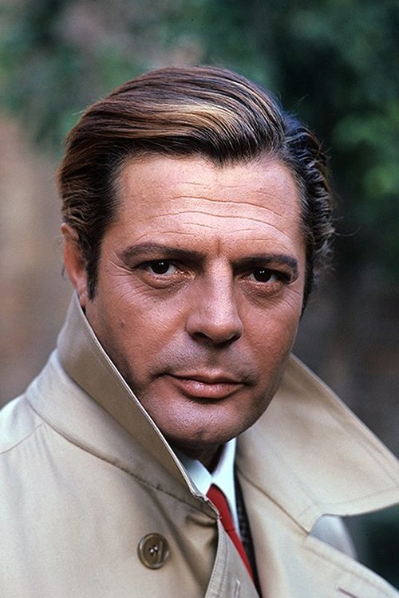
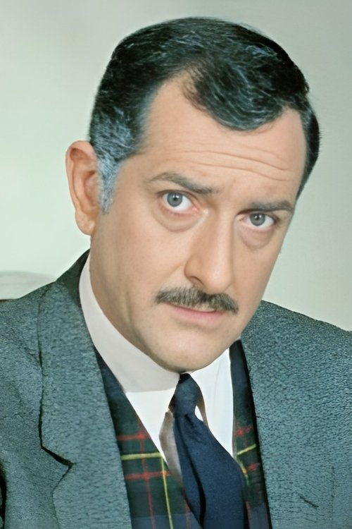



<nav class="films">
  

    <a href="../breathless-1960"><i class="fa-solid fa-chevron-left fa-xs"></i> Previous</a>
  

  

    <a class="simple" href="../">5 / 100</a>
  

  

    <a href="../purple-noon-1960">Next <i class="fa-solid fa-chevron-right fa-xs"></i></a>
  

  

    
      Previous film:
      Breathless
    
    
      Next film:
      Purple Noon
    
  

</nav>

<article class="film slug-la-dolce-vita-1960">
  

    
    
  

  <h1>{{ film.title }} ({{ film | filmYear }})</h1>

  

    Language: {{ film.language }}.
    
  

  

    Directed by <strong>{{ film | directors }}</strong>
  

  
    <blockquote>
      {{ films.reviews[slug] | safe }} <em>—&nbsp;<a href="/bill">Bill</a></em>
    </blockquote>
  

  <section class="cast-grid">
  

    

  
  

    Marcello Mastroianni
    Marcello Rubini
  

    

  
  

    Anita Ekberg
    Sylvia
  

    

  
  

    Anouk Aimée
    Maddalena
  

    

  
  

    Yvonne Furneaux
    Emma
  

    

  
  

    Magali Noël
    Fanny
  

    

  
  

    Alain Cuny
    Steiner
  

    

  
  

    Annibale Ninchi
    Marcello's father
  

    

  
  

    Walter Santesso
    Paparazzo
  

    

  
  

    Valeria Ciangottini
    Paola
  

    

  
  

    Riccardo Garrone
    Riccardo
  

    

  
  

    Ida Galli
    Debutante of the year
  

    

  
  

    Audrey McDonald
    Jane
  

  

</section>

  <section class="film-detail">
    

      

        

          <i class="fa-solid fa-masks-theater"></i>
          Cast
        

        <ul>
          
            <li>
              {{ cast.name }} as <em>{{ cast.character }}</em>
            </li>
          
        </ul>
      

      

        

          <i class="fa-solid fa-clapperboard"></i>
          Crew
        

        <ul>
          
            <li>
              {{ crew.name }} &mdash; <em>{{ crew.job }}</em>
            </li>
          
        </ul>
      

    

  </section>

  <section class="related-films">
  <h2>Related films</h2>
  <ul>
    <li><a href="../la-strada-1954">La Strada</a> because of Federico Fellini</li>
  </ul>
</section>

</article>
