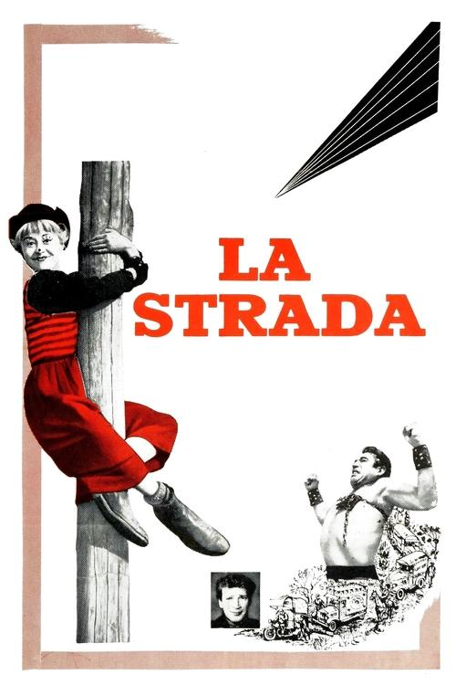
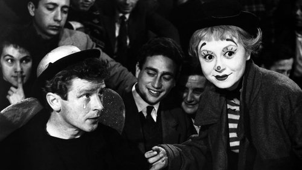



<nav class="films">
  <a class="prev" href="../whisky-galore-1949">Previous</a>
  <a href="../">Film list</a>
  <a class="next" href="../north-by-northwest-1959">Next</a>
</nav>

3 / 100

<article class="film">
  

    
    
  

  <h1>La Strada ({{ film | filmYear }})</h1>

  

    Directed by <strong>{{ film | directors }}</strong>
  

  <h2>
    Cast
  </h2>
  <ul>
            <li><strong>Giulietta Masina</strong> as <em>Gelsomina</em></li>
        <li><strong>Anthony Quinn</strong> as <em>Zampanò</em></li>
        <li><strong>Richard Basehart</strong> as <em>Il 'Matto'</em></li>
        <li><strong>Aldo Silvani</strong> as <em>Il Signor Giraffa</em></li>
        <li><strong>Marcella Rovere</strong> as <em>La Vedova</em></li>
        <li><strong>Livia Venturini</strong> as <em>La Suorina</em></li>
        <li><strong>Pietro Ceccarelli</strong> as <em>Innkeeper (uncredited)</em></li>
        <li><strong>Giovanna Galli</strong> as <em>Prostitute at the Inn (uncredited)</em></li>
        <li><strong>Gustavo Giorgi</strong> as <em>(uncredited)</em></li>
        <li><strong>Yami Kamadeva</strong> as <em>Prostitute (uncredited)</em></li>
        <li><strong>Mario Passante</strong> as <em>Waiter (uncredited)</em></li>
        <li><strong>Anna Primula</strong> as <em>Gelsomina's Mother (uncredited)</em></li>
        <li><strong>Alexandre Trannoy</strong> as <em>Juggler (uncredited)</em></li>
        <li><strong>Goffredo Unger</strong> as <em>Man Restraining Zampano from Attacking (uncredited)</em></li>
        <li><strong>Nazzareno Zamperla</strong> as <em>Man Restraining Zampano from Attacking (uncredited)</em></li>
  </ul>
</article>
<footer>
  <a href="../about">About this list</a>
</footer>
