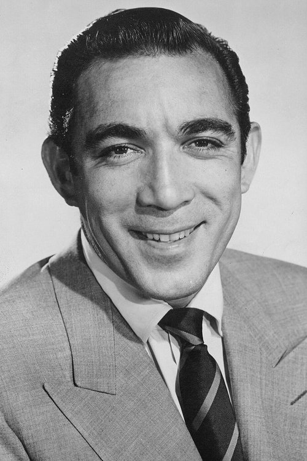
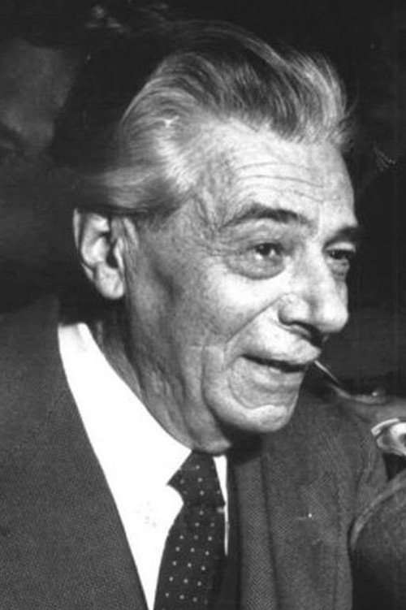
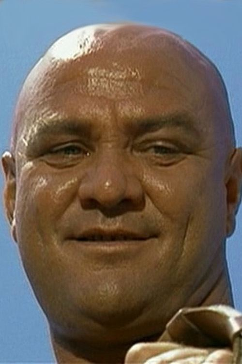



<nav class="films">
  

    <a href="../its-a-wonderful-life-1946"><i class="fa-solid fa-chevron-left fa-xs"></i> Previous</a>
  

  

    <a class="simple" href="../">2 / 100</a>
  

  

    <a href="../rear-window-1954">Next <i class="fa-solid fa-chevron-right fa-xs"></i></a>
  

  

    
      Previous film:
      It's a Wonderful Life
    
    
      Next film:
      Rear Window
    
  

</nav>

<article class="film slug-la-strada-1954">
  

    
    
  

  <h1>{{ film.title }} ({{ film | filmYear }})</h1>

  

    Language: {{ film.language }}.
    
  

  

    Directed by <strong>{{ film | directors }}</strong>
  

  
    <blockquote>
      {{ films.reviews[slug] | safe }} <em>—&nbsp;<a href="/bill">Bill</a></em>
    </blockquote>
  

  <section class="cast-grid">
  

    

  
  

    Giulietta Masina
    Gelsomina
  

    

  
  

    Anthony Quinn
    Zampanò
  

    

  
  

    Richard Basehart
    Il 'Matto'
  

    

  
  

    Aldo Silvani
    Il Signor Giraffa
  

    

  
  

    Marcella Rovere
    La Vedova
  

    

  
<i class="fa-solid fa-user"></i>

  

    Livia Venturini
    La Suorina
  

    

  
  

    Pietro Ceccarelli
    Innkeeper (uncredited)
  

    

  
<i class="fa-solid fa-user"></i>

  

    Giovanna Galli
    Prostitute at the Inn (uncredited)
  

    

  
<i class="fa-solid fa-user"></i>

  

    Gustavo Giorgi
    (uncredited)
  

    

  
<i class="fa-solid fa-user"></i>

  

    Yami Kamadeva
    Prostitute (uncredited)
  

    

  
  

    Mario Passante
    Waiter (uncredited)
  

    

  
<i class="fa-solid fa-user"></i>

  

    Anna Primula
    Gelsomina's Mother (uncredited)
  

  

</section>

  <section class="film-detail">
    

      

        

          <i class="fa-solid fa-masks-theater"></i>
          Cast
        

        <ul>
          
            <li>
              {{ cast.name }} as <em>{{ cast.character }}</em>
            </li>
          
        </ul>
      

      

        

          <i class="fa-solid fa-clapperboard"></i>
          Crew
        

        <ul>
          
            <li>
              {{ crew.name }} &mdash; <em>{{ crew.job }}</em>
            </li>
          
        </ul>
      

    

  </section>

  <section class="related-films">
  <h2>Related films</h2>
  <ul>
    <li><a href="../la-dolce-vita-1960">La Dolce Vita</a> because of Federico Fellini</li>
  </ul>
</section>

</article>
