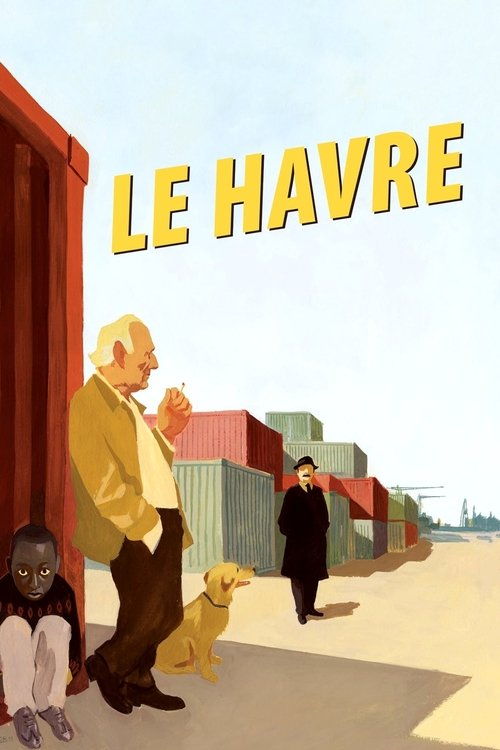
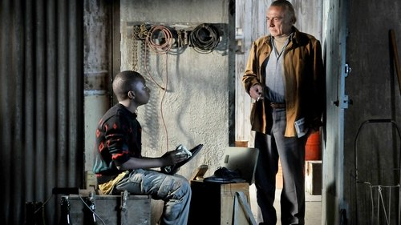



<nav class="films">
  <a class="prev" href="../tomboy-2011">Previous</a>
  <a href="../">Film list</a>
  <a class="next" href="../all-is-lost-2013">Next</a>
</nav>

60 / 100

<article class="film">
  

    
    
  

  <h1>Le Havre ({{ film | filmYear }})</h1>

  

  

    Directed by <strong>{{ film | directors }}</strong>
  

  <h2>
    Cast
  </h2>
  <ul>
            <li><strong>André Wilms</strong> as <em>Marcel Marx</em></li>
        <li><strong>Kati Outinen</strong> as <em>Arletty</em></li>
        <li><strong>Jean-Pierre Darroussin</strong> as <em>Monet</em></li>
        <li><strong>Blondin Miguel</strong> as <em>Idrissa</em></li>
        <li><strong>Elina Salo</strong> as <em>Claire</em></li>
        <li><strong>Evelyne Didi</strong> as <em>Yvette</em></li>
        <li><strong>Quoc Dung Nguyen</strong> as <em>Chang</em></li>
        <li><strong>François Monnié</strong> as <em>Greengrocer</em></li>
        <li><strong>Roberto Piazza</strong> as <em>Little Bob</em></li>
        <li><strong>Pierre Étaix</strong> as <em>Dr. Becker</em></li>
        <li><strong>Jean-Pierre Léaud</strong> as <em>The Whistleblower</em></li>
        <li><strong>Vincent Lebodo</strong> as <em>Francis</em></li>
        <li><strong>Umban U'kset</strong> as <em>Mahamat</em></li>
        <li><strong>Patrick Bonnel</strong> as <em>Detention Centre Manager</em></li>
        <li><strong>Ilkka Koivula</strong> as <em>The Italian</em></li>
        <li><strong>Myriam "Mimie" Piazza</strong> as <em>Mimie</em></li>
        <li><strong>Luce Vigo</strong> as <em>Sandwich Vendor</em></li>
        <li><strong>Valérie Caron</strong> as <em>Greengrocer's Wife</em></li>
        <li><strong>Jérôme Boyer</strong> as <em>Border Police</em></li>
        <li><strong>Jean-Luc Guion-Firmin</strong> as <em>Calais Refugee</em></li>
        <li><strong>Pierre Morineau</strong> as <em>Container Park Night Guard</em></li>
        <li><strong>Johann Rioux</strong> as <em>CRS Commander</em></li>
        <li><strong>Julien Flematti</strong> as <em>Trigger-happy CRS Guard</em></li>
        <li><strong>Éric Duteil</strong> as <em>Medic</em></li>
        <li><strong>Corinne Belet</strong> as <em>Nurse</em></li>
        <li><strong>Dominique Lepagne</strong> as <em>Nurse</em></li>
        <li><strong>Anne Lizy</strong> as <em>Nurse</em></li>
        <li><strong>Pierre Richards</strong> as <em>Dock Worker</em></li>
        <li><strong>Loïc Jamet</strong> as <em>Dock Worker 2</em></li>
        <li><strong>Nico Garotin</strong> as <em>Band Member</em></li>
        <li><strong>Bertrand Couloume</strong> as <em>Band Member</em></li>
        <li><strong>Nicolas Noël</strong> as <em>Band Member</em></li>
        <li><strong>Gilles Mallet</strong> as <em>Band Member</em></li>
        <li><strong>Gilles Adam</strong> as <em>"La Moderne" Regular / Prefect of Police (voice)</em></li>
        <li><strong>Patrick Leboucher</strong> as <em>"La Moderne" Regular</em></li>
        <li><strong>Michel Lacaille</strong> as <em>"La Moderne" Regular</em></li>
        <li><strong>Stéphane Livonnen</strong> as <em>"La Moderne" Regular</em></li>
        <li><strong>Arnaud Clément</strong> as <em>"La Moderne" Customer</em></li>
        <li><strong>Dominique Comont</strong> as <em>"La Moderne" Customer</em></li>
        <li><strong>Alain Guillot</strong> as <em>"La Moderne" Customer</em></li>
        <li><strong>Philippe Hubschwerlin</strong> as <em>"La Moderne" Customer</em></li>
        <li><strong>Franck Durand</strong> as <em>"La Moderne" Customer</em></li>
        <li><strong>Christian Amyard</strong> as <em>Docker</em></li>
        <li><strong>Rudy Amyard</strong> as <em>Docker</em></li>
        <li><strong>Brice Augé</strong> as <em>Docker</em></li>
        <li><strong>Lucas Loubaresse</strong> as <em>Assassin</em></li>
        <li><strong>Ireneusz (Irek) Spiewak</strong> as <em>Assassin</em></li>
        <li><strong>Gilles Charmant</strong> as <em>Shoe Shop Manager</em></li>
        <li><strong>Mary Berkelmans</strong> as <em>Housewife</em></li>
        <li><strong>Seluna Lemercier</strong> as <em>Housewife</em></li>
        <li><strong>Fanette Martinie</strong> as <em>Housewife</em></li>
        <li><strong>Rémi Pradinas</strong> as <em>Priest</em></li>
        <li><strong>Stéphane Parthenay</strong> as <em>Priest</em></li>
        <li><strong>Alain Chapelain</strong> as <em>Accordionist</em></li>
        <li><strong>Rachid Bessal</strong> as <em>Calais Refugee</em></li>
        <li><strong>Oumar Ly</strong> as <em>Calais Refugee</em></li>
        <li><strong>Emmanuel Ingweiller</strong> as <em>Photographer</em></li>
        <li><strong>Matthieu Hébert</strong> as <em>Bartender</em></li>
        <li><strong>Frank Atinault</strong> as <em>Fisherman</em></li>
        <li><strong>Dominique Mare</strong> as <em>Fisherman</em></li>
        <li><strong>Brice Niel</strong> as <em>Fisherman</em></li>
        <li><strong>Alban Rutten</strong> as <em>Fisherman</em></li>
        <li><strong>Franck Rutten</strong> as <em>Fisherman</em></li>
  </ul>
</article>
<footer>
  <a href="../about">About this list</a>
</footer>
