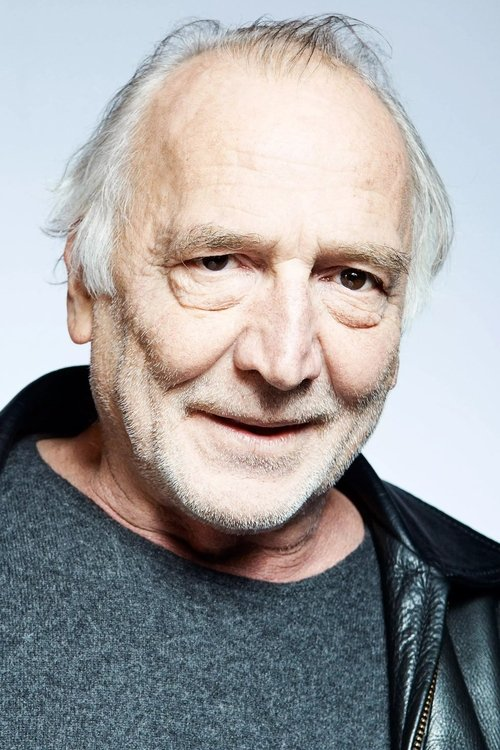
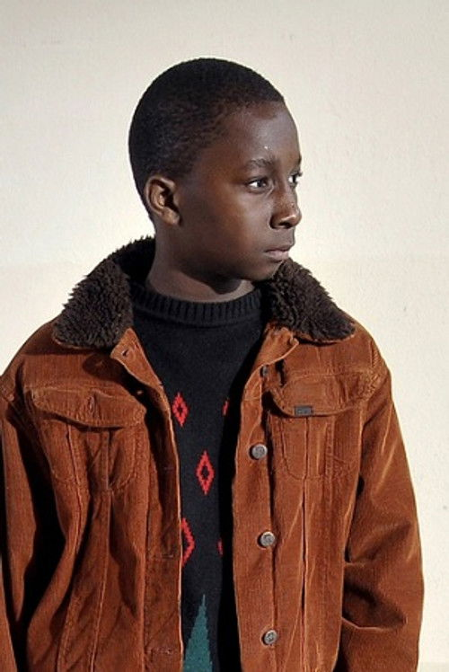



<nav class="films">
  

    <a href="../micmacs-2009"><i class="fa-solid fa-chevron-left fa-xs"></i> Previous</a>
  

  

    <a class="simple" href="../">50 / 100</a>
  

  

    <a href="../tomboy-2011">Next <i class="fa-solid fa-chevron-right fa-xs"></i></a>
  

  

    
      Previous film:
      Micmacs
    
    
      Next film:
      Tomboy
    
  

</nav>

<article class="film slug-le-havre-2011">
  

    
    
  

  <h1>{{ film.title }} ({{ film | filmYear }})</h1>

  

    Language: {{ film.language }}.
    
  

  

    Directed by <strong>{{ film | directors }}</strong>
  

  
    <blockquote>
      {{ films.reviews[slug] | safe }} <em>—&nbsp;<a href="/bill">Bill</a></em>
    </blockquote>
  

  <section class="cast-grid">
  

    

  
  

    André Wilms
    Marcel Marx
  

    

  
  

    Kati Outinen
    Arletty
  

    

  
  

    Jean-Pierre Darroussin
    Monet
  

    

  
  

    Blondin Miguel
    Idrissa
  

    

  
  

    Elina Salo
    Claire
  

    

  
  

    Evelyne Didi
    Yvette
  

    

  
<i class="fa-solid fa-user"></i>

  

    Quoc Dung Nguyen
    Chang
  

    

  
<i class="fa-solid fa-user"></i>

  

    François Monnié
    Greengrocer
  

    

  
<i class="fa-solid fa-user"></i>

  

    Roberto Piazza
    Little Bob
  

    

  
  

    Pierre Étaix
    Dr. Becker
  

    

  
  

    Jean-Pierre Léaud
    The Whistleblower
  

    

  
<i class="fa-solid fa-user"></i>

  

    Vincent Lebodo
    Francis
  

  

</section>

  <section class="film-detail">
    

      

        

          <i class="fa-solid fa-masks-theater"></i>
          Cast
        

        <ul>
          
            <li>
              {{ cast.name }} as <em>{{ cast.character }}</em>
            </li>
          
        </ul>
      

      

        

          <i class="fa-solid fa-clapperboard"></i>
          Crew
        

        <ul>
          
            <li>
              {{ crew.name }} &mdash; <em>{{ crew.job }}</em>
            </li>
          
        </ul>
      

    

  </section>

  <section class="related-films">
  <h2>Related films</h2>
  <ul>
    <li><a href="../day-for-night-1973">Day for Night</a> because of Jean-Pierre Léaud</li>
  </ul>
</section>

</article>
