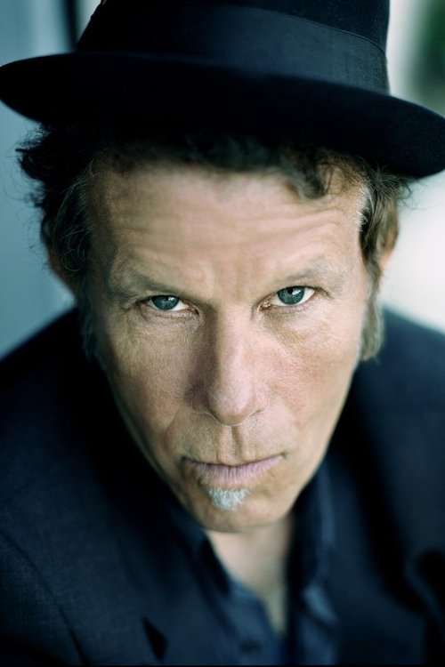



<nav class="films">
  

    <a href="../house-of-gucci-2021"><i class="fa-solid fa-chevron-left fa-xs"></i> Previous</a>
  

  

    <a class="simple" href="../">80 / 100</a>
  

  

    <a href="../nomadland-2021">Next <i class="fa-solid fa-chevron-right fa-xs"></i></a>
  

  

    
      Previous film:
      House of Gucci
    
    
      Next film:
      Nomadland
    
  

</nav>

<article class="film slug-licorice-pizza-2021">
  

    
    
  

  <h1>{{ film.title }} ({{ film | filmYear }})</h1>

  

    Language: {{ film.language }}.
    
  

  

    Directed by <strong>{{ film | directors }}</strong>
  

  
    <blockquote>
      {{ films.reviews[slug] | safe }} <em>—&nbsp;<a href="/bill">Bill</a></em>
    </blockquote>
  

  <section class="cast-grid">
  

    

  
  

    Alana Haim
    Alana Kane
  

    

  
  

    Cooper Hoffman
    Gary Valentine
  

    

  
  

    Sean Penn
    Jack Holden
  

    

  
  

    Tom Waits
    Rex Blau
  

    

  
  

    Bradley Cooper
    Jon Peters
  

    

  
  

    Benny Safdie
    Joel Wachs
  

    

  
  

    Skyler Gisondo
    Lance Brannigan
  

    

  
  

    Mary Elizabeth Ellis
    Momma Anita
  

    

  
  

    John Michael Higgins
    Jerry Frick
  

    

  
  

    Christine Ebersole
    Lucille Doolittle
  

    

  
  

    Harriet Sansom Harris
    Mary Grady
  

    

  
  

    Joseph Cross
    Matthew
  

  

</section>

  <section class="film-detail">
    

      

        

          <i class="fa-solid fa-masks-theater"></i>
          Cast
        

        <ul>
          
            <li>
              {{ cast.name }} as <em>{{ cast.character }}</em>
            </li>
          
        </ul>
      

      

        

          <i class="fa-solid fa-clapperboard"></i>
          Crew
        

        <ul>
          
            <li>
              {{ crew.name }} &mdash; <em>{{ crew.job }}</em>
            </li>
          
        </ul>
      

    

  </section>

  <section class="related-films">
  <h2>Related films</h2>
  <ul>
    <li><a href="../magnolia-1999">Magnolia</a> because of John C. Reilly, Mark Flanagan, Paul Thomas Anderson and Brian Kehew</li>
<li><a href="../uncut-gems-2019">Uncut Gems</a> because of Benny Safdie</li>
<li><a href="../the-fabelmans-2022">The Fabelmans</a> because of Isabelle Kusman and Paige Locke</li>
  </ul>
</section>

</article>
