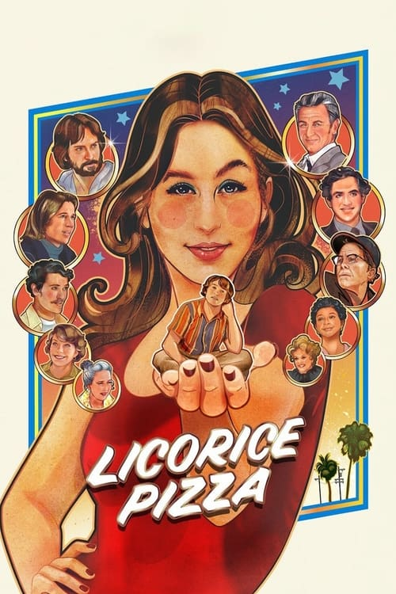



<nav class="films">
  <a class="prev" href="../house-of-gucci-2021">Previous</a>
  <a href="../">Film list</a>
  <a class="next" href="../the-tragedy-of-macbeth-2021">Next</a>
</nav>

89 / 100

<article class="film">
  

    
    
  

  <h1>Licorice Pizza ({{ film | filmYear }})</h1>

  

  

    Directed by <strong>{{ film | directors }}</strong>
  

  <h2>
    Cast
  </h2>
  <ul>
            <li><strong>Alana Haim</strong> as <em>Alana Kane</em></li>
        <li><strong>Cooper Hoffman</strong> as <em>Gary Valentine</em></li>
        <li><strong>Sean Penn</strong> as <em>Jack Holden</em></li>
        <li><strong>Tom Waits</strong> as <em>Rex Blau</em></li>
        <li><strong>Bradley Cooper</strong> as <em>Jon Peters</em></li>
        <li><strong>Benny Safdie</strong> as <em>Joel Wachs</em></li>
        <li><strong>Skyler Gisondo</strong> as <em>Lance Brannigan</em></li>
        <li><strong>Mary Elizabeth Ellis</strong> as <em>Momma Anita</em></li>
        <li><strong>John Michael Higgins</strong> as <em>Jerry Frick</em></li>
        <li><strong>Christine Ebersole</strong> as <em>Lucille Doolittle</em></li>
        <li><strong>Harriet Sansom Harris</strong> as <em>Mary Grady</em></li>
        <li><strong>Joseph Cross</strong> as <em>Matthew</em></li>
        <li><strong>Danielle Haim</strong> as <em>Danielle Kane</em></li>
        <li><strong>Este Haim</strong> as <em>Este Kane</em></li>
        <li><strong>Moti Haim</strong> as <em>Moti Kane</em></li>
        <li><strong>Donna Haim</strong> as <em>Donna Kane</em></li>
        <li><strong>Maya Rudolph</strong> as <em>Gale</em></li>
        <li><strong>Ryan Heffington</strong> as <em>Steve</em></li>
        <li><strong>Nate Mann</strong> as <em>Brian</em></li>
        <li><strong>Isabelle Kusman</strong> as <em>Sue Pomerantz</em></li>
        <li><strong>Destry Allyn Spielberg</strong> as <em>Frisbee Kahill</em></li>
        <li><strong>George DiCaprio</strong> as <em>Mr. Jack</em></li>
        <li><strong>Iyana Halley</strong> as <em>Wig Shop Brenda</em></li>
        <li><strong>Ray Chase</strong> as <em>B. Mitch Reed</em></li>
        <li><strong>Emma Dumont</strong> as <em>Airplane Brenda</em></li>
        <li><strong>Yumi Mizui</strong> as <em>Mioko</em></li>
        <li><strong>Megumi Anjo</strong> as <em>Kimiko</em></li>
        <li><strong>Emily Althaus</strong> as <em>Kiki Page</em></li>
        <li><strong>Tim Conway Jr.</strong> as <em>Vic the Director</em></li>
        <li><strong>Griff Giacchino</strong> as <em>Mark</em></li>
        <li><strong>Will Angarola</strong> as <em>Kirk</em></li>
        <li><strong>Milo Herschlag</strong> as <em>Greg Valentine</em></li>
        <li><strong>Craig Stark</strong> as <em>Long Haired Freak</em></li>
        <li><strong>Louis Delavenne</strong> as <em>Rive Gauche Waiter</em></li>
        <li><strong>Rogelio Camarillo</strong> as <em>Armand</em></li>
        <li><strong>Nathan M. Hadden</strong> as <em>Tail o' the Cock Valet</em></li>
        <li><strong>Brian Kehew</strong> as <em>Sonny & Cher Tech</em></li>
        <li><strong>Ray Nicholson</strong> as <em>Ray</em></li>
        <li><strong>Eloy Perez</strong> as <em>Guillermo</em></li>
        <li><strong>Pearl Minnie Anderson</strong> as <em>Sharon</em></li>
        <li><strong>Dan Chariton</strong> as <em>Sam Harpoon</em></li>
        <li><strong>James Kelley</strong> as <em>Tim</em></li>
        <li><strong>Dexter Demme</strong> as <em>Cherry Bomb Kid / Fat Bernie's Pinball Crowd</em></li>
        <li><strong>River Cornwell</strong> as <em>Cherry Bomb Kid</em></li>
        <li><strong>Harrison Bray</strong> as <em>Cherry Bomb Kid</em></li>
        <li><strong>Sasha Spielberg</strong> as <em>Tiny Toes Girl</em></li>
        <li><strong>Karissa Reynafarje</strong> as <em>Tiny Toes Girl</em></li>
        <li><strong>Savannah Ioakimedes</strong> as <em>Tiny Toes Girl</em></li>
        <li><strong>Dorie Samovitz</strong> as <em>Tiny Toes Girl</em></li>
        <li><strong>Anna Cordell</strong> as <em>Tiny Toes Girl</em></li>
        <li><strong>Adam Somner</strong> as <em>Tiny Toes Photographer</em></li>
        <li><strong>Joshua Carl Allen</strong> as <em>Tiny Toes Photographer</em></li>
        <li><strong>Patrick Hoelck</strong> as <em>Tiny Toes Photographer</em></li>
        <li><strong>Collin Sutton</strong> as <em>Tiny Toes Photographer</em></li>
        <li><strong>Lucia Angarola</strong> as <em>Grant High School Student</em></li>
        <li><strong>Lola Brown</strong> as <em>Grant High School Student</em></li>
        <li><strong>Nancy Cornwell</strong> as <em>Grant High School Student</em></li>
        <li><strong>Harry Fincher</strong> as <em>Grant High School Student</em></li>
        <li><strong>Laura Gary</strong> as <em>Grant High School Student</em></li>
        <li><strong>Julie Goldklang</strong> as <em>Grant High School Student</em></li>
        <li><strong>Ava Gosselaar</strong> as <em>Grant High School Student</em></li>
        <li><strong>Lila Kay</strong> as <em>Grant High School Student</em></li>
        <li><strong>Lucy Lopez</strong> as <em>Grant High School Student</em></li>
        <li><strong>Zoe Novak</strong> as <em>Grant High School Student</em></li>
        <li><strong>Van Rich-Takayama</strong> as <em>Grant High School Student</em></li>
        <li><strong>Isaac Soren</strong> as <em>Grant High School Student</em></li>
        <li><strong>Phil Bray</strong> as <em>Don the Bartender</em></li>
        <li><strong>Patrick Aranda</strong> as <em>Tail o' the Cock Pianist</em></li>
        <li><strong>Andrew C. Eure</strong> as <em>Jerry Best Crew</em></li>
        <li><strong>Joshua Zev Nathan</strong> as <em>Jerry Best Crew / Tilt</em></li>
        <li><strong>Mia Bruno</strong> as <em>Jerry Best Crew</em></li>
        <li><strong>Trevor Tavares</strong> as <em>A Jack</em></li>
        <li><strong>Kathy Trinh</strong> as <em>A Jill</em></li>
        <li><strong>Greg Goetzman</strong> as <em>Jerry Best</em></li>
        <li><strong>Grace Anderson</strong> as <em>Under One Roof Kid</em></li>
        <li><strong>Minnie Ida Anderson</strong> as <em>Under One Roof Kid</em></li>
        <li><strong>Jack Anderson</strong> as <em>Under One Roof Kid / Jimbo</em></li>
        <li><strong>Lucille Anderson</strong> as <em>Under One Roof Kid</em></li>
        <li><strong>Mahalia Flanagan</strong> as <em>Under One Roof Kid</em></li>
        <li><strong>Seamus Flanagan</strong> as <em>Under One Roof Kid</em></li>
        <li><strong>Tallulah Hoffman</strong> as <em>Under One Roof Kid</em></li>
        <li><strong>Willa Hoffman</strong> as <em>Under One Roof Kid</em></li>
        <li><strong>Megan Kelley</strong> as <em>Under One Roof Kid</em></li>
        <li><strong>Hudson Monkarsh</strong> as <em>Under One Roof Kid</em></li>
        <li><strong>Olive Monkarsh</strong> as <em>Under One Roof Kid</em></li>
        <li><strong>Stella Monkarsh</strong> as <em>Under One Roof Kid</em></li>
        <li><strong>Waylon Richling</strong> as <em>Under One Roof Kid</em></li>
        <li><strong>Ben Schacter</strong> as <em>Under One Roof Kid</em></li>
        <li><strong>Matty Schacter</strong> as <em>Under One Roof Kid</em></li>
        <li><strong>Hazel Schaffer</strong> as <em>Under One Roof Kid</em></li>
        <li><strong>June Schaffer</strong> as <em>Under One Roof Kid</em></li>
        <li><strong>Delaina Mitchell</strong> as <em>Stage Mom</em></li>
        <li><strong>Liz Cackowski</strong> as <em>Stage Mom</em></li>
        <li><strong>Vanessa Schacter</strong> as <em>Stage Mom</em></li>
        <li><strong>Alexandra Monkarsh</strong> as <em>Stage Mom</em></li>
        <li><strong>Tyler Young</strong> as <em>Audience Dad</em></li>
        <li><strong>Josh Monkarsh</strong> as <em>Audience Dad</em></li>
        <li><strong>Max Mitchell</strong> as <em>William</em></li>
        <li><strong>Erica Sullivan</strong> as <em>Director's Assistant</em></li>
        <li><strong>Bottara Angele</strong> as <em>Fairgoer</em></li>
        <li><strong>Laura Louise Richardson</strong> as <em>Fairgoer</em></li>
        <li><strong>Lakin Valdez</strong> as <em>Cop</em></li>
        <li><strong>Mark Kirksey</strong> as <em>Cop</em></li>
        <li><strong>Allegra Clark</strong> as <em>Police Dispatch (voice)</em></li>
        <li><strong>Ingrid Sophie Schram</strong> as <em>B. Mitch Reed Assistant</em></li>
        <li><strong>Ariel Rechtshaid</strong> as <em>KPPC Management</em></li>
        <li><strong>Doug Weaver</strong> as <em>UPS Driver</em></li>
        <li><strong>Ted McCarthy</strong> as <em>Waterbed Ted (voice)</em></li>
        <li><strong>Lori Killam</strong> as <em>Janice</em></li>
        <li><strong>Coco Soren</strong> as <em>Lucy's Friend</em></li>
        <li><strong>Austin Anderson</strong> as <em>Fat Bernie's Waterbed Customer</em></li>
        <li><strong>William Angarola</strong> as <em>Fat Bernie's Waterbed Customer</em></li>
        <li><strong>Hudson Brown</strong> as <em>Fat Bernie's Waterbed Customer</em></li>
        <li><strong>Sawyer Conklin</strong> as <em>Fat Bernie's Waterbed Customer</em></li>
        <li><strong>Sylvie Conklin</strong> as <em>Fat Bernie's Waterbed Customer</em></li>
        <li><strong>Sharyn Dent-Bray</strong> as <em>Fat Bernie's Waterbed Customer</em></li>
        <li><strong>Renee Flanagan</strong> as <em>Fat Bernie's Waterbed Customer</em></li>
        <li><strong>Jamie Giacchino</strong> as <em>Fat Bernie's Waterbed Customer</em></li>
        <li><strong>Apryl Huntzinger</strong> as <em>Fat Bernie's Waterbed Customer</em></li>
        <li><strong>Shana Dishell Richling</strong> as <em>Fat Bernie's Waterbed Customer</em></li>
        <li><strong>Thomas John Rudolph</strong> as <em>Fat Bernie's Waterbed Customer</em></li>
        <li><strong>Charlotte Schmid-Maybach</strong> as <em>Fat Bernie's Waterbed Customer</em></li>
        <li><strong>Ford Stoller</strong> as <em>Fat Bernie's Waterbed Customer</em></li>
        <li><strong>George Stoller</strong> as <em>Fat Bernie's Waterbed Customer</em></li>
        <li><strong>Theo Stoller</strong> as <em>Fat Bernie's Waterbed Customer</em></li>
        <li><strong>William Stoller</strong> as <em>Fat Bernie's Waterbed Customer</em></li>
        <li><strong>Zoe Herschlag</strong> as <em>Wendi Jo</em></li>
        <li><strong>Henri Abergel</strong> as <em>Henri</em></li>
        <li><strong>Theresa Anderson</strong> as <em>Tail o' the Cock Patron</em></li>
        <li><strong>Mark Flanagan</strong> as <em>Tail o' the Cock Patron</em></li>
        <li><strong>Joanne Gough</strong> as <em>Tail o' the Cock Patron</em></li>
        <li><strong>Paul Gough</strong> as <em>Tail o' the Cock Patron</em></li>
        <li><strong>Cassandra Kulukundis</strong> as <em>Tail o' the Cock Patron</em></li>
        <li><strong>Danielle Miller</strong> as <em>Tail o' the Cock Patron</em></li>
        <li><strong>Hank Oster</strong> as <em>Tail o' the Cock Patron</em></li>
        <li><strong>Reina Reyes</strong> as <em>Tail o' the Cock Patron</em></li>
        <li><strong>Kimiko Kasai</strong> as <em>Tail o' the Cock Patron</em></li>
        <li><strong>Richard Rudolph</strong> as <em>Tail o' the Cock Patron</em></li>
        <li><strong>Kirk Saduski</strong> as <em>Tail o' the Cock Patron</em></li>
        <li><strong>Katy Weber</strong> as <em>Tail o' the Cock Patron</em></li>
        <li><strong>Dennis Weiss</strong> as <em>Tail o' the Cock Patron</em></li>
        <li><strong>Mark Wolfson</strong> as <em>Tail o' the Cock Patron</em></li>
        <li><strong>Ryan B. Young</strong> as <em>Tail o' the Cock Patron</em></li>
        <li><strong>Benjamin Barrett</strong> as <em>Latin Lad</em></li>
        <li><strong>Demelza Cronin</strong> as <em>Tennis Girl</em></li>
        <li><strong>Katie Cronin</strong> as <em>Tennis Girl</em></li>
        <li><strong>Dennis McCarthy</strong> as <em>Reporter</em></li>
        <li><strong>Mary Eileen O'Donnell</strong> as <em>Reporter</em></li>
        <li><strong>William Potter</strong> as <em>Joel Wachs Photographer</em></li>
        <li><strong>Ted McCarthy</strong> as <em>Joel Wachs Chief of Staff</em></li>
        <li><strong>Karen Kilgariff</strong> as <em>Joel Wachs Mom</em></li>
        <li><strong>Alex Herschlag</strong> as <em>Joel Wachs Dad</em></li>
        <li><strong>Madison Sonora</strong> as <em>Joel Wachs Volunteer</em></li>
        <li><strong>Jonathan Goetzman</strong> as <em>Joel Wachs Volunteer</em></li>
        <li><strong>Victoria Kunkel</strong> as <em>Joel Wachs Volunteer</em></li>
        <li><strong>Jon Beavers</strong> as <em>Number 12 Creep</em></li>
        <li><strong>Luigi Della Ripa</strong> as <em>Luigi the Tailor</em></li>
        <li><strong>Riley Parker</strong> as <em>Annoying Pinball Kid</em></li>
        <li><strong>Max Beristain</strong> as <em>Fat Bernie's Pinball Crowd</em></li>
        <li><strong>Eden Burakoff</strong> as <em>Fat Bernie's Pinball Crowd</em></li>
        <li><strong>Alex Canter</strong> as <em>Fat Bernie's Pinball Crowd</em></li>
        <li><strong>Avery Carey</strong> as <em>Fat Bernie's Pinball Crowd</em></li>
        <li><strong>AJ Carr</strong> as <em>Fat Bernie's Pinball Crowd</em></li>
        <li><strong>Angenaya Carr</strong> as <em>Fat Bernie's Pinball Crowd</em></li>
        <li><strong>Nick Cohen</strong> as <em>Fat Bernie's Pinball Crowd</em></li>
        <li><strong>Eric Culhane</strong> as <em>Fat Bernie's Pinball Crowd</em></li>
        <li><strong>Astaria Dayne</strong> as <em>Fat Bernie's Pinball Crowd</em></li>
        <li><strong>Mick Giacchino</strong> as <em>Fat Bernie's Pinball Crowd</em></li>
        <li><strong>Luna Gray</strong> as <em>Fat Bernie's Pinball Crowd</em></li>
        <li><strong>Julia Greene</strong> as <em>Fat Bernie's Pinball Crowd</em></li>
        <li><strong>Sung Han</strong> as <em>Fat Bernie's Pinball Crowd</em></li>
        <li><strong>Lawrence Haymes</strong> as <em>Fat Bernie's Pinball Crowd</em></li>
        <li><strong>Arlo Reilly</strong> as <em>Fat Bernie's Pinball Crowd</em></li>
        <li><strong>Francesca Sarracino</strong> as <em>Fat Bernie's Pinball Crowd</em></li>
        <li><strong>Luigi Sarracino</strong> as <em>Fat Bernie's Pinball Crowd</em></li>
        <li><strong>Frank Scott</strong> as <em>Fat Bernie's Pinball Crowd</em></li>
        <li><strong>Max Scott</strong> as <em>Fat Bernie's Pinball Crowd</em></li>
        <li><strong>Yanari Warren</strong> as <em>Fat Bernie's Pinball Crowd</em></li>
        <li><strong>Ciara Williamson</strong> as <em>Fat Bernie's Pinball Crowd</em></li>
        <li><strong>Hannah Williamson</strong> as <em>Fat Bernie's Pinball Crowd</em></li>
        <li><strong>Dan Anderson</strong> as <em>Encino Theater Staff</em></li>
        <li><strong>Kat Barnette</strong> as <em>Ticket Taker</em></li>
        <li><strong>Natalia Becerril</strong> as <em>Latin Lady (uncredited)</em></li>
        <li><strong>Zachary Chicos</strong> as <em>Upscale Restaurant Patron (uncredited)</em></li>
        <li><strong>Gerren Hall</strong> as <em>Campaign Employee (uncredited)</em></li>
        <li><strong>Fatimah Hassan</strong> as <em>Driver (uncredited)</em></li>
        <li><strong>Steven Herrera</strong> as <em>Teen Fair Goer (uncredited)</em></li>
        <li><strong>Brandon Koen</strong> as <em>Fair Goer (uncredited)</em></li>
        <li><strong>Richard B. Larimore</strong> as <em>Golfer (uncredited)</em></li>
        <li><strong>Paige Locke</strong> as <em>Fair Goer (uncredited)</em></li>
        <li><strong>Zoe McLane</strong> as <em>Pinball Teen (uncredited)</em></li>
        <li><strong>Anthony Molinari</strong> as <em>Cop #2 (uncredited)</em></li>
        <li><strong>John C. Reilly</strong> as <em>Fred Gwynne / Herman Munster (uncredited)</em></li>
        <li><strong>Patrick Salway</strong> as <em>Pinball Kid (uncredited)</em></li>
        <li><strong>Tess Rianne Sullivan</strong> as <em>Wachs Campaign Staffer (uncredited)</em></li>
        <li><strong>Charlotte Townsend</strong> as <em>Fairgoer #3 (uncredited)</em></li>
        <li><strong>Jeff Willy</strong> as <em>Fair Volunteer (uncredited)</em></li>
  </ul>
</article>
<footer>
  <a href="../about">About this list</a>
</footer>
