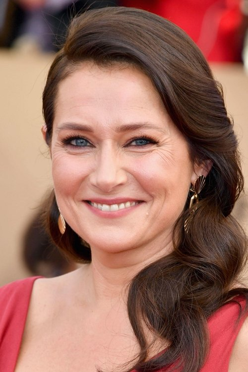



<nav class="films">
  

    <a href="../eternal-beauty-2020"><i class="fa-solid fa-chevron-left fa-xs"></i> Previous</a>
  

  

    <a class="simple" href="../">74 / 100</a>
  

  

    <a href="../the-truffle-hunters-2020">Next <i class="fa-solid fa-chevron-right fa-xs"></i></a>
  

  

    
      Previous film:
      Eternal Beauty
    
    
      Next film:
      The Truffle Hunters
    
  

</nav>

<article class="film slug-limbo-2020">
  

    
    
  

  <h1>{{ film.title }} ({{ film | filmYear }})</h1>

  

    Language: {{ film.language }}.
    
  

  

    Directed by <strong>{{ film | directors }}</strong>
  

  
    <blockquote>
      {{ films.reviews[slug] | safe }} <em>—&nbsp;<a href="/bill">Bill</a></em>
    </blockquote>
  

  <section class="cast-grid">
  

    

  
  

    Amir El-Masry
    Omar
  

    

  
  

    Vikash Bhai
    Farhad
  

    

  
  

    Ola Orebiyi
    Wasef
  

    

  
<i class="fa-solid fa-user"></i>

  

    Kwabena Ansah
    Abedi
  

    

  
  

    Sidse Babett Knudsen
    Helga
  

    

  
  

    Qais Nashif
    
  

    

  
  

    Kenneth Collard
    Boris
  

    

  
  

    Sanjeev Kohli
    Vikram
  

    

  
  

    Cameron Fulton
    Plug
  

    

  
  

    Lewis Gribben
    Stevie
  

    

  
  

    Grace Chilton
    Margaret
  

    

  
  

    Raymond Mearns
    Mike
  

  

</section>

  <section class="film-detail">
    

      

        

          <i class="fa-solid fa-masks-theater"></i>
          Cast
        

        <ul>
          
            <li>
              {{ cast.name }} as <em>{{ cast.character }}</em>
            </li>
          
        </ul>
      

      

        

          <i class="fa-solid fa-clapperboard"></i>
          Crew
        

        <ul>
          
            <li>
              {{ crew.name }} &mdash; <em>{{ crew.job }}</em>
            </li>
          
        </ul>
      

    

  </section>

  
</article>
