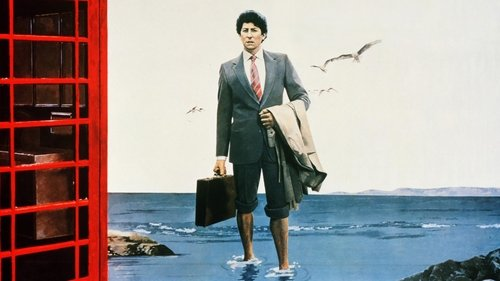

<nav class="films">
  <a class="prev" href="../gregorys-girl">Previous</a>
  <a href="../">Film list</a>
  <a class="next" href="../paris-texas">Next</a>
</nav>

24 / 100

<article class="film">
  
  

  <h1>Local Hero (1983)</h1>

  

    Directed by <strong>Bill Forsyth</strong>
  

  <h2>
    Cast
  </h2>
  <ul>
    <li><strong>Burt Lancaster</strong> as <em>Felix Happer</em></li>
<li><strong>Peter Riegert</strong> as <em>Mac</em></li>
<li><strong>Denis Lawson</strong> as <em>Urquhart</em></li>
<li><strong>Fulton Mackay</strong> as <em>Ben</em></li>
<li><strong>Peter Capaldi</strong> as <em>Oldsen</em></li>
<li><strong>Jennifer Black</strong> as <em>Stella</em></li>
<li><strong>Jenny Seagrove</strong> as <em>Marina</em></li>
<li><strong>Norman Chancer</strong> as <em>Moritz</em></li>
<li><strong>Rikki Fulton</strong> as <em>Geddes</em></li>
<li><strong>Alex Norton</strong> as <em>Watt</em></li>
<li><strong>Christopher Rozycki</strong> as <em>Victor</em></li>
<li><strong>Gyearbuor Asante</strong> as <em>Rev Macpherson</em></li>
<li><strong>John M. Jackson</strong> as <em>Cal</em></li>
<li><strong>Dan Ammerman</strong> as <em>Donaldson</em></li>
<li><strong>Tam Dean Burn</strong> as <em>Roddy</em></li>
<li><strong>John Gordon Sinclair</strong> as <em>Ricky</em></li>
<li><strong>Caroline Guthrie</strong> as <em>Pauline</em></li>
<li><strong>Jimmy Yuill</strong> as <em>Iain</em></li>
<li><strong>Karen Douglas</strong> as <em>Mrs Wyatt</em></li>
<li><strong>Kenny Ireland</strong> as <em>Skipper</em></li>
<li><strong>Sandra Voe</strong> as <em>Mrs Fraser</em></li>
<li><strong>Harlan Jordan</strong> as <em>Fountain</em></li>
<li><strong>Charles Kearney</strong> as <em>Peter</em></li>
<li><strong>David Mowat</strong> as <em>Gideon</em></li>
<li><strong>John Poland</strong> as <em>Anderson</em></li>
<li><strong>Ann Scott-Jones</strong> as <em>Linda Fraser</em></li>
<li><strong>Ian Stewart</strong> as <em>Mr Bulloch</em></li>
<li><strong>Jonathan Watson</strong> as <em>Jonathan</em></li>
<li><strong>Dave Anderson</strong> as <em>Fraser</em></li>
<li><strong>Ray Jeffries</strong> as <em>Andrew</em></li>
<li><strong>James Kennedy</strong> as <em>Edward</em></li>
<li><strong>Willie Joss</strong> as <em>Sandy</em></li>
<li><strong>Tanya Ticktin</strong> as <em>Russian Girl</em></li>
<li><strong>Edith Ruddick</strong> as <em>Old Lady</em></li>
<li><strong>Betty Macey</strong> as <em>Switchboard Operator</em></li>
<li><strong>Michelle McCarel</strong> as <em>Switchboard Operator</em></li>
<li><strong>Anne Thompson</strong> as <em>Switchboard Operator</em></li>
<li><strong>Brian Rowan</strong> as <em>Ace Tone</em></li>
<li><strong>Mark Winchester</strong> as <em>Ace Tone</em></li>
<li><strong>Alan Clark</strong> as <em>Ace Tone</em></li>
<li><strong>Alan Darby</strong> as <em>Ace Tone</em></li>
<li><strong>Roddy Murray</strong> as <em>Ace Tone</em></li>
<li><strong>Dale Winchester</strong> as <em>Ace Tone</em></li>
<li><strong>Luke Coulter</strong> as <em>Baby</em></li>
<li><strong>Buddy Quaid</strong> as <em>Crabbe</em></li>
  </ul>
</article>
<footer>
  <a href="../about">About this list</a>
</footer>
