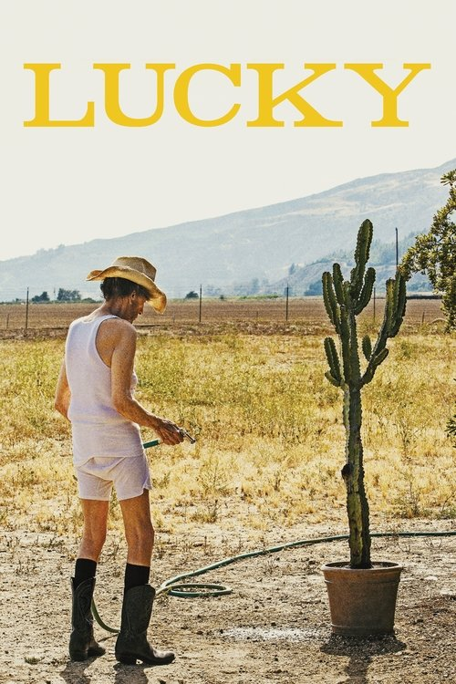
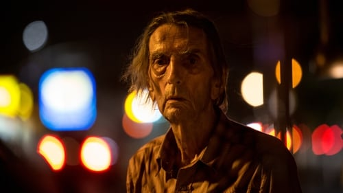



<nav class="films">
  <a class="prev" href="../the-party-2017">Previous</a>
  <a href="../">Film list</a>
  <a class="next" href="../cest-la-vie-2017">Next</a>
</nav>

69 / 100

<article class="film">
  

    
    
  

  <h1>Lucky ({{ film | filmYear }})</h1>

  

  

    Directed by <strong>{{ film | directors }}</strong>
  

  <h2>
    Cast
  </h2>
  <ul>
            <li><strong>Harry Dean Stanton</strong> as <em>Lucky</em></li>
        <li><strong>David Lynch</strong> as <em>Howard</em></li>
        <li><strong>Ron Livingston</strong> as <em>Bobby Lawrence</em></li>
        <li><strong>Ed Begley Jr.</strong> as <em>Dr. Kneedler</em></li>
        <li><strong>Tom Skerritt</strong> as <em>Fred</em></li>
        <li><strong>Barry Shabaka Henley</strong> as <em>Joe</em></li>
        <li><strong>James Darren</strong> as <em>Paulie</em></li>
        <li><strong>Beth Grant</strong> as <em>Elaine</em></li>
        <li><strong>Yvonne Huff Lee</strong> as <em>Loretta</em></li>
        <li><strong>Hugo Armstrong</strong> as <em>Vincent</em></li>
        <li><strong>Bertila Damas</strong> as <em>Bibi</em></li>
        <li><strong>Pamela Sparks</strong> as <em>Pam</em></li>
        <li><strong>Mouse</strong> as <em>Mouse</em></li>
        <li><strong>Ulysses Olmedo</strong> as <em>Juan Wayne</em></li>
        <li><strong>Ana Mercedes</strong> as <em>Victoria</em></li>
        <li><strong>Sarah Cook</strong> as <em>Debbie</em></li>
        <li><strong>Amy Claire</strong> as <em>Frances</em></li>
        <li><strong>Otti Feder</strong> as <em>Woman With Walker</em></li>
        <li><strong>Fiona</strong> as <em>Fiona</em></li>
        <li><strong>Alan Corvaia</strong> as <em>Vero (uncredited)</em></li>
        <li><strong>Johnny Glasser</strong> as <em>Background (uncredited)</em></li>
        <li><strong>Dan Gruenberg</strong> as <em>Laughing Barfly (uncredited)</em></li>
        <li><strong>Mikey Kampmann</strong> as <em>Hipster (uncredited)</em></li>
        <li><strong>Daniel R. Lawson Jr.</strong> as <em>Patron (uncredited)</em></li>
        <li><strong>Kim Kaycee Page</strong> as <em>Susan (uncredited)</em></li>
        <li><strong>Rhandy Torres</strong> as <em>TV Producer (uncredited)</em></li>
        <li><strong>Liberace</strong> as <em>Self (archive footage) (uncredited)</em></li>
  </ul>
</article>
<footer>
  <a href="../about">About this list</a>
</footer>
