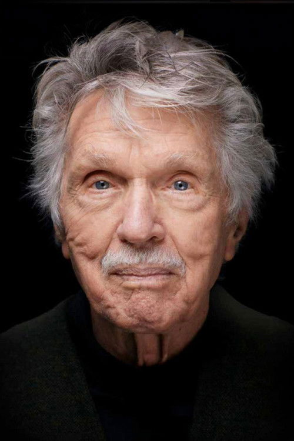
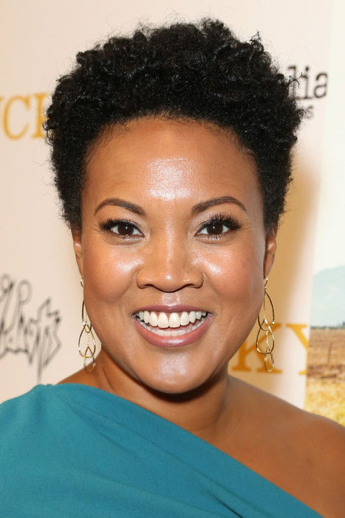



<nav class="films">
  

    <a href="../lady-bird-2017"><i class="fa-solid fa-chevron-left fa-xs"></i> Previous</a>
  

  

    <a class="simple" href="../">62 / 100</a>
  

  

    <a href="../the-party-2017">Next <i class="fa-solid fa-chevron-right fa-xs"></i></a>
  

  

    
      Previous film:
      Lady Bird
    
    
      Next film:
      The Party
    
  

</nav>

<article class="film slug-lucky-2017">
  

    
    
  

  <h1>{{ film.title }} ({{ film | filmYear }})</h1>

  

    Language: {{ film.language }}.
    
  

  

    Directed by <strong>{{ film | directors }}</strong>
  

  
    <blockquote>
      {{ films.reviews[slug] | safe }} <em>—&nbsp;<a href="/bill">Bill</a></em>
    </blockquote>
  

  <section class="cast-grid">
  

    

  
  

    Harry Dean Stanton
    Lucky
  

    

  
  

    David Lynch
    Howard
  

    

  
  

    Ron Livingston
    Bobby Lawrence
  

    

  
  

    Ed Begley Jr.
    Dr. Kneedler
  

    

  
  

    Tom Skerritt
    Fred
  

    

  
  

    Barry Shabaka Henley
    Joe
  

    

  
  

    James Darren
    Paulie
  

    

  
  

    Beth Grant
    Elaine
  

    

  
  

    Yvonne Huff Lee
    Loretta
  

    

  
  

    Hugo Armstrong
    Vincent
  

    

  
  

    Bertila Damas
    Bibi
  

    

  
<i class="fa-solid fa-user"></i>

  

    Pamela Sparks
    Pam
  

  

</section>

  <section class="film-detail">
    

      

        

          <i class="fa-solid fa-masks-theater"></i>
          Cast
        

        <ul>
          
            <li>
              {{ cast.name }} as <em>{{ cast.character }}</em>
            </li>
          
        </ul>
      

      

        

          <i class="fa-solid fa-clapperboard"></i>
          Crew
        

        <ul>
          
            <li>
              {{ crew.name }} &mdash; <em>{{ crew.job }}</em>
            </li>
          
        </ul>
      

    

  </section>

  <section class="related-films">
  <h2>Related films</h2>
  <ul>
    <li><a href="../paris-texas-1984">Paris, Texas</a> because of Harry Dean Stanton</li>
<li><a href="../the-straight-story-1999">The Straight Story</a> because of Harry Dean Stanton and David Lynch</li>
<li><a href="../fargo-1996">Fargo</a> because of John Carroll Lynch</li>
<li><a href="../the-fabelmans-2022">The Fabelmans</a> because of David Lynch</li>
<li><a href="../no-country-for-old-men-2007">No Country for Old Men</a> because of Beth Grant</li>
  </ul>
</section>

</article>
