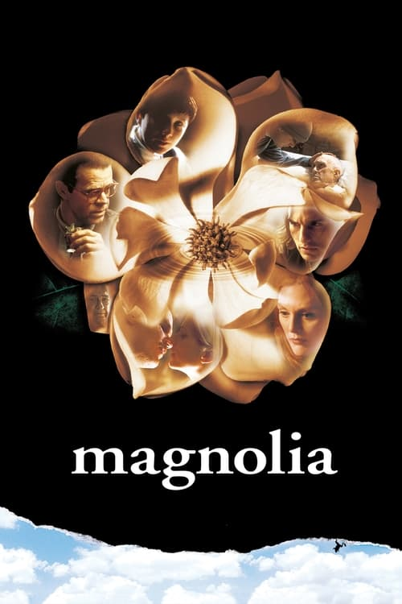

<nav class="films">
  <a class="prev" href="../the-straight-story">Previous</a>
  <a href="../">Film list</a>
  <a class="next" href="../the-talented-mr-ripley">Next</a>
</nav>

42 / 100

<article class="film">
  <h1>Magnolia (1999)</h1>

  

    Directed by <strong>Paul Thomas Anderson</strong>
  

  

  <h2>
    Cast
  </h2>
  <ul>
    <li><strong>Tom Cruise</strong> as <em>Frank T.J. Mackey</em></li>
<li><strong>Philip Baker Hall</strong> as <em>Jimmy Gator</em></li>
<li><strong>Philip Seymour Hoffman</strong> as <em>Phil Parma</em></li>
<li><strong>Julianne Moore</strong> as <em>Linda Partridge</em></li>
<li><strong>William H. Macy</strong> as <em>Quiz Kid Donnie Smith</em></li>
<li><strong>John C. Reilly</strong> as <em>Officer Jim Kurring</em></li>
<li><strong>Melora Walters</strong> as <em>Claudia Wilson Gator</em></li>
<li><strong>Jeremy Blackman</strong> as <em>Stanley Spector</em></li>
<li><strong>Jason Robards</strong> as <em>Earl Partridge</em></li>
<li><strong>Melinda Dillon</strong> as <em>Rose Gator</em></li>
<li><strong>Michael Bowen</strong> as <em>Rick Spector</em></li>
<li><strong>April Grace</strong> as <em>Gwenovier</em></li>
<li><strong>Ricky Jay</strong> as <em>Burt Ramsey / Narrator</em></li>
<li><strong>Emmanuel Johnson</strong> as <em>Dixon</em></li>
<li><strong>Pat Healy</strong> as <em>Sir Edmund William Godfrey / Young Pharmacy Kid</em></li>
<li><strong>Genevieve Zweig</strong> as <em>Mrs. Godfrey</em></li>
<li><strong>Mark Flanagan</strong> as <em>Joseph Green</em></li>
<li><strong>Neil Flynn</strong> as <em>Stanley Berry</em></li>
<li><strong>Rod McLachlan</strong> as <em>Daniel Hill</em></li>
<li><strong>Allan Graf</strong> as <em>Firefighter</em></li>
<li><strong>Patton Oswalt</strong> as <em>Delmer Darion</em></li>
<li><strong>Raymond 'Big Guy' Gonzales</strong> as <em>Reno Security Guard</em></li>
<li><strong>Brad Hunt</strong> as <em>Craig Hansen</em></li>
<li><strong>Jim Meskimen</strong> as <em>Forensic Scientist</em></li>
<li><strong>Chris O'Hara</strong> as <em>Sydney Barringer</em></li>
<li><strong>Clement Blake</strong> as <em>Arthur Barringer</em></li>
<li><strong>Frank Elmore</strong> as <em>1958 Detective</em></li>
<li><strong>John Kraft Seitz</strong> as <em>1958 Policeman</em></li>
<li><strong>Cory Buck</strong> as <em>Young Boy</em></li>
<li><strong>Tim Soronen</strong> as <em>Infomercial Guy</em></li>
<li><strong>Jim Ortlieb</strong> as <em>Middle-Aged Guy</em></li>
<li><strong>Thomas Jane</strong> as <em>Young Jimmy Gator</em></li>
<li><strong>Holly Houston</strong> as <em>Jimmy's Showgirl</em></li>
<li><strong>Benjamin Niedens</strong> as <em>Little Donnie Smith</em></li>
<li><strong>Veronica Hart</strong> as <em>Dentist Nurse #1</em></li>
<li><strong>Missy Spell Tanner</strong> as <em>Dentist Nurse #2</em></li>
<li><strong>James Kiriyama-Lem</strong> as <em>Dr. Lee</em></li>
<li><strong>Jake Cross</strong> as <em>Pedestrian #1</em></li>
<li><strong>Charlie Scott Jr.</strong> as <em>Pedestrian #2</em></li>
<li><strong>Juan Medrano</strong> as <em>Nurse Juan</em></li>
<li><strong>John Pritchett</strong> as <em>Police Captain</em></li>
<li><strong>Cleo King</strong> as <em>Marcie</em></li>
<li><strong>Don McManus</strong> as <em>Dr. Landon</em></li>
<li><strong>Michael Shamus Wiles</strong> as <em>Captain Muffy</em></li>
<li><strong>Jason Andrews</strong> as <em>Doc</em></li>
<li><strong>John S. Davies</strong> as <em>Cameraman</em></li>
<li><strong>Kevin Breznahan</strong> as <em>Geoff, Seminar Guy</em></li>
<li><strong>Miguel Pérez</strong> as <em>Avi Solomon</em></li>
<li><strong>Alfred Molina</strong> as <em>Solomon Solomon</em></li>
<li><strong>David Masuda</strong> as <em>Coroner Man</em></li>
<li><strong>Neil Pepe</strong> as <em>Officer #1</em></li>
<li><strong>Lionel Mark Smith</strong> as <em>Detective</em></li>
<li><strong>Annette Helde</strong> as <em>Coroner Woman</em></li>
<li><strong>Lynne Lerner</strong> as <em>Librarian</em></li>
<li><strong>Felicity Huffman</strong> as <em>Cynthia</em></li>
<li><strong>Scott Burkett</strong> as <em>WDKK Page #1</em></li>
<li><strong>Bob Brewer</strong> as <em>Richard's Dad</em></li>
<li><strong>Julie Brewer</strong> as <em>Richard's Mom</em></li>
<li><strong>Nancy Marston</strong> as <em>Julia's Mom</em></li>
<li><strong>Maurey Marston</strong> as <em>Julia's Dad</em></li>
<li><strong>Jamala Gaither</strong> as <em>WDKK P.A.</em></li>
<li><strong>Danny Wells</strong> as <em>Dick Jennings</em></li>
<li><strong>Amy Brown</strong> as <em>WDKK Page #2</em></li>
<li><strong>Eileen Ryan</strong> as <em>Mary</em></li>
<li><strong>Meagen Fay</strong> as <em>Dr. Diane</em></li>
<li><strong>Patricia Forte</strong> as <em>Mim</em></li>
<li><strong>Luis Guzmán</strong> as <em>Luis</em></li>
<li><strong>Patrick Warren</strong> as <em>Todd Geronimo</em></li>
<li><strong>Orlando Jones</strong> as <em>Worm</em></li>
<li><strong>Virginia Pereira</strong> as <em>Pink Dot Girl (voice)</em></li>
<li><strong>Craig Kvinsland</strong> as <em>Brad the Bartender</em></li>
<li><strong>Patricia Scanlon</strong> as <em>Cocktail Waitress</em></li>
<li><strong>Henry Gibson</strong> as <em>Thurston Howell</em></li>
<li><strong>Natalie Elizabeth Marston</strong> as <em>Julia</em></li>
<li><strong>Bobby Brewer</strong> as <em>Richard</em></li>
<li><strong>Clark Gregg</strong> as <em>WDKK Floor Director</em></li>
<li><strong>Art Frankel</strong> as <em>Old Pharmacist</em></li>
<li><strong>Matt Gerald</strong> as <em>Officer #2</em></li>
<li><strong>Guillermo Melgarejo</strong> as <em>Pink Dot Guy</em></li>
<li><strong>Paul F. Tompkins</strong> as <em>Chad (Seduce & Destroy) (voice)</em></li>
<li><strong>Mary Lynn Rajskub</strong> as <em>Janet (Frank's Assistant) (voice)</em></li>
<li><strong>Jim Beaver</strong> as <em>Smiling Peanut Patron #1</em></li>
<li><strong>Ezra Buzzington</strong> as <em>Smiling Peanut Patron #2</em></li>
<li><strong>Denise Woolfork</strong> as <em>Smiling Peanut Patron #3</em></li>
<li><strong>Michael Murphy</strong> as <em>Alan Kligman, Esq.</em></li>
<li><strong>Robert Downey Sr.</strong> as <em>WDKK Show Director</em></li>
<li><strong>William Mapother</strong> as <em>WDKK Show Director's Assistant</em></li>
<li><strong>Larry Ballard</strong> as <em>WDKK Medic</em></li>
<li><strong>Brett Higgins</strong> as <em>Mackey Disciple Twin #1</em></li>
<li><strong>Brian Higgins</strong> as <em>Mackey Disciple Twin #2</em></li>
<li><strong>Michael Lee Phillips Jr.</strong> as <em>Mackey Disciple in Middle</em></li>
<li><strong>Lillian Adams</strong> as <em>Donnie's Old Neighbor</em></li>
<li><strong>Steven Bush</strong> as <em>Paramedic #1</em></li>
<li><strong>Mike Massa</strong> as <em>Paramedic #2</em></li>
<li><strong>Dale Gibson</strong> as <em>Paramedic #3</em></li>
<li><strong>Scott Alan Smith</strong> as <em>E.R. Doctor</em></li>
<li><strong>Paul Thomas Anderson</strong> as <em>Man Confiscating Sign (uncredited)</em></li>
<li><strong>Miriam Margolyes</strong> as <em>Faye Barringer (uncredited)</em></li>
<li><strong>Bruno Angelico</strong> as <em>Fireman #2 (uncredited)</em></li>
<li><strong>Robert Bella</strong> as <em>Detective #2 (uncredited)</em></li>
<li><strong>Greg Bronson</strong> as <em>Waiter (uncredited)</em></li>
<li><strong>Douglas Busby</strong> as <em>Extra (uncredited)</em></li>
<li><strong>Marc Davies</strong> as <em>Seminar Attendee #1 (uncredited)</em></li>
<li><strong>Bruce Gregory</strong> as <em>Randy (uncredited)</em></li>
<li><strong>Phil Hawn</strong> as <em>Bob (uncredited)</em></li>
<li><strong>Spencer Kayden</strong> as <em>Seminar Patron (uncredited)</em></li>
<li><strong>Brian Kehew</strong> as <em>Seminar Patron (uncredited)</em></li>
<li><strong>Michael Laren</strong> as <em>Officer Tom 1958 (uncredited)</em></li>
<li><strong>Aimee Mann</strong> as <em>Hot Date Infomercial (uncredited)</em></li>
<li><strong>Tom Ohmer</strong> as <em>Detective (uncredited)</em></li>
<li><strong>Colleen Pelletier</strong> as <em>Gameshow Audience Member (uncredited)</em></li>
<li><strong>Herb Santos Jr.</strong> as <em>21 Dealer (uncredited)</em></li>
<li><strong>Tom Tangen</strong> as <em>Drunken Dart Player (uncredited)</em></li>
  </ul>
</article>
<footer>
  <a href="../about">About this list</a>
</footer>
