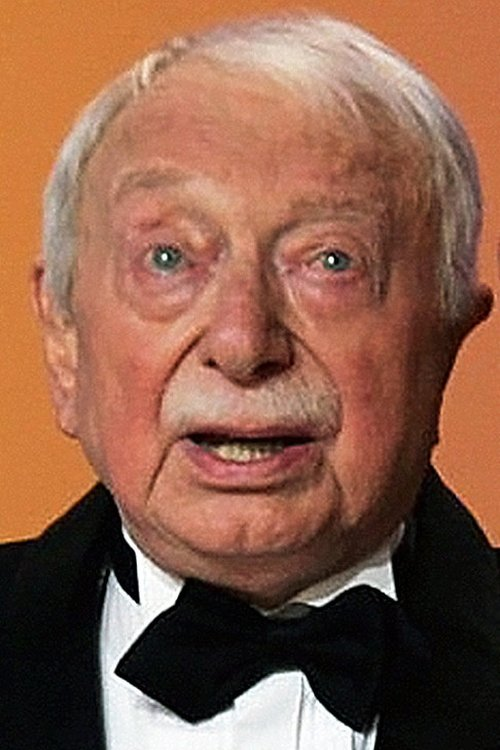



<nav class="films">
  

    <a href="../24-hour-party-people-2002"><i class="fa-solid fa-chevron-left fa-xs"></i> Previous</a>
  

  

    <a class="simple" href="../">41 / 100</a>
  

  

    <a href="../the-bourne-identity-2002">Next <i class="fa-solid fa-chevron-right fa-xs"></i></a>
  

  

    
      Previous film:
      24 Hour Party People
    
    
      Next film:
      The Bourne Identity
    
  

</nav>

<article class="film slug-man-on-the-train-2002">
  

    
    
  

  <h1>{{ film.title }} ({{ film | filmYear }})</h1>

  

    Language: {{ film.language }}.
    Also known as L'Homme du train.
  

  

    Directed by <strong>{{ film | directors }}</strong>
  

  
    <blockquote>
      {{ films.reviews[slug] | safe }} <em>—&nbsp;<a href="/bill">Bill</a></em>
    </blockquote>
  

  <section class="cast-grid">
  

    

  
  

    Jean Rochefort
    Monsieur Manesquier
  

    

  
  

    Johnny Hallyday
    Milan
  

    

  
  

    Jean-François Stévenin
    Luigi
  

    

  
  

    Pascal Parmentier
    Sadko
  

    

  
  

    Charlie Nelson
    Max
  

    

  
  

    Isabelle Petit-Jacques
    Viviane, Manesquier's mistress
  

    

  
  

    Édith Scob
    Manesquier's Sister
  

    

  
  

    Maurice Chevit
    Hairdresser
  

    

  
  

    Riton Liebman
    Burly Guy
  

    

  
<i class="fa-solid fa-user"></i>

  

    Olivier Fauron
    Schoolboy
  

    

  
  

    Véronique Kapoyan
    Baker
  

    

  
<i class="fa-solid fa-user"></i>

  

    Armand Chagot
    Gardener of Manesquier
  

  

</section>

  <section class="film-detail">
    

      

        

          <i class="fa-solid fa-masks-theater"></i>
          Cast
        

        <ul>
          
            <li>
              {{ cast.name }} as <em>{{ cast.character }}</em>
            </li>
          
        </ul>
      

      

        

          <i class="fa-solid fa-clapperboard"></i>
          Crew
        

        <ul>
          
            <li>
              {{ crew.name }} &mdash; <em>{{ crew.job }}</em>
            </li>
          
        </ul>
      

    

  </section>

  <section class="related-films">
  <h2>Related films</h2>
  <ul>
    <li><a href="../day-for-night-1973">Day for Night</a> because of Jean-François Stévenin</li>
  </ul>
</section>

</article>
