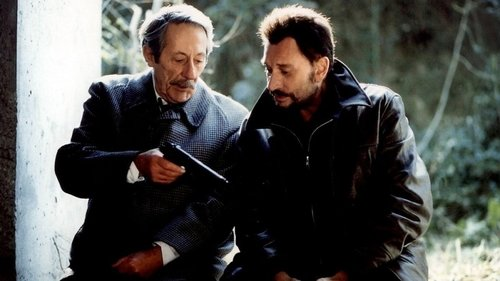

<nav class="films">
  <a class="prev" href="../the-bourne-identity">Previous</a>
  <a href="../">Film list</a>
  <a class="next" href="../phone-booth">Next</a>
</nav>

49 / 100

<article class="film">
  
  

  <h1>Man on the Train (2002)</h1>

  

    Directed by <strong>Patrice Leconte</strong>
  

  <h2>
    Cast
  </h2>
  <ul>
    <li><strong>Jean Rochefort</strong> as <em>Monsieur Manesquier</em></li>
<li><strong>Johnny Hallyday</strong> as <em>Milan</em></li>
<li><strong>Jean-François Stévenin</strong> as <em>Luigi</em></li>
<li><strong>Pascal Parmentier</strong> as <em>Sadko</em></li>
<li><strong>Charlie Nelson</strong> as <em>Max</em></li>
<li><strong>Isabelle Petit-Jacques</strong> as <em>Viviane, Manesquier's mistress</em></li>
<li><strong>Édith Scob</strong> as <em>Manesquier's Sister</em></li>
<li><strong>Maurice Chevit</strong> as <em>Hairdresser</em></li>
<li><strong>Riton Liebman</strong> as <em>Burly Guy</em></li>
<li><strong>Olivier Fauron</strong> as <em>Schoolboy</em></li>
<li><strong>Véronique Kapoyan</strong> as <em>Baker</em></li>
<li><strong>Armand Chagot</strong> as <em>Gardener of Manesquier</em></li>
<li><strong>Michel Laforest</strong> as <em>Pharmacist</em></li>
<li><strong>Alain Guellaff</strong> as <em>Surgeon</em></li>
<li><strong>Hélène Chambon</strong> as <em>Radiologist Nurse</em></li>
<li><strong>Sophie Durand</strong> as <em>Operating Room Nurse</em></li>
<li><strong>Sébastien Bonnet</strong> as <em>Burly Guy's Friend</em></li>
  </ul>
</article>
<footer>
  <a href="../about">About this list</a>
</footer>
