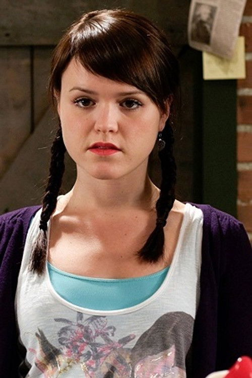



<nav class="films">
  

    <a href="../taxi-2015"><i class="fa-solid fa-chevron-left fa-xs"></i> Previous</a>
  

  

    <a class="simple" href="../">58 / 100</a>
  

  

    <a href="../the-handmaiden-2016">Next <i class="fa-solid fa-chevron-right fa-xs"></i></a>
  

  

    
      Previous film:
      Taxi
    
    
      Next film:
      The Handmaiden
    
  

</nav>

<article class="film slug-maudie-2016">
  

    
    
  

  <h1>{{ film.title }} ({{ film | filmYear }})</h1>

  

    Language: {{ film.language }}.
    
  

  

    Directed by <strong>{{ film | directors }}</strong>
  

  
    <blockquote>
      {{ films.reviews[slug] | safe }} <em>—&nbsp;<a href="/bill">Bill</a></em>
    </blockquote>
  

  <section class="cast-grid">
  

    

  
  

    Sally Hawkins
    Maud Lewis
  

    

  
  

    Ethan Hawke
    Everett Lewis
  

    

  
  

    Gabrielle Rose
    Aunt Ida
  

    

  
  

    Billy MacLellan
    Frank
  

    

  
  

    Zachary Bennett
    Charles Dowley
  

    

  
  

    Kari Matchett
    Sandra
  

    

  
  

    David Feehan
    Paul
  

    

  
  

    Lawrence Barry
    Mr. Davis (Shopkeeper)
  

    

  
  

    Marthe Bernard
    Kay
  

    

  
  

    Greg Malone
    Mr. Hill
  

    

  
  

    Nik Sexton
    Steven (CBC Reporter)
  

    

  
  

    Brian Marler
    Doctor
  

  

</section>

  <section class="film-detail">
    

      

        

          <i class="fa-solid fa-masks-theater"></i>
          Cast
        

        <ul>
          
            <li>
              {{ cast.name }} as <em>{{ cast.character }}</em>
            </li>
          
        </ul>
      

      

        

          <i class="fa-solid fa-clapperboard"></i>
          Crew
        

        <ul>
          
            <li>
              {{ crew.name }} &mdash; <em>{{ crew.job }}</em>
            </li>
          
        </ul>
      

    

  </section>

  <section class="related-films">
  <h2>Related films</h2>
  <ul>
    <li><a href="../eternal-beauty-2020">Eternal Beauty</a> because of Sally Hawkins</li>
  </ul>
</section>

</article>
