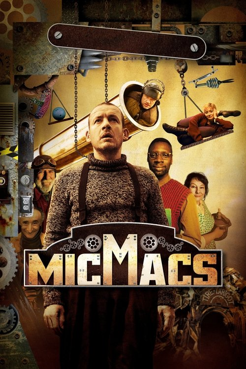
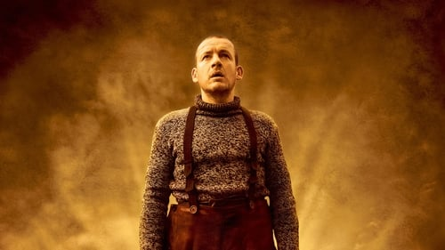



<nav class="films">
  <a class="prev" href="../fantastic-mr-fox-2009">Previous</a>
  <a href="../">Film list</a>
  <a class="next" href="../tomboy-2011">Next</a>
</nav>

58 / 100

<article class="film">
  

    
    
  

  <h1>Micmacs ({{ film | filmYear }})</h1>

  
Also known as <strong>Micmacs à tire-larigot</strong>

  

    Directed by <strong>{{ film | directors }}</strong>
  

  <h2>
    Cast
  </h2>
  <ul>
            <li><strong>Dany Boon</strong> as <em>Bazil</em></li>
        <li><strong>Dominique Pinon</strong> as <em>Fracasse</em></li>
        <li><strong>André Dussollier</strong> as <em>Nicolas Thibault De Fenouillet</em></li>
        <li><strong>Jean-Pierre Marielle</strong> as <em>Placard</em></li>
        <li><strong>Julie Ferrier</strong> as <em>Rubber Kid</em></li>
        <li><strong>Yolande Moreau</strong> as <em>Tambouille</em></li>
        <li><strong>Michel Crémadès</strong> as <em>Petit Pierre</em></li>
        <li><strong>Nicolas Marié</strong> as <em>François Marconi</em></li>
        <li><strong>Omar Sy</strong> as <em>Remington</em></li>
        <li><strong>Marie-Julie Baup</strong> as <em>Calculette</em></li>
        <li><strong>Philippe Girard</strong> as <em>Gravier</em></li>
        <li><strong>Thérèse Roussel</strong> as <em>Old Lady in Bed</em></li>
        <li><strong>Alix Poisson</strong> as <em>Blue Train Hostess</em></li>
        <li><strong>Stéphanie Gesnel</strong> as <em>Lewd Technician's Partner</em></li>
        <li><strong>Juliette Armanet</strong> as <em>Subway Singer</em></li>
  </ul>
</article>
<footer>
  <a href="../about">About this list</a>
</footer>
