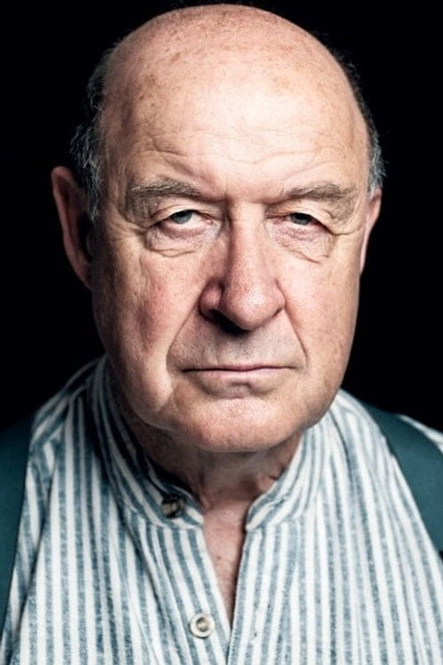
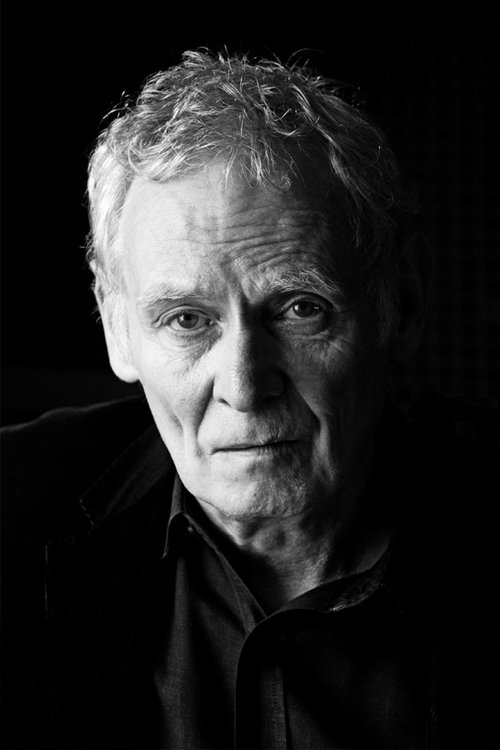



<nav class="films">
  

    <a href="../dallas-buyers-club-2013"><i class="fa-solid fa-chevron-left fa-xs"></i> Previous</a>
  

  

    <a class="simple" href="../">55 / 100</a>
  

  

    <a href="../the-grand-budapest-hotel-2014">Next <i class="fa-solid fa-chevron-right fa-xs"></i></a>
  

  

    
      Previous film:
      Dallas Buyers Club
    
    
      Next film:
      The Grand Budapest Hotel
    
  

</nav>

<article class="film slug-mr-turner-2014">
  

    
    
  

  <h1>{{ film.title }} ({{ film | filmYear }})</h1>

  

    Language: {{ film.language }}.
    
  

  

    Directed by <strong>{{ film | directors }}</strong>
  

  
    <blockquote>
      {{ films.reviews[slug] | safe }} <em>—&nbsp;<a href="/bill">Bill</a></em>
    </blockquote>
  

  <section class="cast-grid">
  

    

  
  

    Timothy Spall
    JMW Turner
  

    

  
  

    Dorothy Atkinson
    Hannah Danby
  

    

  
  

    Marion Bailey
    Sophia Booth
  

    

  
  

    Paul Jesson
    William Turner Snr
  

    

  
  

    Lesley Manville
    Mary Somerville
  

    

  
  

    Martin Savage
    Benjamin Robert Haydon
  

    

  
  

    Ruth Sheen
    Sarah Danby
  

    

  
  

    David Horovitch
    Dr Price
  

    

  
  

    Karl Johnson
    Mr. Booth
  

    

  
  

    Peter Wight
    Joseph Gillot
  

    

  
  

    Joshua McGuire
    John Ruskin
  

    

  
  

    Stuart McQuarrie
    Ruskin's Father
  

  

</section>

  <section class="film-detail">
    

      

        

          <i class="fa-solid fa-masks-theater"></i>
          Cast
        

        <ul>
          
            <li>
              {{ cast.name }} as <em>{{ cast.character }}</em>
            </li>
          
        </ul>
      

      

        

          <i class="fa-solid fa-clapperboard"></i>
          Crew
        

        <ul>
          
            <li>
              {{ crew.name }} &mdash; <em>{{ crew.job }}</em>
            </li>
          
        </ul>
      

    

  </section>

  <section class="related-films">
  <h2>Related films</h2>
  <ul>
    <li><a href="../brazil-1985">Brazil</a> because of Roger Ashton-Griffiths</li>
<li><a href="../trainspotting-1996">Trainspotting</a> because of Stuart McQuarrie</li>
<li><a href="../the-bourne-identity-2002">The Bourne Identity</a> because of Vincent Franklin</li>
<li><a href="../hot-fuzz-2007">Hot Fuzz</a> because of Karl Johnson and Peter Wight</li>
<li><a href="../in-bruges-2008">In Bruges</a> because of Elizabeth Berrington</li>
<li><a href="../the-party-2017">The Party</a> because of Timothy Spall</li>
<li><a href="../little-women-2019">Little Women</a> because of James Norton</li>
  </ul>
</section>

</article>
