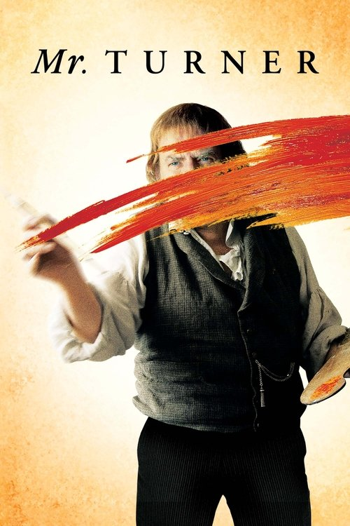
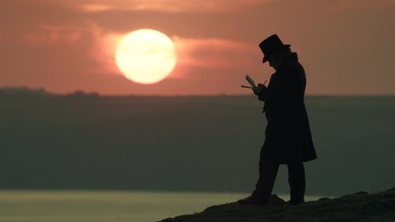

<nav class="films">
  <a class="prev" href="../the-grand-budapest-hotel">Previous</a>
  <a href="../">Film list</a>
  <a class="next" href="../interstellar">Next</a>
</nav>

63 / 100

<article class="film">
  
  

  <h1>Mr. Turner (2014)</h1>

  

    Directed by <strong>Mike Leigh</strong>
  

  <h2>
    Cast
  </h2>
  <ul>
    <li><strong>Timothy Spall</strong> as <em>JMW Turner</em></li>
<li><strong>Dorothy Atkinson</strong> as <em>Hannah Danby</em></li>
<li><strong>Marion Bailey</strong> as <em>Sophia Booth</em></li>
<li><strong>Paul Jesson</strong> as <em>William Turner Snr</em></li>
<li><strong>Lesley Manville</strong> as <em>Mary Somerville</em></li>
<li><strong>Martin Savage</strong> as <em>Benjamin Robert Haydon</em></li>
<li><strong>Ruth Sheen</strong> as <em>Sarah Danby</em></li>
<li><strong>David Horovitch</strong> as <em>Dr Price</em></li>
<li><strong>Karl Johnson</strong> as <em>Mr. Booth</em></li>
<li><strong>Peter Wight</strong> as <em>Joseph Gillot</em></li>
<li><strong>Joshua McGuire</strong> as <em>John Ruskin</em></li>
<li><strong>Stuart McQuarrie</strong> as <em>Ruskin's Father</em></li>
<li><strong>Sylvestra Le Touzel</strong> as <em>Ruskin's Mother</em></li>
<li><strong>Leo Bill</strong> as <em>JE Mayall</em></li>
<li><strong>Kate O'Flynn</strong> as <em>Prostitute</em></li>
<li><strong>Sinead Matthews</strong> as <em>Queen Victoria</em></li>
<li><strong>Karina Fernandez</strong> as <em>Miss Coggins</em></li>
<li><strong>Richard Bremmer</strong> as <em>George Jones</em></li>
<li><strong>Mark Stanley</strong> as <em>Clarkson Stanfield</em></li>
<li><strong>Jamie Thomas King</strong> as <em>David Roberts</em></li>
<li><strong>Tom Wlaschiha</strong> as <em>Prince Albert</em></li>
<li><strong>Patrick Godfrey</strong> as <em>Lord Egremont</em></li>
<li><strong>Niall Buggy</strong> as <em>John Carew</em></li>
<li><strong>Fred Pearson</strong> as <em>Sir William Beechey</em></li>
<li><strong>Tom Edden</strong> as <em>CR Leslie</em></li>
<li><strong>Clive Francis</strong> as <em>Sir Martin Archer Shee</em></li>
<li><strong>Robert Portal</strong> as <em>Sir Charles Eastlake</em></li>
<li><strong>James Fleet</strong> as <em>John Constable</em></li>
<li><strong>Roger Ashton-Griffiths</strong> as <em>Henry William Pickersgill</em></li>
<li><strong>Simon Chandler</strong> as <em>Sir Augustus Wall Callcott</em></li>
<li><strong>Edward de Souza</strong> as <em>Thomas Stothard</em></li>
<li><strong>Oliver Maltman</strong> as <em>Theatre Actor</em></li>
<li><strong>Sam Kelly</strong> as <em>Theatre Actor</em></li>
<li><strong>Sandy Foster</strong> as <em>Evelina</em></li>
<li><strong>Amy Dawson</strong> as <em>Georgiana</em></li>
<li><strong>Alice Bailey Johnson</strong> as <em>Young Lady Singer</em></li>
<li><strong>Alice Orr-Ewing</strong> as <em>Second Young Lady</em></li>
<li><strong>Veronica Roberts</strong> as <em>Lady Stuckley</em></li>
<li><strong>Richard Dixon</strong> as <em>Mr Manners</em></li>
<li><strong>Michael Keane</strong> as <em>Clergyman</em></li>
<li><strong>James Norton</strong> as <em>Clarinettist</em></li>
<li><strong>David Ryall</strong> as <em>Footman</em></li>
<li><strong>Nicola Sloane</strong> as <em>Brothel Keeper</em></li>
<li><strong>Eleanor Yates</strong> as <em>Ruskin's Wife</em></li>
<li><strong>Fenella Woolgar</strong> as <em>Lady Eastlake</em></li>
<li><strong>Richard Cordery</strong> as <em>Dinner Guest</em></li>
<li><strong>James Dryden</strong> as <em>Cornelius</em></li>
<li><strong>Marcello Magni</strong> as <em>Colourman</em></li>
<li><strong>Mark Wingett</strong> as <em>Mariner</em></li>
<li><strong>Ruby Bentall</strong> as <em>Unhappy Couple</em></li>
<li><strong>Lee Ingleby</strong> as <em>Unhappy Couple</em></li>
<li><strong>Pearl Chanda</strong> as <em>Theatre Actor</em></li>
<li><strong>Ned Derrington</strong> as <em>Theatre Actor</em></li>
<li><strong>Phil Elstob</strong> as <em>Theatre Actor</em></li>
<li><strong>Peter Hannah</strong> as <em>Theatre Actor</em></li>
<li><strong>Francesca Zoutewelle</strong> as <em>Theatre Actor</em></li>
<li><strong>Billy Holland</strong> as <em>Boy Actor</em></li>
<li><strong>Michael Culkin</strong> as <em>Gentleman Critic</em></li>
<li><strong>Vincent Franklin</strong> as <em>Gentleman Critic</em></li>
<li><strong>Nicholas Woodeson</strong> as <em>Gentleman Critic</em></li>
<li><strong>Elizabeth Berrington</strong> as <em>Lady Critics</em></li>
<li><strong>Eileen Davies</strong> as <em>Lady Critics</em></li>
<li><strong>Bob Goody</strong> as <em>Gallery Visitor</em></li>
<li><strong>Terrence Hardiman</strong> as <em>Gallery Visitor</em></li>
<li><strong>Theresa Watson</strong> as <em>Gallery Visitor</em></li>
<li><strong>Judi Scott</strong> as <em>Neighbour</em></li>
<li><strong>Angela Curran</strong> as <em>Neighbour</em></li>
<li><strong>Amanda Lawrence</strong> as <em>Hannah's Friend</em></li>
<li><strong>Judith Amsenga</strong> as <em>Dutch Lady</em></li>
<li><strong>Helen Cooper</strong> as <em>Dutch Lady</em></li>
<li><strong>Stuart Matthews</strong> as <em>Market Trader (uncredited)</em></li>
<li><strong>Nicholas Jones</strong> as <em>Sir John Soane</em></li>
<li><strong>Robert J. Fraser</strong> as <em>Art Student (uncredited)</em></li>
  </ul>
</article>
<footer>
  <a href="../about">About this list</a>
</footer>
