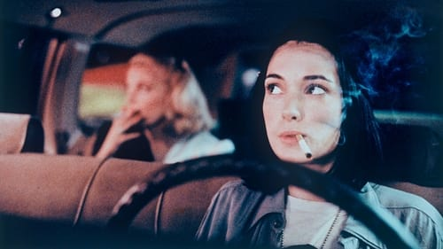



<nav class="films">
  <a class="prev" href="../delicatessen-1991">Previous</a>
  <a href="../">Film list</a>
  <a class="next" href="../the-fugitive-1993">Next</a>
</nav>

31 / 100

<article class="film">
  

    
    
  

  <h1>Night on Earth ({{ film | filmYear }})</h1>

  

  

    Directed by <strong>{{ film | directors }}</strong>
  

  <h2>
    Cast
  </h2>
  <ul>
            <li><strong>Winona Ryder</strong> as <em>Corky</em></li>
        <li><strong>Gena Rowlands</strong> as <em>Victoria Snelling</em></li>
        <li><strong>Giancarlo Esposito</strong> as <em>YoYo</em></li>
        <li><strong>Armin Mueller-Stahl</strong> as <em>Helmut Grokenberger</em></li>
        <li><strong>Rosie Perez</strong> as <em>Angela</em></li>
        <li><strong>Isaach de Bankolé</strong> as <em>Cab Driver Paris</em></li>
        <li><strong>Béatrice Dalle</strong> as <em>Blind Woman</em></li>
        <li><strong>Roberto Benigni</strong> as <em>Cab Driver Rome</em></li>
        <li><strong>Paolo Bonacelli</strong> as <em>Priest</em></li>
        <li><strong>Matti Pellonpää</strong> as <em>Mika</em></li>
        <li><strong>Kari Väänänen</strong> as <em>Man #1 Helsinki</em></li>
        <li><strong>Sakari Kuosmanen</strong> as <em>Man #2 Helsinki</em></li>
        <li><strong>Tomi Salmela</strong> as <em>Aki</em></li>
        <li><strong>Lisanne Falk</strong> as <em>Rock Manager</em></li>
        <li><strong>Alan Randolph Scott</strong> as <em>Rock Musician #1</em></li>
        <li><strong>Anthony Portillo</strong> as <em>Rock Musician #2</em></li>
        <li><strong>Richard Boes</strong> as <em>Cab Driver New York</em></li>
        <li><strong>Pascal N'Zonzi</strong> as <em>Passenger #1</em></li>
        <li><strong>Emile Abossolo M'bo</strong> as <em>Passenger #2</em></li>
        <li><strong>Noel Kaufmann</strong> as <em>Motorcyclist</em></li>
        <li><strong>Stéphane Boucher</strong> as <em>Man in Accident</em></li>
        <li><strong>Gianni Schettini</strong> as <em>Transvestite #1</em></li>
        <li><strong>Antonio Ragusa</strong> as <em>Transvestite #2</em></li>
        <li><strong>Nicola Facondo</strong> as <em>Lover</em></li>
        <li><strong>Camilla Begnoni</strong> as <em>Lover</em></li>
        <li><strong>Romolo Di Biasi</strong> as <em>Angry Driver</em></li>
        <li><strong>Donatella Servadio</strong> as <em>Dispatcher Rome</em></li>
        <li><strong>Eija Vilpas</strong> as <em>Dispatcher Helsinki</em></li>
        <li><strong>Jaakko Talaskivi</strong> as <em>Factory Worker #1</em></li>
        <li><strong>Klaus Heydemann</strong> as <em>Factory Worker #2</em></li>
  </ul>
</article>
<footer>
  <a href="../about">About this list</a>
</footer>
