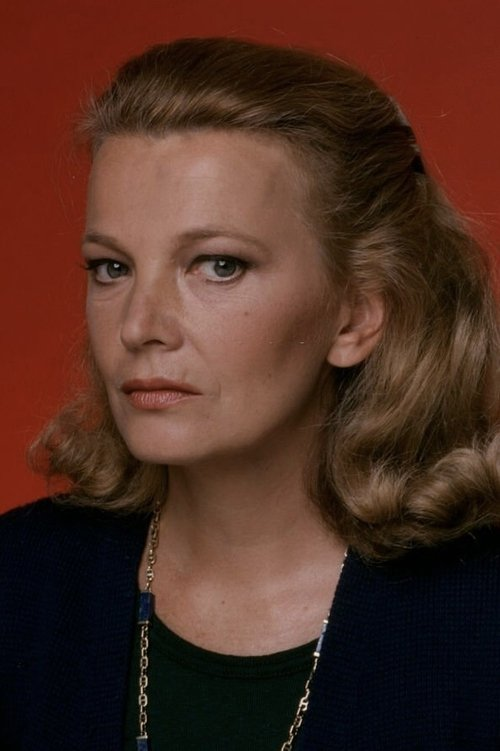
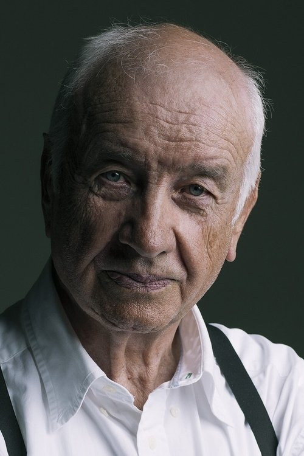
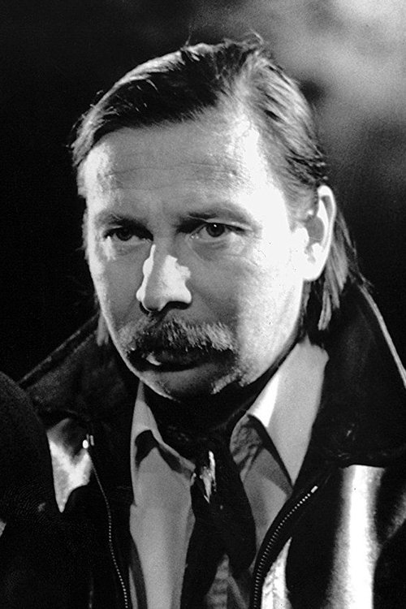



<nav class="films">
  

    <a href="../delicatessen-1991"><i class="fa-solid fa-chevron-left fa-xs"></i> Previous</a>
  

  

    <a class="simple" href="../">25 / 100</a>
  

  

    <a href="../lon-the-professional-1994">Next <i class="fa-solid fa-chevron-right fa-xs"></i></a>
  

  

    
      Previous film:
      Delicatessen
    
    
      Next film:
      Léon: The Professional
    
  

</nav>

<article class="film slug-night-on-earth-1991">
  

    
    
  

  <h1>{{ film.title }} ({{ film | filmYear }})</h1>

  

    Language: {{ film.language }}.
    
  

  

    Directed by <strong>{{ film | directors }}</strong>
  

  
    <blockquote>
      {{ films.reviews[slug] | safe }} <em>—&nbsp;<a href="/bill">Bill</a></em>
    </blockquote>
  

  <section class="cast-grid">
  

    

  
  

    Winona Ryder
    Corky
  

    

  
  

    Gena Rowlands
    Victoria Snelling
  

    

  
  

    Giancarlo Esposito
    YoYo
  

    

  
  

    Armin Mueller-Stahl
    Helmut Grokenberger
  

    

  
  

    Rosie Perez
    Angela
  

    

  
  

    Isaach de Bankolé
    Cab Driver Paris
  

    

  
  

    Béatrice Dalle
    Blind Woman
  

    

  
  

    Roberto Benigni
    Cab Driver Rome
  

    

  
  

    Paolo Bonacelli
    Priest
  

    

  
  

    Matti Pellonpää
    Mika
  

    

  
  

    Kari Väänänen
    Man #1 Helsinki
  

    

  
  

    Sakari Kuosmanen
    Man #2 Helsinki
  

  

</section>

  <section class="film-detail">
    

      

        

          <i class="fa-solid fa-masks-theater"></i>
          Cast
        

        <ul>
          
            <li>
              {{ cast.name }} as <em>{{ cast.character }}</em>
            </li>
          
        </ul>
      

      

        

          <i class="fa-solid fa-clapperboard"></i>
          Crew
        

        <ul>
          
            <li>
              {{ crew.name }} &mdash; <em>{{ crew.job }}</em>
            </li>
          
        </ul>
      

    

  </section>

  <section class="related-films">
  <h2>Related films</h2>
  <ul>
    <li><a href="../ghost-dog-the-way-of-the-samurai-1999">Ghost Dog: The Way of the Samurai</a> because of Isaach de Bankolé and Jim Jarmusch</li>
  </ul>
</section>

</article>
