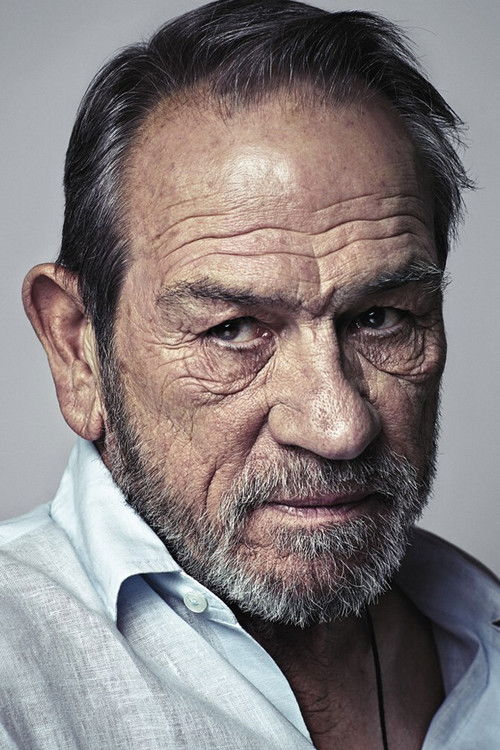
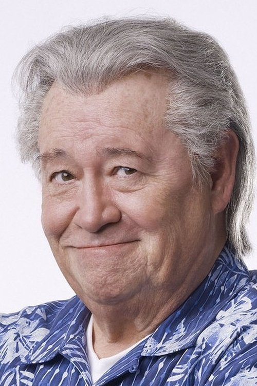



<nav class="films">
  

    <a href="../hot-fuzz-2007"><i class="fa-solid fa-chevron-left fa-xs"></i> Previous</a>
  

  

    <a class="simple" href="../">46 / 100</a>
  

  

    <a href="../in-bruges-2008">Next <i class="fa-solid fa-chevron-right fa-xs"></i></a>
  

  

    
      Previous film:
      Hot Fuzz
    
    
      Next film:
      In Bruges
    
  

</nav>

<article class="film slug-no-country-for-old-men-2007">
  

    
    
  

  <h1>{{ film.title }} ({{ film | filmYear }})</h1>

  

    Language: {{ film.language }}.
    
  

  

    Directed by <strong>{{ film | directors }}</strong>
  

  
    <blockquote>
      {{ films.reviews[slug] | safe }} <em>—&nbsp;<a href="/bill">Bill</a></em>
    </blockquote>
  

  <section class="cast-grid">
  

    

  
  

    Javier Bardem
    Anton Chigurh
  

    

  
  

    Tommy Lee Jones
    Ed Tom Bell
  

    

  
  

    Josh Brolin
    Llewelyn Moss
  

    

  
  

    Woody Harrelson
    Carson Wells
  

    

  
  

    Kelly Macdonald
    Carla Jean Moss
  

    

  
  

    Garret Dillahunt
    Wendell
  

    

  
  

    Tess Harper
    Loretta Bell
  

    

  
  

    Barry Corbin
    Ellis
  

    

  
  

    Stephen Root
    Man Who Hires Wells
  

    

  
  

    Rodger Boyce
    El Paso Sheriff
  

    

  
  

    Beth Grant
    Carla Jean's Mother
  

    

  
  

    Ana Reeder
    Poolside Woman
  

  

</section>

  <section class="film-detail">
    

      

        

          <i class="fa-solid fa-masks-theater"></i>
          Cast
        

        <ul>
          
            <li>
              {{ cast.name }} as <em>{{ cast.character }}</em>
            </li>
          
        </ul>
      

      

        

          <i class="fa-solid fa-clapperboard"></i>
          Crew
        

        <ul>
          
            <li>
              {{ crew.name }} &mdash; <em>{{ crew.job }}</em>
            </li>
          
        </ul>
      

    

  </section>

  <section class="related-films">
  <h2>Related films</h2>
  <ul>
    <li><a href="../fargo-1996">Fargo</a> and <a href="../the-big-lebowski-1998">The Big Lebowski</a> because of Joel Coen</li>
<li><a href="../the-tragedy-of-macbeth-2021">The Tragedy of Macbeth</a> because of Joel Coen and Stephen Root</li>
<li><a href="../trainspotting-1996">Trainspotting</a> because of Kelly Macdonald</li>
<li><a href="../dune-2021">Dune</a> because of Javier Bardem and Josh Brolin</li>
<li><a href="../lucky-2017">Lucky</a> because of Beth Grant</li>
  </ul>
</section>

</article>
