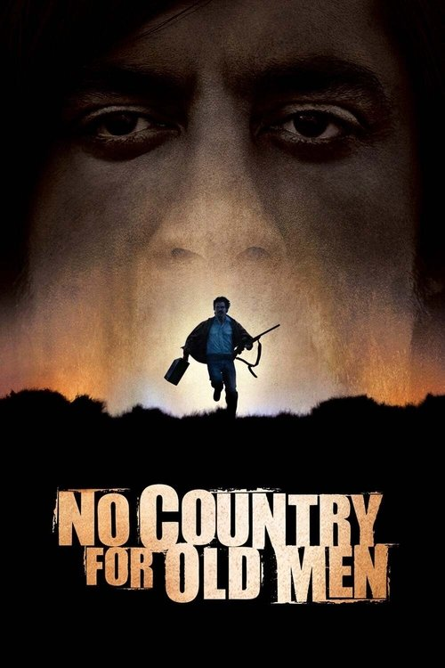

<a href="../">Back to all films</a>

<article class="film">
  <h1>No Country for Old Men (2007)</h1>

  

    Directed by <strong>Joel Coen, Ethan Coen</strong>
  

  

  <h2>
    Cast
  </h2>
  <ul>
    <li><strong>Javier Bardem</strong> as <em>Anton Chigurh</em></li>
<li><strong>Tommy Lee Jones</strong> as <em>Ed Tom Bell</em></li>
<li><strong>Josh Brolin</strong> as <em>Llewelyn Moss</em></li>
<li><strong>Woody Harrelson</strong> as <em>Carson Wells</em></li>
<li><strong>Kelly Macdonald</strong> as <em>Carla Jean Moss</em></li>
<li><strong>Garret Dillahunt</strong> as <em>Wendell</em></li>
<li><strong>Tess Harper</strong> as <em>Loretta Bell</em></li>
<li><strong>Barry Corbin</strong> as <em>Ellis</em></li>
<li><strong>Stephen Root</strong> as <em>Man Who Hires Wells</em></li>
<li><strong>Rodger Boyce</strong> as <em>El Paso Sheriff</em></li>
<li><strong>Beth Grant</strong> as <em>Carla Jean's Mother</em></li>
<li><strong>Ana Reeder</strong> as <em>Poolside Woman</em></li>
<li><strong>Kit Gwin</strong> as <em>Sheriff Bell's Secretary</em></li>
<li><strong>Zach Hopkins</strong> as <em>Strangled Deputy</em></li>
<li><strong>Chip Love</strong> as <em>Man in Ford</em></li>
<li><strong>Eduardo Antonio Garcia</strong> as <em>"Agua" Man</em></li>
<li><strong>Gene Jones</strong> as <em>Gas Station Proprietor</em></li>
<li><strong>Myk Watford</strong> as <em>"Managerial" Victim</em></li>
<li><strong>Boots Southerland</strong> as <em>"Managerial" Victim</em></li>
<li><strong>Kathy Lamkin</strong> as <em>Desert Aire Manager</em></li>
<li><strong>Johnnie Hector</strong> as <em>Cabbie at Bus Station</em></li>
<li><strong>Margaret Bowman</strong> as <em>Del Rio Motel Clerk</em></li>
<li><strong>Thomas Kopache</strong> as <em>Boot Salesman</em></li>
<li><strong>Jason Douglas</strong> as <em>Cabbie at Motel</em></li>
<li><strong>Doris Hargrave</strong> as <em>Waitress</em></li>
<li><strong>Rutherford Cravens</strong> as <em>Gun Store Clerk</em></li>
<li><strong>Matthew Posey</strong> as <em>Sporting Goods Clerk</em></li>
<li><strong>George Adelo</strong> as <em>Mexican in Bathtub</em></li>
<li><strong>Mathew Greer</strong> as <em>Hitchhiking Driver</em></li>
<li><strong>Trent Moore</strong> as <em>Nervous Accountant</em></li>
<li><strong>Marc Miles</strong> as <em>Hotel Eagle Clerk</em></li>
<li><strong>Luce Rains</strong> as <em>Pickup Driver</em></li>
<li><strong>Philip Bentham</strong> as <em>Border Bridge Youth</em></li>
<li><strong>Eric Reeves</strong> as <em>Border Bridge Youth</em></li>
<li><strong>Josh Meyer</strong> as <em>Border Bridge Youth</em></li>
<li><strong>Chris Warner</strong> as <em>Flatbed Driver</em></li>
<li><strong>Brandon Smith</strong> as <em>INS Official</em></li>
<li><strong>Roland Uribe</strong> as <em>Well Dressed Mexican</em></li>
<li><strong>Richard Jackson</strong> as <em>Chicken Farmer</em></li>
<li><strong>Josh Blaylock</strong> as <em>Boy on Bike</em></li>
<li><strong>Caleb Landry Jones</strong> as <em>Boy on Bike</em></li>
<li><strong>Dorsey Ray</strong> as <em>Odessa Cabbie</em></li>
<li><strong>Angel H. Alvarado Jr.</strong> as <em>Norteño Band</em></li>
<li><strong>David A. Gomez</strong> as <em>Norteño Band</em></li>
<li><strong>Milton Hernandez</strong> as <em>Norteño Band</em></li>
<li><strong>John Mancha</strong> as <em>Norteño Band</em></li>
<li><strong>Scott Flick</strong> as <em>Cab Driver (uncredited)</em></li>
<li><strong>Albert Fry Jr.</strong> as <em>El Paso Deputy (uncredited)</em></li>
<li><strong>Angelo Martinez</strong> as <em>Bus Passenger (uncredited)</em></li>
<li><strong>James Rishe</strong> as <em>Coffee Shop Customer (uncredited)</em></li>
<li><strong>Elizabeth Slagsvol</strong> as <em>Nurse (uncredited)</em></li>
<li><strong>Rachel Manera</strong> as <em>Pharmacy Driver (uncredited)</em></li>
  </ul>
</article>
