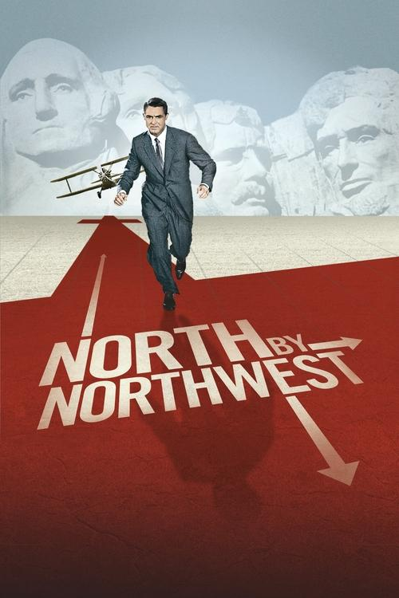
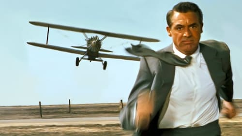



<nav class="films">
  <a class="prev" href="../la-strada-1954">Previous</a>
  <a href="../">Film list</a>
  <a class="next" href="../im-all-right-jack-1959">Next</a>
</nav>

4 / 100

<article class="film">
  

    
    
  

  <h1>North by Northwest ({{ film | filmYear }})</h1>

  

  

    Directed by <strong>{{ film | directors }}</strong>
  

  <h2>
    Cast
  </h2>
  <ul>
            <li><strong>Cary Grant</strong> as <em>Roger Thornhill</em></li>
        <li><strong>Eva Marie Saint</strong> as <em>Eve Kendall</em></li>
        <li><strong>James Mason</strong> as <em>Phillip Vandamm</em></li>
        <li><strong>Jessie Royce Landis</strong> as <em>Clara Thornhill</em></li>
        <li><strong>Leo G. Carroll</strong> as <em>Professor</em></li>
        <li><strong>Josephine Hutchinson</strong> as <em>Mrs. Townsend</em></li>
        <li><strong>Philip Ober</strong> as <em>Lester Townsend</em></li>
        <li><strong>Martin Landau</strong> as <em>Leonard</em></li>
        <li><strong>Adam Williams</strong> as <em>Valerian</em></li>
        <li><strong>Edward Platt</strong> as <em>Victor Larrabee</em></li>
        <li><strong>Robert Ellenstein</strong> as <em>Licht</em></li>
        <li><strong>Les Tremayne</strong> as <em>Auctioneer</em></li>
        <li><strong>Philip Coolidge</strong> as <em>Dr. Cross</em></li>
        <li><strong>Patrick McVey</strong> as <em>Sergeant Flamm</em></li>
        <li><strong>Edward Binns</strong> as <em>Captain Junket</em></li>
        <li><strong>Ken Lynch</strong> as <em>Charley</em></li>
        <li><strong>Nora Marlowe</strong> as <em>Anna, the Menacing Housekeeper (uncredited)</em></li>
        <li><strong>Doreen Lang</strong> as <em>Maggie - Thornhill's Secretary (uncredited)</em></li>
        <li><strong>John Beradino</strong> as <em>Sergeant Emile Klinger (uncredited)</em></li>
        <li><strong>Ned Glass</strong> as <em>Ticket Seller (uncredited)</em></li>
        <li><strong>Tol Avery</strong> as <em>State Police Detective (uncredited)</em></li>
        <li><strong>Malcolm Atterbury</strong> as <em>Man at Prairie Crossing (uncredited)</em></li>
        <li><strong>Maudie Prickett</strong> as <em>Hotel Maid Elsie (uncredited)</em></li>
        <li><strong>Bess Flowers</strong> as <em>Plaza Hotel Lounge Patron (uncredited)</em></li>
        <li><strong>Stanley Adams</strong> as <em>Lieutenant Harding (uncredited)</em></li>
        <li><strong>Andy Albin</strong> as <em>Farmer (uncredited)</em></li>
        <li><strong>Ernest Anderson</strong> as <em>Porter on Twentieth Century Ltd. (uncredited)</em></li>
        <li><strong>Frank Wilcox</strong> as <em>Herman Weltner (uncredited)</em></li>
        <li><strong>Brandon Beach</strong> as <em>Man at Auction (uncredited)</em></li>
        <li><strong>Steve Carruthers</strong> as <em>Man at Auction (uncredited)</em></li>
        <li><strong>Taggart Casey</strong> as <em>Shaving Man (uncredited)</em></li>
        <li><strong>Bill Catching</strong> as <em>Auction Attendant (uncredited)</em></li>
        <li><strong>Walter Coy</strong> as <em>U.S. Intelligence Agency Official (uncredited)</em></li>
        <li><strong>Jimmy Cross</strong> as <em>Taxi Driver #1 (uncredited)</em></li>
        <li><strong>Patricia Cutts</strong> as <em>Hospital Patient (uncredited)</em></li>
        <li><strong>Jack Daly</strong> as <em>Train Steward (uncredited)</em></li>
        <li><strong>John Damler</strong> as <em>Police Lieutenant (uncredited)</em></li>
        <li><strong>Lawrence Dobkin</strong> as <em>U.S. Intelligence Agency Official (uncredited)</em></li>
        <li><strong>Tommy Farrell</strong> as <em>Eddie - Elevator Starter (uncredited)</em></li>
        <li><strong>Jesslyn Fax</strong> as <em>Train Passenger (uncredited)</em></li>
        <li><strong>Adolph Faylauer</strong> as <em>Bald Bidder (uncredited)</em></li>
        <li><strong>Sally Fraser</strong> as <em>Second United Nations Receptionist (uncredited)</em></li>
        <li><strong>Paul Genge</strong> as <em>Lieutenant Hagerman (uncredited)</em></li>
        <li><strong>James Gonzalez</strong> as <em>Man at Auction (uncredited)</em></li>
        <li><strong>Tom Greenway</strong> as <em>Silent State Police Detective (uncredited)</em></li>
        <li><strong>Robert Haines</strong> as <em>Man at United Nations Building (uncredited)</em></li>
        <li><strong>Stuart Hall</strong> as <em>Train Passenger (uncredited)</em></li>
        <li><strong>Alfred Hitchcock</strong> as <em>Man Who Misses Bus (uncredited)</em></li>
        <li><strong>Stuart Holmes</strong> as <em>Hotel Lounge Patron (uncredited)</em></li>
        <li><strong>Eugene Jackson</strong> as <em>Security Guard at Auction (uncredited)</em></li>
        <li><strong>Bobby Johnson</strong> as <em>Waiter (uncredited)</em></li>
        <li><strong>Kenner G. Kemp</strong> as <em>Man Leaving Office Building (uncredited)</em></li>
        <li><strong>Madge Kennedy</strong> as <em>Mrs. Finlay (uncredited)</em></li>
        <li><strong>Colin Kenny</strong> as <em>Man at Auction (uncredited)</em></li>
        <li><strong>Carl M. Leviness</strong> as <em>Man at United Nations Building (uncredited)</em></li>
        <li><strong>Alexander Lockwood</strong> as <em>Judge Anson B. Flynn (uncredited)</em></li>
        <li><strong>Frank Marlowe</strong> as <em>Taxi Driver (uncredited)</em></li>
        <li><strong>Baynes Barron</strong> as <em>Taxi Driver #2 (uncredited)</em></li>
        <li><strong>Thomas Martin</strong> as <em>Train Passenger (uncredited)</em></li>
        <li><strong>James McCallion</strong> as <em>Plaza Valet (uncredited)</em></li>
        <li><strong>Maura McGiveney</strong> as <em>Attendant (uncredited)</em></li>
        <li><strong>Carl Milletaire</strong> as <em>Hotel Clerk (uncredited)</em></li>
        <li><strong>Hans Moebus</strong> as <em>Man at United Nations Building (uncredited)</em></li>
        <li><strong>Howard Negley</strong> as <em>Conductor on Twentieth Century, Ltd. (uncredited)</em></li>
        <li><strong>Monty O'Grady</strong> as <em>Man at United Nations Building (uncredited)</em></li>
        <li><strong>Ralph Reed</strong> as <em>Bellhop (uncredited)</em></li>
        <li><strong>John Roy</strong> as <em>Train Passenger (uncredited)</em></li>
        <li><strong>Jeffrey Sayre</strong> as <em>Hotel Lounge Patron / Man at Mt. Rushmore Cafeteria (uncredited)</em></li>
        <li><strong>Scott Seaton</strong> as <em>Man at Auction (uncredited)</em></li>
        <li><strong>Harry Seymour</strong> as <em>Victor - Captain of Waiters (uncredited)</em></li>
        <li><strong>Robert Shayne</strong> as <em>Larry Wade (uncredited)</em></li>
        <li><strong>Jeremy Slate</strong> as <em>Policeman at Grand Central Station (uncredited)</em></li>
        <li><strong>Olan Soule</strong> as <em>Assistant Auctioneer (uncredited)</em></li>
        <li><strong>Helen Spring</strong> as <em>Bidder (uncredited)</em></li>
        <li><strong>Harvey Stephens</strong> as <em>Stockbroker (uncredited)</em></li>
        <li><strong>Harry Strang</strong> as <em>Assistant Conductor (uncredited)</em></li>
        <li><strong>Arthur Tovey</strong> as <em>Man at Auction (uncredited)</em></li>
        <li><strong>Dale Van Sickel</strong> as <em>Ranger (uncredited)</em></li>
        <li><strong>Lloyd Williams</strong> as <em>Minor Role (uncredited)</em></li>
        <li><strong>Robert B. Williams</strong> as <em>Patrolman Waggoner (uncredited)</em></li>
        <li><strong>Paula Winslowe</strong> as <em>Woman at Auction (uncredited)</em></li>
        <li><strong>Wilson Wood</strong> as <em>Photographer at United Nations (uncredited)</em></li>
        <li><strong>Carleton Young</strong> as <em>Fanning Nelson (uncredited)</em></li>
        <li><strong>Dick Johnstone</strong> as <em>Courtroom Spectator (uncredited)</em></li>
        <li><strong>Bert Stevens</strong> as <em>Man at United Nations Building (uncredited)</em></li>
        <li><strong>Cosmo Sardo</strong> as <em>Worker (uncredited)</em></li>
        <li><strong>Don Anderson</strong> as <em>Worker (uncredited)</em></li>
        <li><strong>Alphonso DuBois</strong> as <em>Man at United Nations Building (uncredited)</em></li>
        <li><strong>Len Hendry</strong> as <em>Police Lieutenant (uncredited)</em></li>
        <li><strong>Anne Anderson</strong> as <em>Woman (uncredited)</em></li>
        <li><strong>Rama Bai</strong> as <em>Woman at United Nations Building (uncredited)</em></li>
        <li><strong>Finn Zirzow</strong> as <em>Worker (uncredited)</em></li>
        <li><strong>Roger C. Carmel</strong> as <em>Tall Man in Crowd (uncredited)</em></li>
        <li><strong>Donna Douglas</strong> as <em>Woman on Sidewalk (uncredited)</em></li>
        <li><strong>Caryl Lincoln</strong> as <em>Auction Guest (uncredited)</em></li>
  </ul>
</article>
<footer>
  <a href="../about">About this list</a>
</footer>
