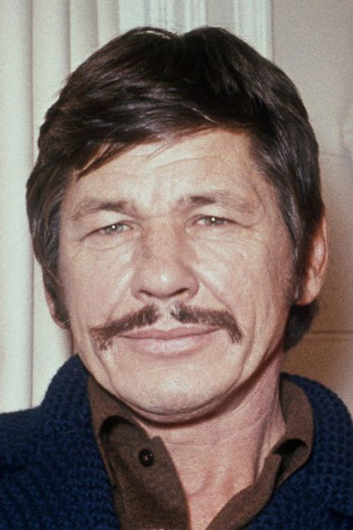
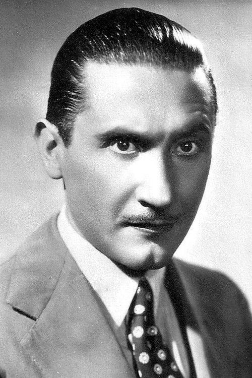
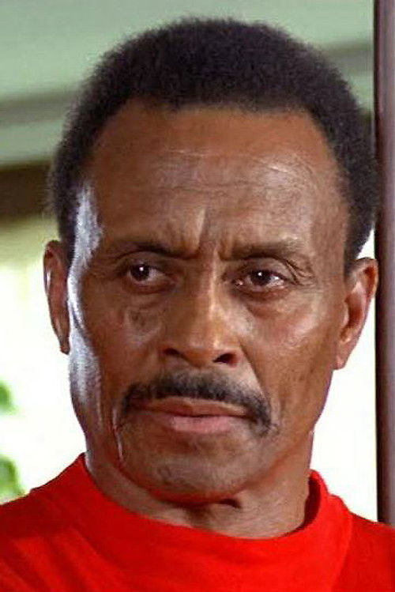
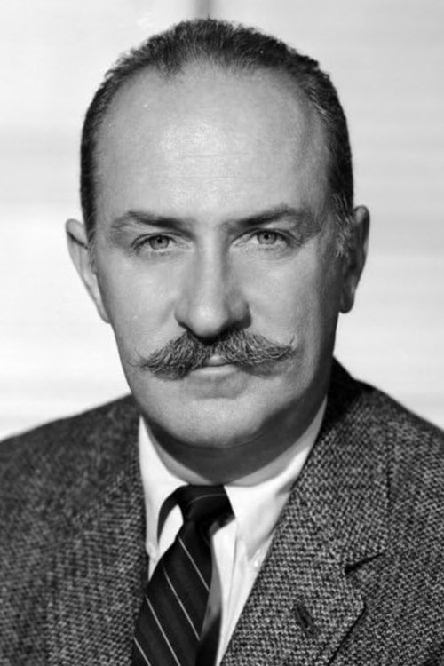
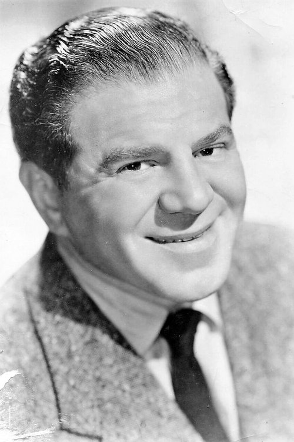



<nav class="films">
  

    <a href="../bullitt-1968"><i class="fa-solid fa-chevron-left fa-xs"></i> Previous</a>
  

  

    <a class="simple" href="../">10 / 100</a>
  

  

    <a href="../the-sting-1973">Next <i class="fa-solid fa-chevron-right fa-xs"></i></a>
  

  

    
      Previous film:
      Bullitt
    
    
      Next film:
      The Sting
    
  

</nav>

<article class="film slug-once-upon-a-time-in-the-west-1968">
  

    
    
  

  <h1>{{ film.title }} ({{ film | filmYear }})</h1>

  

    Language: {{ film.language }}.
    Also known as C'era una volta il West.
  

  

    Directed by <strong>{{ film | directors }}</strong>
  

  
    <blockquote>
      {{ films.reviews[slug] | safe }} <em>—&nbsp;<a href="/bill">Bill</a></em>
    </blockquote>
  

  <section class="cast-grid">
  

    

  
  

    Claudia Cardinale
    Jill
  

    

  
  

    Henry Fonda
    Frank
  

    

  
  

    Jason Robards
    'Cheyenne'
  

    

  
  

    Charles Bronson
    'Harmonica'
  

    

  
  

    Gabriele Ferzetti
    Morton
  

    

  
  

    Paolo Stoppa
    Sam
  

    

  
  

    Woody Strode
    Frank's Gunman
  

    

  
  

    Jack Elam
    Frank's Gunman
  

    

  
  

    Keenan Wynn
    Sheriff
  

    

  
  

    Frank Wolff
    Brett McBain
  

    

  
  

    Lionel Stander
    Innkeeper
  

    

  
  

    Frank Braña
    Frank's Gunman (uncredited)
  

  

</section>

  <section class="film-detail">
    

      

        

          <i class="fa-solid fa-masks-theater"></i>
          Cast
        

        <ul>
          
            <li>
              {{ cast.name }} as <em>{{ cast.character }}</em>
            </li>
          
        </ul>
      

      

        

          <i class="fa-solid fa-clapperboard"></i>
          Crew
        

        <ul>
          
            <li>
              {{ crew.name }} &mdash; <em>{{ crew.job }}</em>
            </li>
          
        </ul>
      

    

  </section>

  <section class="related-films">
  <h2>Related films</h2>
  <ul>
    <li><a href="../magnolia-1999">Magnolia</a> because of Jason Robards</li>
  </ul>
</section>

</article>
