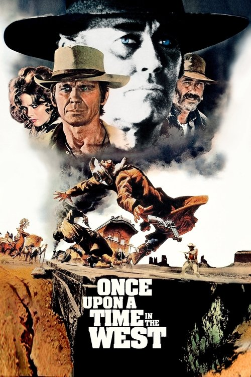

<a href="../">Back to all films</a>

<article class="film">
  <h1>Once Upon a Time in the West (1968)</h1>

  

    Directed by <strong>Sergio Leone</strong>
  

  

  <h2>
    Cast
  </h2>
  <ul>
    <li><strong>Claudia Cardinale</strong> as <em>Jill</em></li>
<li><strong>Henry Fonda</strong> as <em>Frank</em></li>
<li><strong>Jason Robards</strong> as <em>'Cheyenne'</em></li>
<li><strong>Charles Bronson</strong> as <em>'Harmonica'</em></li>
<li><strong>Gabriele Ferzetti</strong> as <em>Morton</em></li>
<li><strong>Paolo Stoppa</strong> as <em>Sam</em></li>
<li><strong>Woody Strode</strong> as <em>Frank's Gunman</em></li>
<li><strong>Jack Elam</strong> as <em>Frank's Gunman</em></li>
<li><strong>Keenan Wynn</strong> as <em>Sheriff</em></li>
<li><strong>Frank Wolff</strong> as <em>Brett McBain</em></li>
<li><strong>Lionel Stander</strong> as <em>Innkeeper</em></li>
<li><strong>Frank Braña</strong> as <em>Frank's Gunman (uncredited)</em></li>
<li><strong>Stefano Imparato</strong> as <em>Patrick McBain (uncredited)</em></li>
<li><strong>Claudio Mancini</strong> as <em>Hanged Man (uncredited)</em></li>
<li><strong>Al Mulock</strong> as <em>Frank's Gunman (uncredited)</em></li>
<li><strong>Antonio Palombi</strong> as <em>Station Agent (uncredited)</em></li>
<li><strong>Renato Pinciroli</strong> as <em>Bidder (uncredited)</em></li>
<li><strong>Aldo Sambrell</strong> as <em>Cheyenne's Gunman (uncredited)</em></li>
<li><strong>Conrado San Martín</strong> as <em>McBain's Neighbor (uncredited)</em></li>
<li><strong>Enzo Santaniello</strong> as <em>Timmy McBain (uncredited)</em></li>
<li><strong>Simonetta Santaniello</strong> as <em>Maureen McBain (uncredited)</em></li>
<li><strong>Luana Strode</strong> as <em>Cattle Corner Woman (uncredited)</em></li>
<li><strong>Fabio Testi</strong> as <em>Frank's Gunman (uncredited)</em></li>
<li><strong>Marco Zuanelli</strong> as <em>'Wobbles' (uncredited)</em></li>
<li><strong>Antonio Molino Rojo</strong> as <em>Frank's Gunman (uncredited)</em></li>
<li><strong>Román Ariznavarreta</strong> as <em>Logan (uncredited)</em></li>
<li><strong>John Frederick</strong> as <em>Jim (uncredited)</em></li>
<li><strong>Aldo Berti</strong> as <em>Frank's Gunman (uncredited)</em></li>
<li><strong>Spartaco Conversi</strong> as <em>Frank's Gunman (uncredited)</em></li>
<li><strong>Saturno Cerra</strong> as <em>Frank's Gunman (uncredited)</em></li>
<li><strong>Paolo Figlia</strong> as <em>Frank's Gunman (uncredited)</em></li>
<li><strong>Dino Mele</strong> as <em>Harmonica as a Boy (uncredited)</em></li>
<li><strong>Simonetta Stefanelli</strong> as <em>Maureen McBain (uncredited)</em></li>
<li><strong>Regina Elena Bisio</strong> as <em>Old Woman in the Tavern (uncredited)</em></li>
<li><strong>Michael Harvey</strong> as <em>Frank's Gunman (uncredited)</em></li>
  </ul>
</article>
