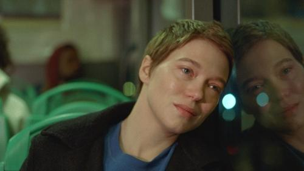



<nav class="films">
  <a class="prev" href="../eo-2022">Previous</a>
  <a href="../">Film list</a>
  <a class="next" href="../the-banshees-of-inisherin-2022">Next</a>
</nav>

93 / 100

<article class="film">
  

    
    
  

  <h1>One Fine Morning ({{ film | filmYear }})</h1>

  

    Directed by <strong>{{ film | directors }}</strong>
  

  <h2>
    Cast
  </h2>
  <ul>
            <li><strong>Léa Seydoux</strong> as <em>Sandra Kienzler</em></li>
        <li><strong>Pascal Greggory</strong> as <em>Georg Kienzler</em></li>
        <li><strong>Melvil Poupaud</strong> as <em>Clément</em></li>
        <li><strong>Nicole Garcia</strong> as <em>Françoise</em></li>
        <li><strong>Camille Leban Martins</strong> as <em>Linn</em></li>
        <li><strong>Sarah Le Picard</strong> as <em>Elodie Kienzler</em></li>
        <li><strong>Pierre Meunier</strong> as <em>Michel</em></li>
        <li><strong>Fejria Deliba</strong> as <em>Leila</em></li>
        <li><strong>Jacqueline Hansen-Løve</strong> as <em>Jacqueline Kienzler</em></li>
        <li><strong>Catherine Vinatier</strong> as <em>Soeur de Georg</em></li>
        <li><strong>Samuel Achache</strong> as <em>Mari d'Elodie</em></li>
        <li><strong>Esther Wajeman</strong> as <em>Enfant d'Elodie</em></li>
        <li><strong>Rose Wajeman</strong> as <em>Enfant d'Elodie</em></li>
        <li><strong>Elsa Guedj</strong> as <em>Ancienne élève</em></li>
        <li><strong>Xavier Combe</strong> as <em>Collègue interprète</em></li>
        <li><strong>Jana Klein</strong> as <em>Collègue interprète</em></li>
        <li><strong>Charles Norman Shay</strong> as <em>Vétéran Omaha</em></li>
        <li><strong>Margaux Garzaro</strong> as <em>Médecin Georg</em></li>
        <li><strong>Masha Kondakova</strong> as <em>Infirmière Hôtel-Dieu</em></li>
        <li><strong>Ary Gabison</strong> as <em>Chef de service Bretonneau</em></li>
        <li><strong>Pascale Oudot</strong> as <em>Directrice Ehpad Courbevoie</em></li>
        <li><strong>Julien Flick</strong> as <em>Directeur Jardins de Montmartre</em></li>
        <li><strong>Sharif Andoura</strong> as <em>Médecin Linn</em></li>
        <li><strong>Stéphanie Pasquet</strong> as <em>Collègue Clément</em></li>
        <li><strong>Jeremy Lewin</strong> as <em>Ancien élève</em></li>
        <li><strong>Arno Nguyen</strong> as <em>Ancien élève</em></li>
        <li><strong>Norah Krief</strong> as <em>Mère d'Esther</em></li>
        <li><strong>Philippe Bertin</strong> as <em>Père d'Esther</em></li>
        <li><strong>Vasco Villaverde</strong> as <em>Fils de Clément</em></li>
  </ul>
</article>
<footer>
  <a href="../about">About this list</a>
</footer>
