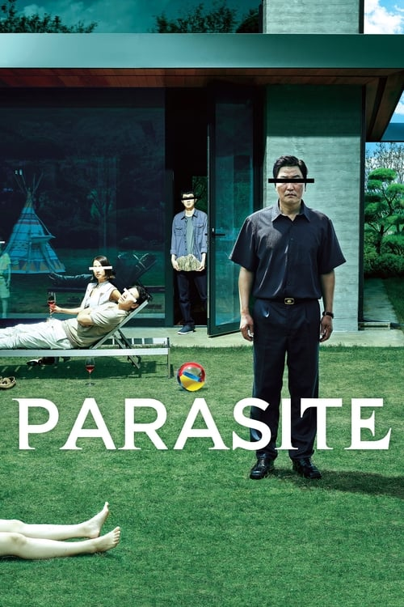

<nav class="films">
  <a class="prev" href="../sink-or-swim">Previous</a>
  <a href="../">Film list</a>
  <a class="next" href="../portrait-of-a-lady-on-fire">Next</a>
</nav>

73 / 100

<article class="film">
  
  

  <h1>Parasite (2019)</h1>

  

    Directed by <strong>Bong Joon Ho</strong>
  

  <h2>
    Cast
  </h2>
  <ul>
    <li><strong>Song Kang-ho</strong> as <em>Kim Ki-taek</em></li>
<li><strong>Lee Sun-kyun</strong> as <em>Park Dong-ik</em></li>
<li><strong>Cho Yeo-jeong</strong> as <em>Yeon-kyo</em></li>
<li><strong>Choi Woo-shik</strong> as <em>Ki-woo</em></li>
<li><strong>Park So-dam</strong> as <em>Ki-jung</em></li>
<li><strong>Lee Jung-eun</strong> as <em>Moon-gwang</em></li>
<li><strong>Jang Hye-jin</strong> as <em>Chung-sook</em></li>
<li><strong>Park Myung-hoon</strong> as <em>Geun-se</em></li>
<li><strong>Jung Ji-so</strong> as <em>Da-hye</em></li>
<li><strong>Jung Hyeon-jun</strong> as <em>Da-song</em></li>
<li><strong>Park Keun-rok</strong> as <em>Driver Yoon</em></li>
<li><strong>Jung Yi-seo</strong> as <em>Pizza Manager</em></li>
<li><strong>Cho Jae-myung</strong> as <em>Pizza Man</em></li>
<li><strong>Jeong Ik-han</strong> as <em>Neighbor</em></li>
<li><strong>Kim Kyu-baek</strong> as <em>Drunk 1</em></li>
<li><strong>Ahn Seong-bong</strong> as <em>Street Man</em></li>
<li><strong>Yoon Young-woo</strong> as <em>Benz Dealer</em></li>
<li><strong>Park Jae-wook</strong> as <em>VR Specialist</em></li>
<li><strong>Lee Dong-yong</strong> as <em>Drunk 2</em></li>
<li><strong>Jeon Eun-mi</strong> as <em>Mart Cashier</em></li>
<li><strong>Kim Geon</strong> as <em>Party Man</em></li>
<li><strong>Lee Joo-hyung</strong> as <em>Party Man</em></li>
<li><strong>Lee Ji-hye</strong> as <em>A Singer</em></li>
<li><strong>Kim Bo-ryeong</strong> as <em>Cellist</em></li>
<li><strong>Park Hye-sook</strong> as <em>Party Woman</em></li>
<li><strong>Baek Seung-hwan</strong> as <em>Party Man</em></li>
<li><strong>Riccardo Ferraresso</strong> as <em>Italy Chef</em></li>
<li><strong>Ko Kwan-jae</strong> as <em>Doctor</em></li>
<li><strong>Lee Si-hoon</strong> as <em>Detective</em></li>
<li><strong>Seo Bok-hyeon</strong> as <em>JTBC Reporter</em></li>
<li><strong>Shim Soo-mi</strong> as <em>JTBC Reporter</em></li>
<li><strong>Yoon Hye-ree</strong> as <em>JTBC Reporter</em></li>
<li><strong>Andreas Fronk</strong> as <em>German Father</em></li>
<li><strong>Anna Elisabeth Rihlmann</strong> as <em>German Mother</em></li>
<li><strong>Rosie Peralta</strong> as <em>Southeast Asian Housekeeper</em></li>
<li><strong>Shin Seung-min</strong> as <em>Namgung Hyun-ja</em></li>
<li><strong>Park Seo-jun</strong> as <em>Min-hyuk</em></li>
<li><strong>Kwak Sin-ae</strong> as <em>Judge (voice)</em></li>
<li><strong>Choi Jeong-hyun</strong> as <em>Assistant Chef</em></li>
<li><strong>Kim Ha-eon</strong> as <em>Party Kid</em></li>
<li><strong>Lee Eun-hee</strong> as <em>Real Estate Woman</em></li>
<li><strong>Choi Ji-won</strong> as <em>Party Woman</em></li>
<li><strong>Park Jae-wan</strong> as <em>Designer Lee Ha-bong</em></li>
<li><strong>Hwang In-gyeong</strong> as <em>PC Room Staff</em></li>
<li><strong>Kim Yeong-jo</strong> as <em>Party Man</em></li>
<li><strong>Kim Jung-woo</strong> as <em>Party Man</em></li>
<li><strong>Lee Sang-kyung</strong> as <em>Party Woman</em></li>
<li><strong>Lee Si-hoo</strong> as <em>Golf Player</em></li>
<li><strong>Ahn Jin-sang</strong> as <em>Shelter Official</em></li>
<li><strong>Alfred Hitchcock</strong> as <em>Self (archive footage)</em></li>
  </ul>
</article>
<footer>
  <a href="../about">About this list</a>
</footer>
