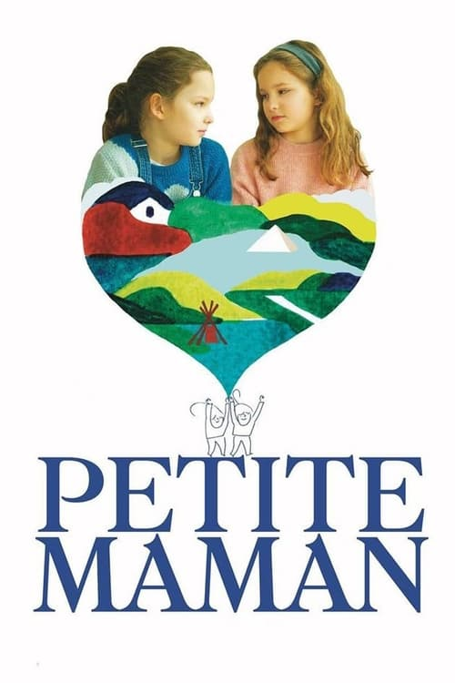
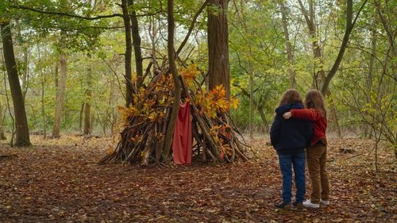



<nav class="films">
  <a class="prev" href="../nomadland-2021">Previous</a>
  <a href="../">Film list</a>
  <a class="next" href="../coda-2021">Next</a>
</nav>

81 / 100

<article class="film">
  

    
    
  

  <h1>Petite Maman ({{ film | filmYear }})</h1>

  

    Directed by <strong>{{ film | directors }}</strong>
  

  <h2>
    Cast
  </h2>
  <ul>
            <li><strong>Joséphine Sanz</strong> as <em>Nelly</em></li>
        <li><strong>Gabrielle Sanz</strong> as <em>Marion</em></li>
        <li><strong>Nina Meurisse</strong> as <em>La mère</em></li>
        <li><strong>Stéphane Varupenne</strong> as <em>Le père</em></li>
        <li><strong>Margot Abascal</strong> as <em>La grand-mère</em></li>
        <li><strong>Florès Cardo</strong> as <em>Dame maison de retraite</em></li>
        <li><strong>Josée Schuller</strong> as <em>Dame maison de retraite</em></li>
        <li><strong>Guylène Péan</strong> as <em>Dame maison de retraite</em></li>
  </ul>
</article>
<footer>
  <a href="../about">About this list</a>
</footer>
