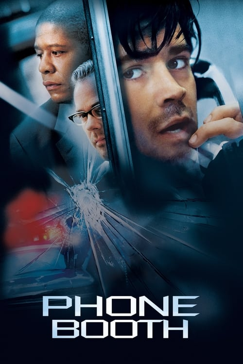
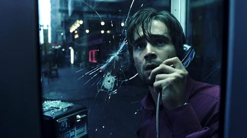

<nav class="films">
  <a class="prev" href="../man-on-the-train">Previous</a>
  <a href="../">Film list</a>
  <a class="next" href="../the-motorcycle-diaries">Next</a>
</nav>

50 / 100

<article class="film">
  

    
    
  

  <h1>Phone Booth (2003)</h1>

  

    Directed by <strong>Joel Schumacher</strong>
  

  <h2>
    Cast
  </h2>
  <ul>
    <li><strong>Colin Farrell</strong> as <em>Stu Shepard</em></li>
<li><strong>Kiefer Sutherland</strong> as <em>The Caller</em></li>
<li><strong>Forest Whitaker</strong> as <em>Captain Ramey</em></li>
<li><strong>Radha Mitchell</strong> as <em>Kelly Shepard</em></li>
<li><strong>Katie Holmes</strong> as <em>Pamela McFadden</em></li>
<li><strong>Paula Jai Parker</strong> as <em>Felicia</em></li>
<li><strong>Arian Ash</strong> as <em>Corky</em></li>
<li><strong>Tia Texada</strong> as <em>Asia</em></li>
<li><strong>John Enos III</strong> as <em>Leon</em></li>
<li><strong>Richard T. Jones</strong> as <em>Sergeant Cole</em></li>
<li><strong>Keith Nobbs</strong> as <em>Adam</em></li>
<li><strong>Dell Yount</strong> as <em>Pizza Guy</em></li>
<li><strong>James MacDonald</strong> as <em>Negotiator</em></li>
<li><strong>Josh Pais</strong> as <em>Mario</em></li>
<li><strong>Yorgo Constantine</strong> as <em>ESU Commander</em></li>
<li><strong>Colin Patrick Lynch</strong> as <em>ESU Technician</em></li>
<li><strong>Troy Gilbert</strong> as <em>ESU Sniper</em></li>
<li><strong>Seth William Meier</strong> as <em>Officer McDuff</em></li>
<li><strong>Svetlana Efremova</strong> as <em>Erica</em></li>
<li><strong>Billy Erb</strong> as <em>Lars</em></li>
<li><strong>Domenick Lombardozzi</strong> as <em>Wyatt</em></li>
<li><strong>Maile Flanagan</strong> as <em>Lana</em></li>
<li><strong>Tom Reynolds</strong> as <em>Richard</em></li>
<li><strong>Julio Oscar Mechoso</strong> as <em>Hispanic Medic</em></li>
<li><strong>Karara Muhoro</strong> as <em>Nigerian Vendor</em></li>
<li><strong>Zidu Chen</strong> as <em>Korean Husband</em></li>
<li><strong>Shu Lan Tuan</strong> as <em>Korean Wife</em></li>
<li><strong>Dean Cochran</strong> as <em>Reporter #1</em></li>
<li><strong>Amy Kowallis</strong> as <em>Reporter #2</em></li>
<li><strong>Tory Kittles</strong> as <em>Reporter #3</em></li>
<li><strong>Bruce Roberts</strong> as <em>Reporter #4</em></li>
<li><strong>Tyree Michael Simpson</strong> as <em>Doorman</em></li>
<li><strong>Dean Tarrolly</strong> as <em>Newscaster</em></li>
<li><strong>Mary Randle</strong> as <em>Dispatcher</em></li>
<li><strong>Paul Fontana</strong> as <em>Dispatcher</em></li>
<li><strong>Steve Alterman</strong> as <em>(voice)</em></li>
<li><strong>Kimberly Bailey</strong> as <em>(voice)</em></li>
<li><strong>Jason Broad</strong> as <em>(voice)</em></li>
<li><strong>Lanei Chapman</strong> as <em>(voice)</em></li>
<li><strong>Django Craig</strong> as <em>(voice)</em></li>
<li><strong>Judith Durand</strong> as <em>(voice)</em></li>
<li><strong>Greg Finley</strong> as <em>(voice)</em></li>
<li><strong>Ramón Franco</strong> as <em>(voice)</em></li>
<li><strong>Anneliese Goldman</strong> as <em>(voice)</em></li>
<li><strong>Rick Gonzales</strong> as <em>(voice)</em></li>
<li><strong>Tracy Metro</strong> as <em>(voice)</em></li>
<li><strong>Jason Pace</strong> as <em>(voice)</em></li>
<li><strong>Juan Pope</strong> as <em>(voice)</em></li>
<li><strong>Nicole Prescott</strong> as <em>(voice)</em></li>
<li><strong>Cheryl Tyre Smith</strong> as <em>(voice)</em></li>
<li><strong>John Vargas</strong> as <em>(voice)</em></li>
<li><strong>Tanya Vidal</strong> as <em>(voice)</em></li>
<li><strong>Billy 'Sly' Williams</strong> as <em>(voice)</em></li>
<li><strong>Ruth Zalduondo</strong> as <em>(voice)</em></li>
<li><strong>Ben Foster</strong> as <em>Big Q (uncredited)</em></li>
<li><strong>Jared Leto</strong> as <em>Bobby (uncredited)</em></li>
<li><strong>Mia Cottet</strong> as <em>Lu Ann (uncredited)</em></li>
  </ul>
</article>
<footer>
  <a href="../about">About this list</a>
</footer>
