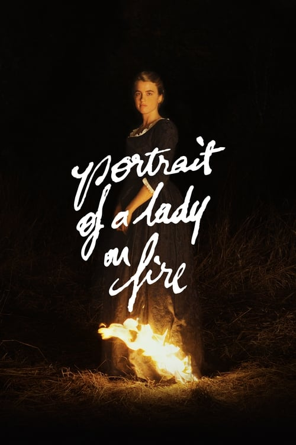
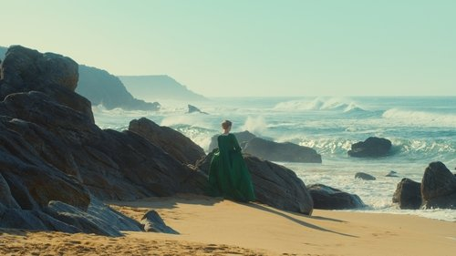



<nav class="films">
  <a class="prev" href="../parasite-2019">Previous</a>
  <a href="../">Film list</a>
  <a class="next" href="../first-cow-2020">Next</a>
</nav>

74 / 100

<article class="film">
  

    
    
  

  <h1>Portrait of a Lady on Fire ({{ film | filmYear }})</h1>

  
Also known as <strong>Portrait de la jeune fille en feu</strong>

  

    Directed by <strong>{{ film | directors }}</strong>
  

  <h2>
    Cast
  </h2>
  <ul>
            <li><strong>Noémie Merlant</strong> as <em>Marianne</em></li>
        <li><strong>Adèle Haenel</strong> as <em>Héloïse</em></li>
        <li><strong>Luàna Bajrami</strong> as <em>Sophie</em></li>
        <li><strong>Valeria Golino</strong> as <em>La Comtesse</em></li>
        <li><strong>Christel Baras</strong> as <em>La faiseuse d'ange</em></li>
        <li><strong>Armande Boulanger</strong> as <em>L'élève atelier</em></li>
        <li><strong>Guy Delamarche</strong> as <em>L'homme salon</em></li>
        <li><strong>Clément Bouyssou</strong> as <em>Le batelier</em></li>
  </ul>
</article>
<footer>
  <a href="../about">About this list</a>
</footer>
