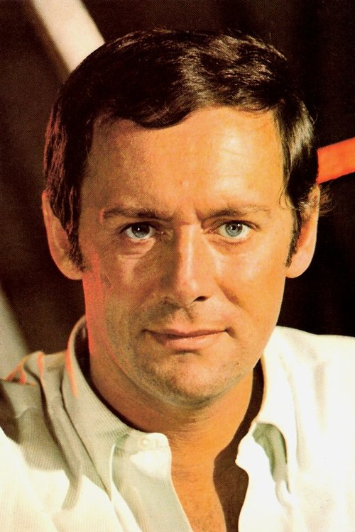



<nav class="films">
  

    <a href="../la-dolce-vita-1960"><i class="fa-solid fa-chevron-left fa-xs"></i> Previous</a>
  

  

    <a class="simple" href="../">6 / 100</a>
  

  

    <a href="../in-the-heat-of-the-night-1967">Next <i class="fa-solid fa-chevron-right fa-xs"></i></a>
  

  

    
      Previous film:
      La Dolce Vita
    
    
      Next film:
      In the Heat of the Night
    
  

</nav>

<article class="film slug-purple-noon-1960">
  

    
    
  

  <h1>{{ film.title }} ({{ film | filmYear }})</h1>

  

    Language: {{ film.language }}.
    Also known as Plein soleil.
  

  

    Directed by <strong>{{ film | directors }}</strong>
  

  
    <blockquote>
      {{ films.reviews[slug] | safe }} <em>—&nbsp;<a href="/bill">Bill</a></em>
    </blockquote>
  

  <section class="cast-grid">
  

    

  
  

    Alain Delon
    Tom Ripley
  

    

  
  

    Marie Laforêt
    Marge Duval
  

    

  
  

    Maurice Ronet
    Philippe Greenleaf
  

    

  
  

    Erno Crisa
    Inspector Riccordi
  

    

  
  

    Frank Latimore
    O'Brien
  

    

  
  

    Billy Kearns
    Freddy Miles
  

    

  
  

    Ave Ninchi
    Signora Gianna
  

    

  
  

    Viviane Chantel
    Belgian Lady
  

    

  
  

    Nerio Bernardi
    Agency Director
  

    

  
<i class="fa-solid fa-user"></i>

  

    Barbel Fanger
    Mr. Greenleaf
  

    

  
<i class="fa-solid fa-user"></i>

  

    Lily Romanelli
    Housekeeper
  

    

  
<i class="fa-solid fa-user"></i>

  

    Nicolas Petrov
    Boris
  

  

</section>

  <section class="film-detail">
    

      

        

          <i class="fa-solid fa-masks-theater"></i>
          Cast
        

        <ul>
          
            <li>
              {{ cast.name }} as <em>{{ cast.character }}</em>
            </li>
          
        </ul>
      

      

        

          <i class="fa-solid fa-clapperboard"></i>
          Crew
        

        <ul>
          
            <li>
              {{ crew.name }} &mdash; <em>{{ crew.job }}</em>
            </li>
          
        </ul>
      

    

  </section>

  
</article>
