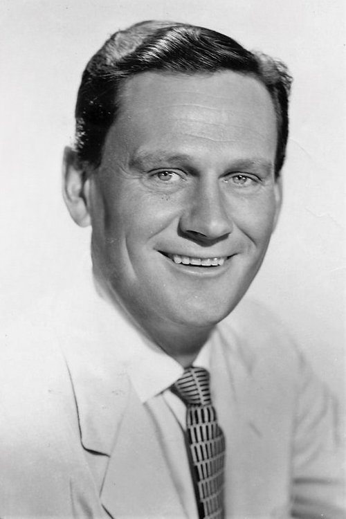
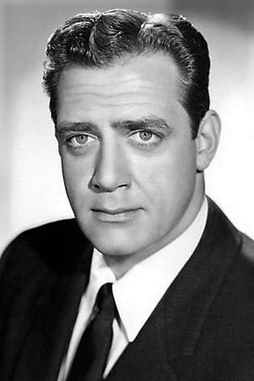
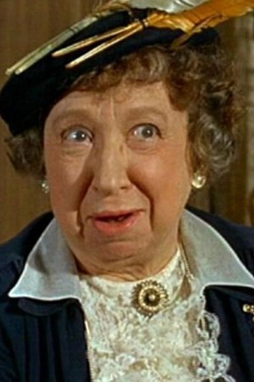



<nav class="films">
  

    <a href="../la-strada-1954"><i class="fa-solid fa-chevron-left fa-xs"></i> Previous</a>
  

  

    <a class="simple" href="../">3 / 100</a>
  

  

    <a href="../breathless-1960">Next <i class="fa-solid fa-chevron-right fa-xs"></i></a>
  

  

    
      Previous film:
      La Strada
    
    
      Next film:
      Breathless
    
  

</nav>

<article class="film slug-rear-window-1954">
  

    
    
  

  <h1>{{ film.title }} ({{ film | filmYear }})</h1>

  

    Language: {{ film.language }}.
    
  

  

    Directed by <strong>{{ film | directors }}</strong>
  

  
    <blockquote>
      {{ films.reviews[slug] | safe }} <em>—&nbsp;<a href="/bill">Bill</a></em>
    </blockquote>
  

  <section class="cast-grid">
  

    

  
  

    James Stewart
    L.B. 'Jeff' Jefferies
  

    

  
  

    Grace Kelly
    Lisa Fremont
  

    

  
  

    Wendell Corey
    Det. Lt. Thomas J. Doyle
  

    

  
  

    Thelma Ritter
    Stella
  

    

  
  

    Raymond Burr
    Lars Thorwald
  

    

  
  

    Judith Evelyn
    Miss Lonelyhearts
  

    

  
  

    Ross Bagdasarian
    Songwriter
  

    

  
  

    Georgine Darcy
    Miss Torso
  

    

  
  

    Sara Berner
    Woman on Fire Escape
  

    

  
  

    Frank Cady
    Man on Fire Escape
  

    

  
  

    Jesslyn Fax
    Miss Hearing Aid
  

    

  
<i class="fa-solid fa-user"></i>

  

    Rand Harper
    Newlywed
  

  

</section>

  <section class="film-detail">
    

      

        

          <i class="fa-solid fa-masks-theater"></i>
          Cast
        

        <ul>
          
            <li>
              {{ cast.name }} as <em>{{ cast.character }}</em>
            </li>
          
        </ul>
      

      

        

          <i class="fa-solid fa-clapperboard"></i>
          Crew
        

        <ul>
          
            <li>
              {{ crew.name }} &mdash; <em>{{ crew.job }}</em>
            </li>
          
        </ul>
      

    

  </section>

  <section class="related-films">
  <h2>Related films</h2>
  <ul>
    <li><a href="../its-a-wonderful-life-1946">It's a Wonderful Life</a> because of James Stewart</li>
<li><a href="../parasite-2019">Parasite</a> because of Alfred Hitchcock</li>
  </ul>
</section>

</article>
