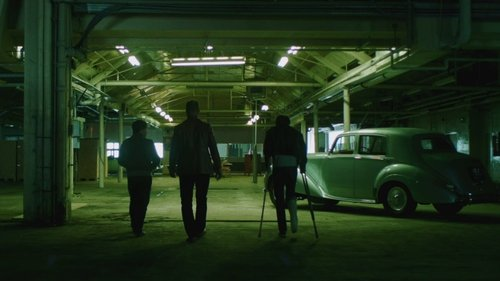



<nav class="films">
  <a class="prev" href="../first-cow-2020">Previous</a>
  <a href="../">Film list</a>
  <a class="next" href="../eternal-beauty-2020">Next</a>
</nav>

76 / 100

<article class="film">
  

    
    
  

  <h1>Schemers ({{ film | filmYear }})</h1>

  

    Directed by <strong>{{ film | directors }}</strong>
  

  <h2>
    Cast
  </h2>
  <ul>
            <li><strong>Conor Berry</strong> as <em>Davie</em></li>
        <li><strong>Sean Connor</strong> as <em>Scot</em></li>
        <li><strong>Grant Robert Keelan</strong> as <em>John</em></li>
        <li><strong>Tara Lee</strong> as <em>Shona</em></li>
        <li><strong>Mingus Johnston</strong> as <em>Kenny</em></li>
        <li><strong>Richard Mason</strong> as <em>Rod Smallwood</em></li>
        <li><strong>David Izatt</strong> as <em>Malky</em></li>
        <li><strong>Shend</strong> as <em>Burton</em></li>
        <li><strong>Jim Sweeney</strong> as <em>Father Vetrianio</em></li>
        <li><strong>Alec Westwood</strong> as <em>Bernie McConnell</em></li>
        <li><strong>Liza Callinicos</strong> as <em>Wendy</em></li>
        <li><strong>Melissa De Mol</strong> as <em>Secretary</em></li>
        <li><strong>Jenni Duffy</strong> as <em>Sheena</em></li>
        <li><strong>Iain Mitchell Leslie</strong> as <em>The Bookie</em></li>
        <li><strong>Ross F. Sutherland</strong> as <em>Fizzog</em></li>
        <li><strong>Keith Warwick</strong> as <em>Andy Lothian</em></li>
        <li><strong>Kerry Browne</strong> as <em>Charlie (uncredited)</em></li>
        <li><strong>Alex Reece</strong> as <em>Manager (uncredited)</em></li>
  </ul>
</article>
<footer>
  <a href="../about">About this list</a>
</footer>
