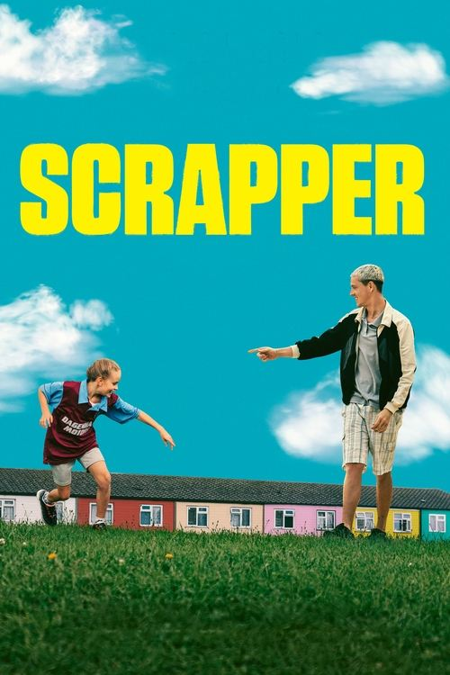

<a href="../">Back to all films</a>

<article class="film">
  <h1>Scrapper (2023)</h1>

  

    Directed by <strong>Charlotte Regan</strong>
  

  

  <h2>
    Cast
  </h2>
  <ul>
    <li><strong>Lola Campbell</strong> as <em>Georgie</em></li>
<li><strong>Harris Dickinson</strong> as <em>Jason</em></li>
<li><strong>Alin Uzun</strong> as <em>Ali</em></li>
<li><strong>Laura Aikman</strong> as <em>Kaye</em></li>
<li><strong>Ambreen Razia</strong> as <em>Zeph</em></li>
<li><strong>Asheq Akhtar</strong> as <em>Youseff</em></li>
<li><strong>Olivia Brady</strong> as <em>Vicky</em></li>
<li><strong>Sam Buchanan</strong> as <em>Henry</em></li>
<li><strong>Matt Brewer</strong> as <em>Suited Bloke</em></li>
<li><strong>Joshua Frater-Loughlin</strong> as <em>Shopkeeper</em></li>
<li><strong>Freya Bell</strong> as <em>Layla</em></li>
<li><strong>Aylin Tezel</strong> as <em>Nina</em></li>
<li><strong>Cary Crankson</strong> as <em>Mr Buchanan</em></li>
<li><strong>Jessica Fostekew</strong> as <em>Sian</em></li>
<li><strong>Carys Bowkett</strong> as <em>Emily</em></li>
<li><strong>Ayokunle Oyesanwo</strong> as <em>Kunle</em></li>
<li><strong>Ayobami Oyesanwo</strong> as <em>Bami</em></li>
<li><strong>Ayooluwa Oyesanwo</strong> as <em>Luwa</em></li>
<li><strong>Aysa Uzun</strong> as <em>Ali's Little Sister #1</em></li>
<li><strong>Ezel Uzun</strong> as <em>Ali's Little Sister #2</em></li>
<li><strong>Tejal Rathore</strong> as <em>Girl in the Street</em></li>
<li><strong>Daniel Burt</strong> as <em>Young Jason</em></li>
<li><strong>Harry Sydes</strong> as <em>Kid 1</em></li>
<li><strong>Mitchell Brown</strong> as <em>Kid 2</em></li>
<li><strong>Ramison Bernardo</strong> as <em>Kid 3</em></li>
<li><strong>Sue King-Spear</strong> as <em>Lady in Lilac (uncredited)</em></li>
  </ul>
</article>
