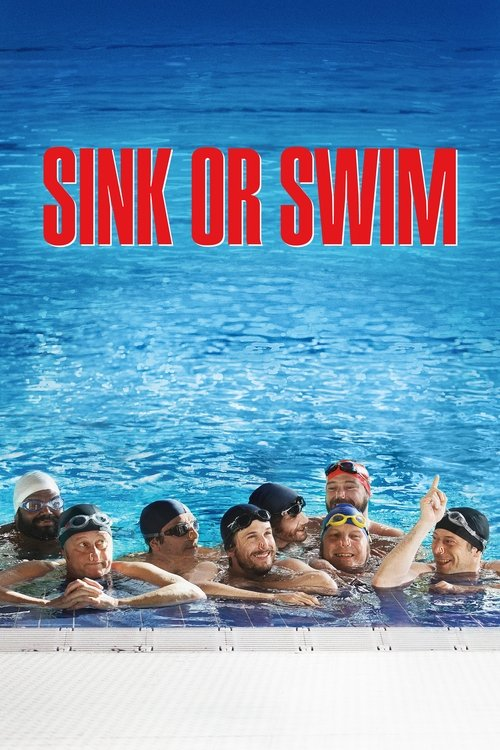
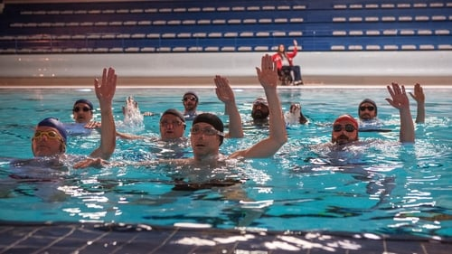



<nav class="films">
  <a class="prev" href="../woman-at-war-2018">Previous</a>
  <a href="../">Film list</a>
  <a class="next" href="../parasite-2019">Next</a>
</nav>

72 / 100

<article class="film">
  

    
    
  

  <h1>Sink or Swim ({{ film | filmYear }})</h1>

  
Also known as <strong>Le Grand Bain</strong>

  

    Directed by <strong>{{ film | directors }}</strong>
  

  <h2>
    Cast
  </h2>
  <ul>
            <li><strong>Mathieu Amalric</strong> as <em>Bertrand</em></li>
        <li><strong>Guillaume Canet</strong> as <em>Laurent</em></li>
        <li><strong>Benoît Poelvoorde</strong> as <em>Marcus</em></li>
        <li><strong>Jean-Hugues Anglade</strong> as <em>Simon</em></li>
        <li><strong>Virginie Efira</strong> as <em>Delphine</em></li>
        <li><strong>Leïla Bekhti</strong> as <em>Amanda</em></li>
        <li><strong>Marina Foïs</strong> as <em>Claire</em></li>
        <li><strong>Philippe Katerine</strong> as <em>Thierry</em></li>
        <li><strong>Félix Moati</strong> as <em>John</em></li>
        <li><strong>Alban Ivanov</strong> as <em>Basile</em></li>
        <li><strong>Balasingham Thamilchelvan</strong> as <em>Avanish</em></li>
        <li><strong>Jonathan Zaccaï</strong> as <em>Thibault</em></li>
        <li><strong>Mélanie Doutey</strong> as <em>Clem</em></li>
        <li><strong>Noée Abita</strong> as <em>Lola</em></li>
        <li><strong>Claire Nadeau</strong> as <em>Laurent's mother</em></li>
        <li><strong>Caroline Grant</strong> as <em>Bertrand's daughter</em></li>
        <li><strong>Guillaume Cloud-Roussel</strong> as <em>Son of Bertrand</em></li>
        <li><strong>Mathieu Torloting</strong> as <em>Romain, son of Laurent</em></li>
        <li><strong>Arno Feffer</strong> as <em>Roadie, Simon's manager</em></li>
        <li><strong>Erika Sainte</strong> as <em>Diane, Laurent's wife</em></li>
        <li><strong>Vincent Darmuzey</strong> as <em>Nicolas, employee of Piscin'Love</em></li>
        <li><strong>Virgile Bramly</strong> as <em>Delphine's companion</em></li>
        <li><strong>Karim Adda</strong> as <em>Host of the Gala</em></li>
        <li><strong>Élodie Hesme</strong> as <em>Marcus's lover</em></li>
        <li><strong>Xavier Alcan</strong> as <em>Speech therapist</em></li>
        <li><strong>Stéphane Rouabah</strong> as <em>Supermarket security guard</em></li>
        <li><strong>Sami Zitouni</strong> as <em>Supermarket security guard</em></li>
        <li><strong>Vincent Varinier</strong> as <em>Municipal policeman</em></li>
        <li><strong>Pierre Pirol</strong> as <em>Benoit Jacquot</em></li>
        <li><strong>Xavier Claudon</strong> as <em>Refectory employee</em></li>
        <li><strong>Ibrahim Koma</strong> as <em>Swimming pool technician</em></li>
        <li><strong>Claire Conty</strong> as <em>Bertrand's neighbor</em></li>
        <li><strong>Sam Lellouche</strong> as <em>Jean-Luc's colleague</em></li>
        <li><strong>Édouard Rerolle</strong> as <em>Boyfriend of Bertrand's son</em></li>
        <li><strong>Charlotte Levy</strong> as <em>Girl with glasses</em></li>
        <li><strong>Maximilien Poullein</strong> as <em>Championship announcer</em></li>
        <li><strong>Fiorella Campanella</strong> as <em>Girl who says "I never loved you"</em></li>
        <li><strong>Alexandre Courtes</strong> as <em>Husband of the couple of friends</em></li>
        <li><strong>Emma Philippe</strong> as <em>Wife of the couple of friends</em></li>
        <li><strong>Hervé Colombel</strong> as <em>Alcoholic Anonymous</em></li>
        <li><strong>Roselyne Geslot</strong> as <em>Alcoholic Anonymous</em></li>
        <li><strong>John Fay</strong> as <em>Swimmer</em></li>
        <li><strong>Jean-Philippe Franqueville</strong> as <em>Swimmer</em></li>
        <li><strong>Tom Godefroy</strong> as <em>Swimmer</em></li>
        <li><strong>Sam Chemoul</strong> as <em>Bertrand's son's friend (uncredited)</em></li>
        <li><strong>Angélique Meyns</strong> as <em>Hostess (uncredited)</em></li>
        <li><strong>Michèle Clément</strong> as <em>Cocktail Hostess (uncredited)</em></li>
        <li><strong>Audrey Quoturi</strong> as <em>Championship Hostess (uncredited)</em></li>
        <li><strong>Anderz Eide</strong> as <em>Norwegian policeman (uncredited)</em></li>
        <li><strong>Christian Gazio</strong> as <em>Couch client (uncredited)</em></li>
        <li><strong>Sébastien Lozach</strong> as <em>Bulgarian swimmer (uncredited)</em></li>
        <li><strong>Bastien Pujol</strong> as <em>Italian swimmer (uncredited)</em></li>
        <li><strong>Ian McCamy</strong> as <em>English coach (uncredited)</em></li>
        <li><strong>Aude Thomas</strong> as <em>Swimming pool employee (uncredited)</em></li>
        <li><strong>Cidney Khosta</strong> as <em>Bulgarian supporter (uncredited)</em></li>
        <li><strong>Floriane Karger</strong> as <em>(uncredited)</em></li>
  </ul>
</article>
<footer>
  <a href="../about">About this list</a>
</footer>
