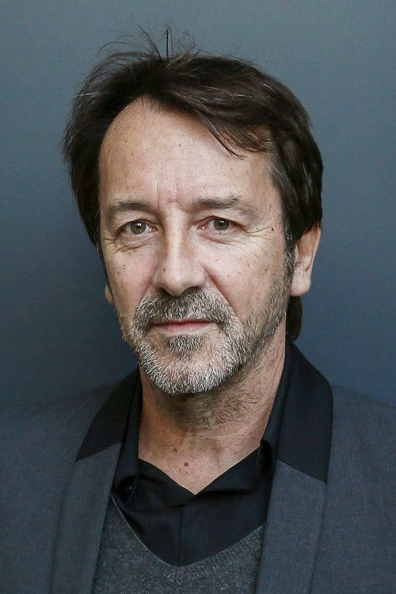
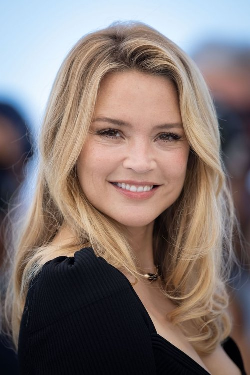
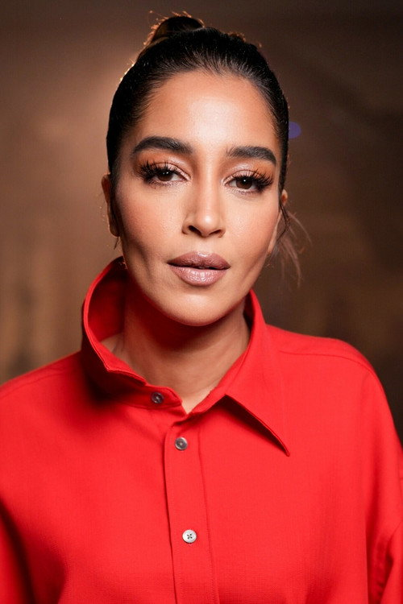
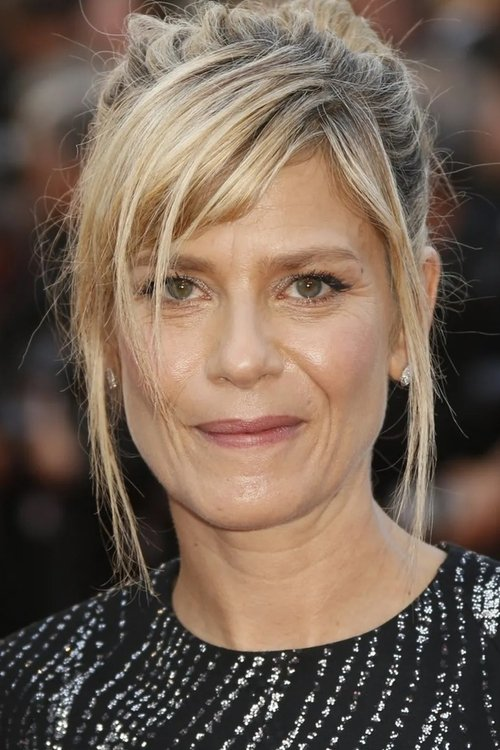
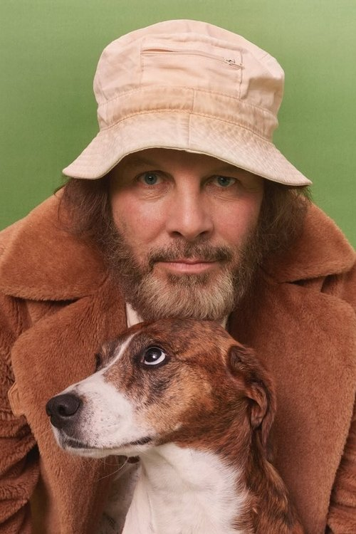
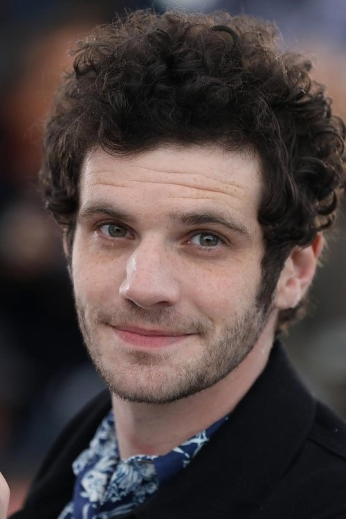
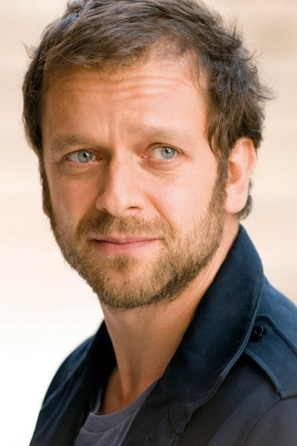



<nav class="films">
  

    <a href="../roma-2018"><i class="fa-solid fa-chevron-left fa-xs"></i> Previous</a>
  

  

    <a class="simple" href="../">65 / 100</a>
  

  

    <a href="../woman-at-war-2018">Next <i class="fa-solid fa-chevron-right fa-xs"></i></a>
  

  

    
      Previous film:
      Roma
    
    
      Next film:
      Woman at War
    
  

</nav>

<article class="film slug-sink-or-swim-2018">
  

    
    
  

  <h1>{{ film.title }} ({{ film | filmYear }})</h1>

  

    Language: {{ film.language }}.
    Also known as Le Grand Bain.
  

  

    Directed by <strong>{{ film | directors }}</strong>
  

  
    <blockquote>
      {{ films.reviews[slug] | safe }} <em>—&nbsp;<a href="/bill">Bill</a></em>
    </blockquote>
  

  <section class="cast-grid">
  

    

  
  

    Mathieu Amalric
    Bertrand
  

    

  
  

    Guillaume Canet
    Laurent
  

    

  
  

    Benoît Poelvoorde
    Marcus
  

    

  
  

    Jean-Hugues Anglade
    Simon
  

    

  
  

    Virginie Efira
    Delphine
  

    

  
  

    Leïla Bekhti
    Amanda
  

    

  
  

    Marina Foïs
    Claire
  

    

  
  

    Philippe Katerine
    Thierry
  

    

  
  

    Félix Moati
    John
  

    

  
  

    Alban Ivanov
    Basile
  

    

  
  

    Balasingham Thamilchelvan
    Avanish
  

    

  
  

    Jonathan Zaccaï
    Thibault
  

  

</section>

  <section class="film-detail">
    

      

        

          <i class="fa-solid fa-masks-theater"></i>
          Cast
        

        <ul>
          
            <li>
              {{ cast.name }} as <em>{{ cast.character }}</em>
            </li>
          
        </ul>
      

      

        

          <i class="fa-solid fa-clapperboard"></i>
          Crew
        

        <ul>
          
            <li>
              {{ crew.name }} &mdash; <em>{{ crew.job }}</em>
            </li>
          
        </ul>
      

    

  </section>

  <section class="related-films">
  <h2>Related films</h2>
  <ul>
    <li><a href="../lon-the-professional-1994">Léon: The Professional</a> because of Jean-Hugues Anglade</li>
<li><a href="../the-grand-budapest-hotel-2014">The Grand Budapest Hotel</a> because of Mathieu Amalric</li>
<li><a href="../the-french-dispatch-2021">The French Dispatch</a> because of Mathieu Amalric and Félix Moati</li>
<li><a href="../cest-la-vie-2017">C'est la vie!</a> because of Gilles Lellouche and Alban Ivanov</li>
  </ul>
</section>

</article>
