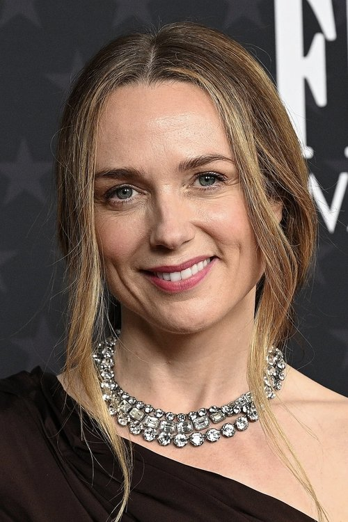
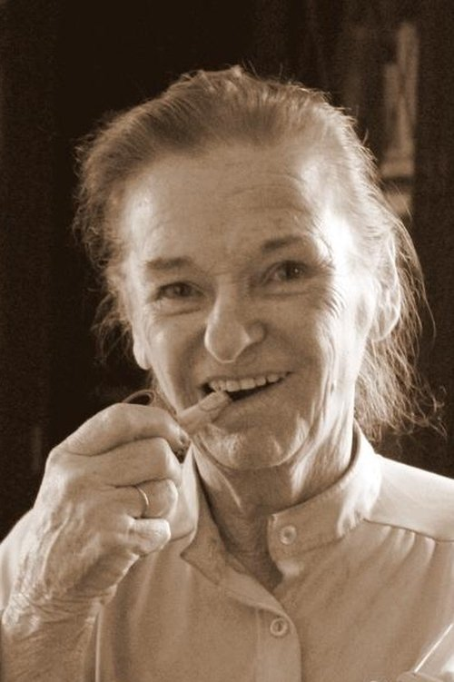
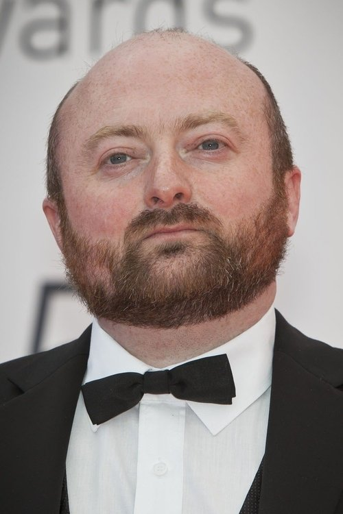



<nav class="films">
  

    <a href="../one-fine-morning-2022"><i class="fa-solid fa-chevron-left fa-xs"></i> Previous</a>
  

  

    <a class="simple" href="../">91 / 100</a>
  

  

    <a href="../the-fabelmans-2022">Next <i class="fa-solid fa-chevron-right fa-xs"></i></a>
  

  

    
      Previous film:
      One Fine Morning
    
    
      Next film:
      The Fabelmans
    
  

</nav>

<article class="film slug-the-banshees-of-inisherin-2022">
  

    
    
  

  <h1>{{ film.title }} ({{ film | filmYear }})</h1>

  

    Language: {{ film.language }}.
    
  

  

    Directed by <strong>{{ film | directors }}</strong>
  

  
    <blockquote>
      {{ films.reviews[slug] | safe }} <em>—&nbsp;<a href="/bill">Bill</a></em>
    </blockquote>
  

  <section class="cast-grid">
  

    

  
  

    Colin Farrell
    Pádraic Súilleabháin
  

    

  
  

    Brendan Gleeson
    Colm Doherty
  

    

  
  

    Kerry Condon
    Siobhán Súilleabháin
  

    

  
  

    Barry Keoghan
    Dominic Kearney
  

    

  
  

    Gary Lydon
    Peadar Kearney
  

    

  
  

    Pat Shortt
    Jonjo Devine
  

    

  
  

    Sheila Flitton
    Mrs. McCormick
  

    

  
  

    Bríd Ní Neachtain
    Mrs. O'Riordan
  

    

  
  

    Jon Kenny
    Gerry
  

    

  
  

    Aaron Monaghan
    Declan
  

    

  
  

    David Pearse
    Priest
  

    

  
<i class="fa-solid fa-user"></i>

  

    John Carty
    Older Musician 1
  

  

</section>

  <section class="film-detail">
    

      

        

          <i class="fa-solid fa-masks-theater"></i>
          Cast
        

        <ul>
          
            <li>
              {{ cast.name }} as <em>{{ cast.character }}</em>
            </li>
          
        </ul>
      

      

        

          <i class="fa-solid fa-clapperboard"></i>
          Crew
        

        <ul>
          
            <li>
              {{ crew.name }} &mdash; <em>{{ crew.job }}</em>
            </li>
          
        </ul>
      

    

  </section>

  <section class="related-films">
  <h2>Related films</h2>
  <ul>
    <li><a href="../phone-booth-2003">Phone Booth</a> because of Colin Farrell</li>
<li><a href="../in-bruges-2008">In Bruges</a> because of Colin Farrell, Brendan Gleeson and Martin McDonagh</li>
<li><a href="../the-tragedy-of-macbeth-2021">The Tragedy of Macbeth</a> because of Brendan Gleeson</li>
  </ul>
</section>

</article>
