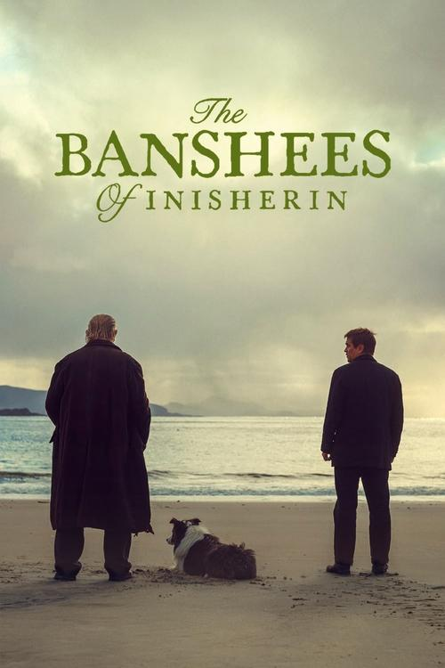
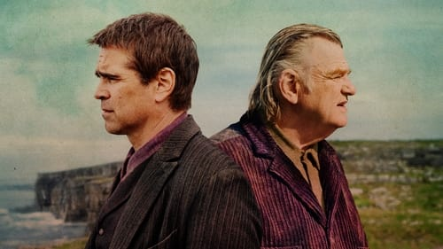

<nav class="films">
  <a class="prev" href="../one-fine-morning">Previous</a>
  <a href="../">Film list</a>
  <a class="next" href="../the-fabelmans">Next</a>
</nav>

94 / 100

<article class="film">
  
  

  <h1>The Banshees of Inisherin (2022)</h1>

  

    Directed by <strong>Martin McDonagh</strong>
  

  <h2>
    Cast
  </h2>
  <ul>
    <li><strong>Colin Farrell</strong> as <em>Pádraic Súilleabháin</em></li>
<li><strong>Brendan Gleeson</strong> as <em>Colm Doherty</em></li>
<li><strong>Kerry Condon</strong> as <em>Siobhán Súilleabháin</em></li>
<li><strong>Barry Keoghan</strong> as <em>Dominic Kearney</em></li>
<li><strong>Gary Lydon</strong> as <em>Peadar Kearney</em></li>
<li><strong>Pat Shortt</strong> as <em>Jonjo Devine</em></li>
<li><strong>Sheila Flitton</strong> as <em>Mrs. McCormick</em></li>
<li><strong>Bríd Ní Neachtain</strong> as <em>Mrs. O'Riordan</em></li>
<li><strong>Jon Kenny</strong> as <em>Gerry</em></li>
<li><strong>Aaron Monaghan</strong> as <em>Declan</em></li>
<li><strong>David Pearse</strong> as <em>Priest</em></li>
<li><strong>John Carty</strong> as <em>Older Musician 1</em></li>
<li><strong>Oliver Farrelly</strong> as <em>Older Musician 2</em></li>
<li><strong>Lasairfhíona Ní Chonaola</strong> as <em>Female Singer</em></li>
<li><strong>James Carty</strong> as <em>Student Musician 1</em></li>
<li><strong>Conor Connolly</strong> as <em>Student Musician 2</em></li>
<li><strong>Ryan Owens</strong> as <em>Student Musician 3</em></li>
<li><strong>Ryan Owen</strong> as <em>Student Musician 3</em></li>
  </ul>
</article>
<footer>
  <a href="../about">About this list</a>
</footer>
