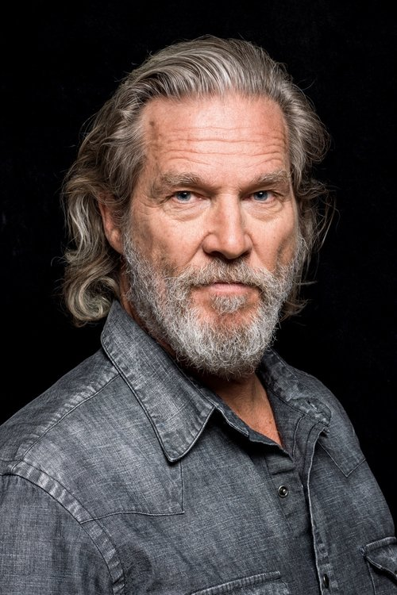
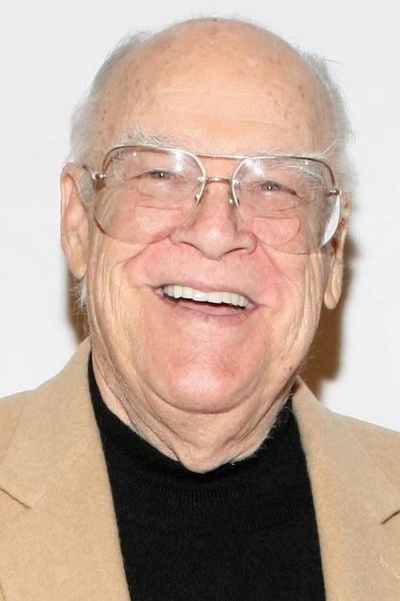
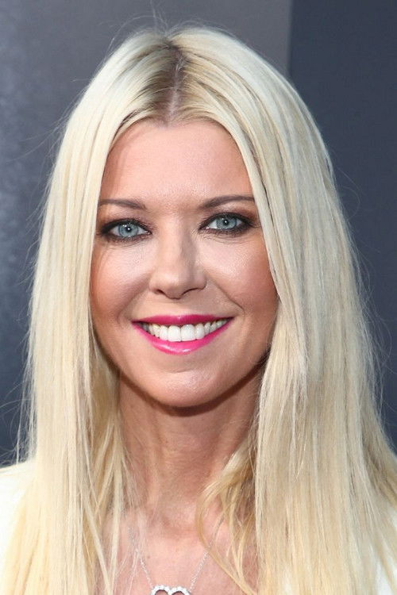
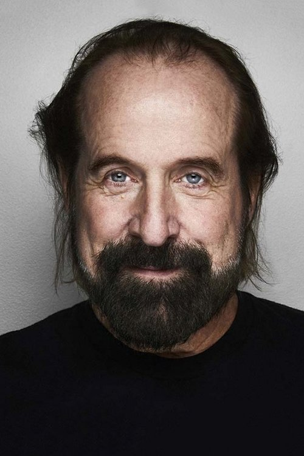



<nav class="films">
  

    <a href="../good-will-hunting-1997"><i class="fa-solid fa-chevron-left fa-xs"></i> Previous</a>
  

  

    <a class="simple" href="../">31 / 100</a>
  

  

    <a href="../fight-club-1999">Next <i class="fa-solid fa-chevron-right fa-xs"></i></a>
  

  

    
      Previous film:
      Good Will Hunting
    
    
      Next film:
      Fight Club
    
  

</nav>

<article class="film slug-the-big-lebowski-1998">
  

    
    
  

  <h1>{{ film.title }} ({{ film | filmYear }})</h1>

  

    Language: {{ film.language }}.
    
  

  

    Directed by <strong>{{ film | directors }}</strong>
  

  
    <blockquote>
      {{ films.reviews[slug] | safe }} <em>—&nbsp;<a href="/bill">Bill</a></em>
    </blockquote>
  

  <section class="cast-grid">
  

    

  
  

    Jeff Bridges
    The Dude
  

    

  
  

    John Goodman
    Walter Sobchak
  

    

  
  

    Julianne Moore
    Maude Lebowski
  

    

  
  

    Steve Buscemi
    Donny
  

    

  
  

    David Huddleston
    The Big Lebowski
  

    

  
  

    Philip Seymour Hoffman
    Brandt
  

    

  
  

    Tara Reid
    Bunny Lebowski
  

    

  
  

    Philip Moon
    Treehorn Thug
  

    

  
  

    Mark Pellegrino
    Treehorn Thug
  

    

  
  

    Peter Stormare
    Nihilist
  

    

  
  

    Flea
    Nihilist
  

    

  
  

    Torsten Voges
    Nihilist
  

  

</section>

  <section class="film-detail">
    

      

        

          <i class="fa-solid fa-masks-theater"></i>
          Cast
        

        <ul>
          
            <li>
              {{ cast.name }} as <em>{{ cast.character }}</em>
            </li>
          
        </ul>
      

      

        

          <i class="fa-solid fa-clapperboard"></i>
          Crew
        

        <ul>
          
            <li>
              {{ crew.name }} &mdash; <em>{{ crew.job }}</em>
            </li>
          
        </ul>
      

    

  </section>

  <section class="related-films">
  <h2>Related films</h2>
  <ul>
    <li><a href="../fargo-1996">Fargo</a> because of Steve Buscemi, Peter Stormare, Warren Keith and Joel Coen</li>
<li><a href="../nomadland-2021">Nomadland</a> because of Warren Keith</li>
<li><a href="../no-country-for-old-men-2007">No Country for Old Men</a> and <a href="../the-tragedy-of-macbeth-2021">The Tragedy of Macbeth</a> because of Joel Coen</li>
<li><a href="../magnolia-1999">Magnolia</a> because of Julianne Moore, Philip Seymour Hoffman and Aimee Mann</li>
<li><a href="../the-talented-mr-ripley-1999">The Talented Mr. Ripley</a> because of Philip Seymour Hoffman</li>
<li><a href="../eternal-beauty-2020">Eternal Beauty</a> because of David Thewlis</li>
  </ul>
</section>

</article>
