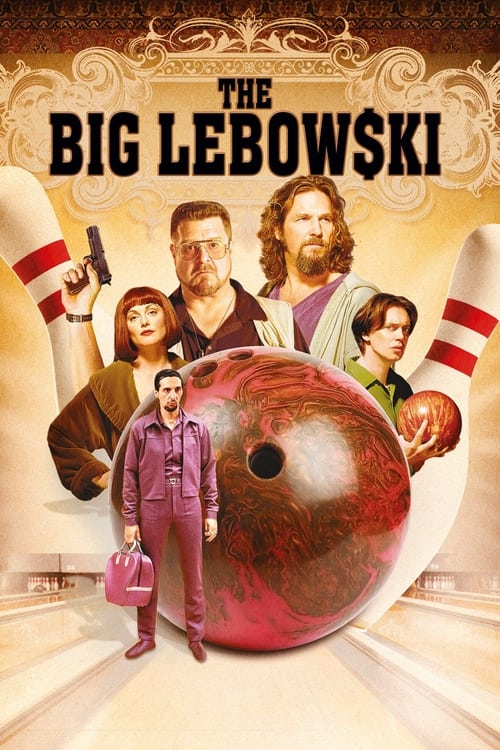

<nav class="films">
  <a class="prev" href="../good-will-hunting">Previous</a>
  <a href="../">Film list</a>
  <a class="next" href="../ghost-dog-the-way-of-the-samurai">Next</a>
</nav>

38 / 100

<article class="film">
  <h1>The Big Lebowski (1998)</h1>

  

    Directed by <strong>Joel Coen</strong>
  

  

  <h2>
    Cast
  </h2>
  <ul>
    <li><strong>Jeff Bridges</strong> as <em>The Dude</em></li>
<li><strong>John Goodman</strong> as <em>Walter Sobchak</em></li>
<li><strong>Julianne Moore</strong> as <em>Maude Lebowski</em></li>
<li><strong>Steve Buscemi</strong> as <em>Donny</em></li>
<li><strong>David Huddleston</strong> as <em>The Big Lebowski</em></li>
<li><strong>Philip Seymour Hoffman</strong> as <em>Brandt</em></li>
<li><strong>Tara Reid</strong> as <em>Bunny Lebowski</em></li>
<li><strong>Philip Moon</strong> as <em>Treehorn Thug</em></li>
<li><strong>Mark Pellegrino</strong> as <em>Treehorn Thug</em></li>
<li><strong>Peter Stormare</strong> as <em>Nihilist</em></li>
<li><strong>Flea</strong> as <em>Nihilist</em></li>
<li><strong>Torsten Voges</strong> as <em>Nihilist</em></li>
<li><strong>Jimmie Dale Gilmore</strong> as <em>Smokey</em></li>
<li><strong>Jack Kehler</strong> as <em>Dude's Landlord</em></li>
<li><strong>John Turturro</strong> as <em>Jesus Quintana</em></li>
<li><strong>James G. Hoosier</strong> as <em>Quintana's Partner</em></li>
<li><strong>Carlos Leon</strong> as <em>Maude's Thug</em></li>
<li><strong>Terrence Burton</strong> as <em>Maude's Thug</em></li>
<li><strong>Richard Gant</strong> as <em>Older Cop</em></li>
<li><strong>Christian Clemenson</strong> as <em>Younger Cop</em></li>
<li><strong>Dom Irrera</strong> as <em>Tony the Chauffeur</em></li>
<li><strong>Gérard L'Heureux</strong> as <em>Lebowski's Chauffeur</em></li>
<li><strong>David Thewlis</strong> as <em>Knox Harrington</em></li>
<li><strong>Lu Elrod</strong> as <em>Coffee Shop Waitress</em></li>
<li><strong>Mike Gomez</strong> as <em>Auto Circus Cop</em></li>
<li><strong>Peter Siragusa</strong> as <em>Gary the Bartender</em></li>
<li><strong>Sam Elliott</strong> as <em>The Stranger</em></li>
<li><strong>Marshall Manesh</strong> as <em>Doctor</em></li>
<li><strong>Harry Bugin</strong> as <em>Arthur Digby Sellers</em></li>
<li><strong>Jesse Flanagan</strong> as <em>Little Larry Sellers</em></li>
<li><strong>Irene Olga López</strong> as <em>Pilar</em></li>
<li><strong>Luis Colina</strong> as <em>Corvette Owner</em></li>
<li><strong>Ben Gazzara</strong> as <em>Jackie Treehorn</em></li>
<li><strong>Leon Russom</strong> as <em>Malibu Police Chief</em></li>
<li><strong>Ajgie Kirkland</strong> as <em>Cab Driver</em></li>
<li><strong>Jon Polito</strong> as <em>Private Snoop</em></li>
<li><strong>Aimee Mann</strong> as <em>Nihilist Woman</em></li>
<li><strong>Jerry Haleva</strong> as <em>Saddam</em></li>
<li><strong>Jennifer Lamb</strong> as <em>Pancake Waitress</em></li>
<li><strong>Warren Keith</strong> as <em>Funeral Director</em></li>
<li><strong>Wendy Braun</strong> as <em>Chorine Dancer (uncredited)</em></li>
<li><strong>Asia Carrera</strong> as <em>Sherry in 'Logjammin' (uncredited)</em></li>
<li><strong>Kiva Dawson</strong> as <em>Dancer (uncredited)</em></li>
  </ul>
</article>
<footer>
  <a href="../about">About this list</a>
</footer>
