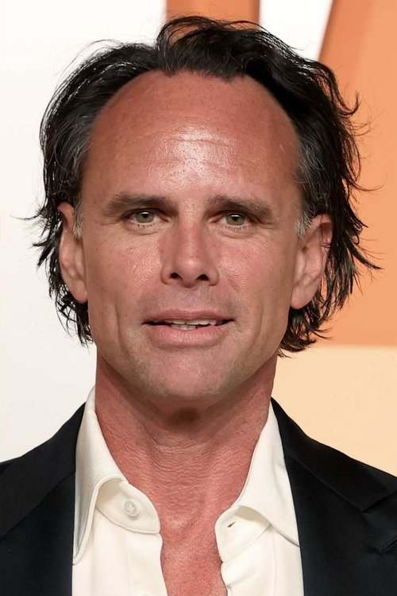



<nav class="films">
  

    <a href="../man-on-the-train-2002"><i class="fa-solid fa-chevron-left fa-xs"></i> Previous</a>
  

  

    <a class="simple" href="../">42 / 100</a>
  

  

    <a href="../phone-booth-2003">Next <i class="fa-solid fa-chevron-right fa-xs"></i></a>
  

  

    
      Previous film:
      Man on the Train
    
    
      Next film:
      Phone Booth
    
  

</nav>

<article class="film slug-the-bourne-identity-2002">
  

    
    
  

  <h1>{{ film.title }} ({{ film | filmYear }})</h1>

  

    Language: {{ film.language }}.
    
  

  

    Directed by <strong>{{ film | directors }}</strong>
  

  
    <blockquote>
      {{ films.reviews[slug] | safe }} <em>—&nbsp;<a href="/bill">Bill</a></em>
    </blockquote>
  

  <section class="cast-grid">
  

    

  
  

    Matt Damon
    Jason Bourne
  

    

  
  

    Franka Potente
    Marie Helena Kreutz
  

    

  
  

    Chris Cooper
    Alexander Conklin
  

    

  
  

    Clive Owen
    The Professor
  

    

  
  

    Brian Cox
    Ward Abbott
  

    

  
  

    Adewale Akinnuoye-Agbaje
    Nykwana Wombosi
  

    

  
  

    Gabriel Mann
    Danny Zorn
  

    

  
  

    Julia Stiles
    Nicky Parsons
  

    

  
  

    Walton Goggins
    Research Tech
  

    

  
  

    Josh Hamilton
    Research Tech
  

    

  
  

    Orso Maria Guerrini
    Giancarlo
  

    

  
  

    Tim Dutton
    Eamon
  

  

</section>

  <section class="film-detail">
    

      

        

          <i class="fa-solid fa-masks-theater"></i>
          Cast
        

        <ul>
          
            <li>
              {{ cast.name }} as <em>{{ cast.character }}</em>
            </li>
          
        </ul>
      

      

        

          <i class="fa-solid fa-clapperboard"></i>
          Crew
        

        <ul>
          
            <li>
              {{ crew.name }} &mdash; <em>{{ crew.job }}</em>
            </li>
          
        </ul>
      

    

  </section>

  <section class="related-films">
  <h2>Related films</h2>
  <ul>
    <li><a href="../good-will-hunting-1997">Good Will Hunting</a> and <a href="../the-talented-mr-ripley-1999">The Talented Mr. Ripley</a> because of Matt Damon</li>
<li><a href="../little-women-2019">Little Women</a> because of Chris Cooper</li>
<li><a href="../fantastic-mr-fox-2009">Fantastic Mr. Fox</a> because of Brian Cox</li>
<li><a href="../mr-turner-2014">Mr. Turner</a> because of Vincent Franklin</li>
  </ul>
</section>

</article>
