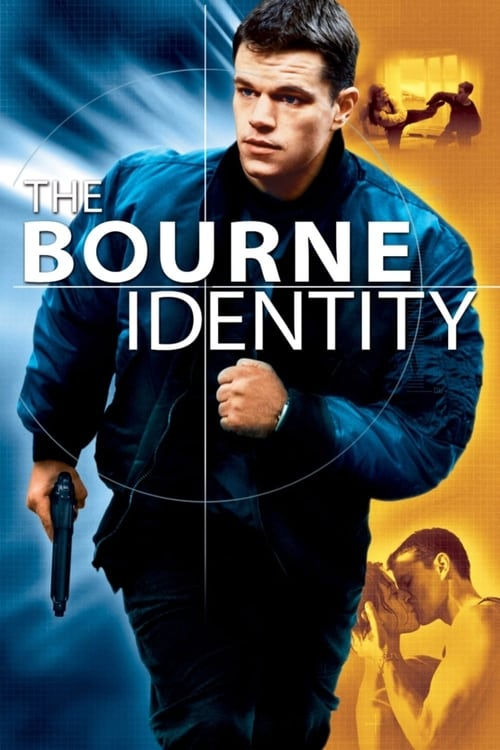

<a href="../">Back to all films</a>

<article class="film">
  <h1>The Bourne Identity (2002)</h1>

  

    Directed by <strong>Doug Liman</strong>
  

  

  <h2>
    Cast
  </h2>
  <ul>
    <li><strong>Matt Damon</strong> as <em>Jason Bourne</em></li>
<li><strong>Franka Potente</strong> as <em>Marie Helena Kreutz</em></li>
<li><strong>Chris Cooper</strong> as <em>Alexander Conklin</em></li>
<li><strong>Clive Owen</strong> as <em>The Professor</em></li>
<li><strong>Brian Cox</strong> as <em>Ward Abbott</em></li>
<li><strong>Adewale Akinnuoye-Agbaje</strong> as <em>Nykwana Wombosi</em></li>
<li><strong>Gabriel Mann</strong> as <em>Danny Zorn</em></li>
<li><strong>Julia Stiles</strong> as <em>Nicky Parsons</em></li>
<li><strong>Walton Goggins</strong> as <em>Research Tech</em></li>
<li><strong>Josh Hamilton</strong> as <em>Research Tech</em></li>
<li><strong>Orso Maria Guerrini</strong> as <em>Giancarlo</em></li>
<li><strong>Tim Dutton</strong> as <em>Eamon</em></li>
<li><strong>Denis Braccini</strong> as <em>Picot</em></li>
<li><strong>Nicky Naudé</strong> as <em>Castel</em></li>
<li><strong>David Selburg</strong> as <em>Marshall</em></li>
<li><strong>Demetri Goritsas</strong> as <em>Com Tech</em></li>
<li><strong>Russell Levy</strong> as <em>Manheim</em></li>
<li><strong>Anthony Green</strong> as <em>Security Chief</em></li>
<li><strong>Hubert Saint-Macary</strong> as <em>Morgue Boss</em></li>
<li><strong>David Bamber</strong> as <em>Consulate Clerk</em></li>
<li><strong>Gwenaël Clause</strong> as <em>Deauvage</em></li>
<li><strong>Emanuel Booz</strong> as <em>Taxi Driver</em></li>
<li><strong>Philippe Durand</strong> as <em>Morgue Attendant</em></li>
<li><strong>Vincent Franklin</strong> as <em>Rawlins</em></li>
<li><strong>Paulette Frantz</strong> as <em>Concierge</em></li>
<li><strong>Thierry René</strong> as <em>Wombosi Counselor</em></li>
<li><strong>Roger Frost</strong> as <em>Apfel</em></li>
<li><strong>David Gasman</strong> as <em>Deputy DCM</em></li>
<li><strong>Harry Gilbert</strong> as <em>Alain</em></li>
<li><strong>Delphine Lanson</strong> as <em>Alliance Secretary</em></li>
<li><strong>William Cagnard</strong> as <em>Davies</em></li>
<li><strong>Kait Tenison</strong> as <em>Bank Receptionist</em></li>
<li><strong>Joseph Beddelin</strong> as <em>Zurich Cop</em></li>
<li><strong>Rainer Werner</strong> as <em>Zurich Cop</em></li>
<li><strong>Katie Thynne</strong> as <em>Claudia</em></li>
<li><strong>Aaron Lilly</strong> as <em>Marine</em></li>
<li><strong>Ronald Benefield</strong> as <em>Marine</em></li>
<li><strong>Bradley J. Goode</strong> as <em>Marine</em></li>
<li><strong>Troy Lenhardt</strong> as <em>Marine</em></li>
<li><strong>Joshua McNew</strong> as <em>Marine</em></li>
<li><strong>Joe Montana</strong> as <em>Marine</em></li>
<li><strong>John Pawlikowski</strong> as <em>Marine</em></li>
<li><strong>Michael Rix</strong> as <em>Marine</em></li>
<li><strong>Brad Rizer</strong> as <em>Marine</em></li>
<li><strong>Andrew Webster</strong> as <em>Marine</em></li>
<li><strong>Houston Williams</strong> as <em>Marine</em></li>
<li><strong>Alain Grellier</strong> as <em>Salvi</em></li>
<li><strong>Arnaud Henriet</strong> as <em>Wombosi Bodyguard</em></li>
<li><strong>Jean-Yves Bilien</strong> as <em>Wombosi Bodyguard</em></li>
<li><strong>Danny Erskine</strong> as <em>Wombosi Bodyguard</em></li>
<li><strong>Elwin 'Chopper' David</strong> as <em>Wombosi Bodyguard</em></li>
  </ul>
</article>
