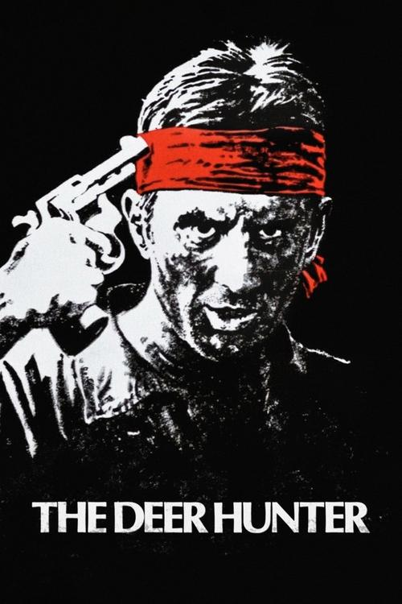
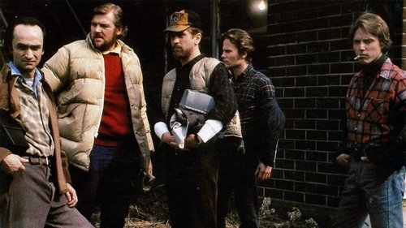

<nav class="films">
  <a class="prev" href="../the-man-who-fell-to-earth">Previous</a>
  <a href="../">Film list</a>
  <a class="next" href="../apocalypse-now">Next</a>
</nav>

20 / 100

<article class="film">
  

    
    
  

  <h1>The Deer Hunter (1978)</h1>

  

    Directed by <strong>Michael Cimino</strong>
  

  <h2>
    Cast
  </h2>
  <ul>
    <li><strong>Robert De Niro</strong> as <em>Michael Vronsky</em></li>
<li><strong>Christopher Walken</strong> as <em>Nikanor "Nick" Chevotarevich</em></li>
<li><strong>John Cazale</strong> as <em>Stan</em></li>
<li><strong>John Savage</strong> as <em>Steven Pushkov</em></li>
<li><strong>Meryl Streep</strong> as <em>Linda</em></li>
<li><strong>George Dzundza</strong> as <em>John</em></li>
<li><strong>Rutanya Alda</strong> as <em>Angela</em></li>
<li><strong>Pierre Segui</strong> as <em>Julien</em></li>
<li><strong>Amy Wright</strong> as <em>Bridesmaid</em></li>
<li><strong>Richard Kuss</strong> as <em>Linda's Father</em></li>
<li><strong>Joe Grifasi</strong> as <em>Bandleader</em></li>
<li><strong>Dennis Watlington</strong> as <em>Cab Driver</em></li>
<li><strong>Shirley Stoler</strong> as <em>Steven's Mother</em></li>
<li><strong>Chuck Aspegren</strong> as <em>Axel</em></li>
<li><strong>Mary Ann Haenel</strong> as <em>Stan's Girl</em></li>
<li><strong>Mady Kaplan</strong> as <em>Axel's Girl</em></li>
<li><strong>Paul D'Amato</strong> as <em>Sergeant</em></li>
<li><strong>Christopher Colombi Jr.</strong> as <em>Wedding Man</em></li>
<li><strong>Victoria Karnafel</strong> as <em>Sad Looking Girl</em></li>
<li><strong>Jack Scardino</strong> as <em>Cold Old Man</em></li>
<li><strong>Joe Strnad</strong> as <em>Bingo Caller</em></li>
<li><strong>Helen Tomko</strong> as <em>Helen</em></li>
<li><strong>Charlene Darrow</strong> as <em>Red Head</em></li>
<li><strong>Jane-Colette Disko</strong> as <em>Girl Checker</em></li>
<li><strong>Michael Wollet</strong> as <em>Stock Boy</em></li>
<li><strong>Robert Beard</strong> as <em>World War Veteran</em></li>
<li><strong>Joe Dzizmba</strong> as <em>World War Veteran</em></li>
<li><strong>Stephen Kopestonsky</strong> as <em>Priest</em></li>
<li><strong>John F. Buchmelter III</strong> as <em>Bar Patron</em></li>
<li><strong>Frank Devore</strong> as <em>Barman</em></li>
<li><strong>Tom Becker</strong> as <em>Doctor</em></li>
<li><strong>Lynn Kongkham</strong> as <em>Nurse</em></li>
<li><strong>Nongnuj Timruang</strong> as <em>Bar Girl</em></li>
<li><strong>Po Pao Pee</strong> as <em>Chinese Referee</em></li>
<li><strong>Dale Burroughs</strong> as <em>Embassy Guard</em></li>
<li><strong>Parris Hicks</strong> as <em>Sergeant</em></li>
<li><strong>Samui Muang-Intata</strong> as <em>Chinese Bodyguard</em></li>
<li><strong>Sapox Colisium</strong> as <em>Chinese Man</em></li>
<li><strong>Vitoon Winwitoon</strong> as <em>NVA Officer</em></li>
<li><strong>Somsak Sengvilai</strong> as <em>V.C. Referee</em></li>
<li><strong>Charan Nusvanon</strong> as <em>Chinese Boss</em></li>
<li><strong>Jiam Gongtongsmoot</strong> as <em>Chinese Man At Door</em></li>
<li><strong>Chai Peyawan</strong> as <em>South Vietnamese Prisoner</em></li>
<li><strong>Mana Hansa</strong> as <em>South Vietnamese Prisoner</em></li>
<li><strong>Sombot Jumpanoi</strong> as <em>South Vietnamese Prisoner</em></li>
<li><strong>Phip Manee</strong> as <em>Woman In Village</em></li>
<li><strong>Ding Santos</strong> as <em>V.C. Guard</em></li>
<li><strong>Krieng Chaiyapuk</strong> as <em>V.C. Guard</em></li>
<li><strong>Ot Palapoo</strong> as <em>V.C. Guard</em></li>
<li><strong>Chok Chai Mahasoke</strong> as <em>V.C. Guard</em></li>
<li><strong>Joel Thingvall</strong> as <em>Steel Worker (uncredited)</em></li>
<li><strong>Gary A. Jones</strong> as <em>Hospital Orderly (uncredited)</em></li>
  </ul>
</article>
<footer>
  <a href="../about">About this list</a>
</footer>
