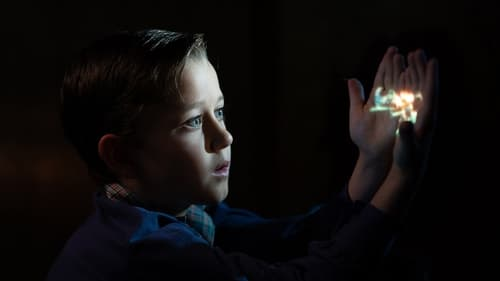



<nav class="films">
  <a class="prev" href="../the-banshees-of-inisherin-2022">Previous</a>
  <a href="../">Film list</a>
  <a class="next" href="../empire-of-light-2022">Next</a>
</nav>

95 / 100

<article class="film">
  

    
    
  

  <h1>The Fabelmans ({{ film | filmYear }})</h1>

  

    Directed by <strong>{{ film | directors }}</strong>
  

  <h2>
    Cast
  </h2>
  <ul>
            <li><strong>Michelle Williams</strong> as <em>Mitzi Fabelman</em></li>
        <li><strong>Paul Dano</strong> as <em>Burt Fabelman</em></li>
        <li><strong>Seth Rogen</strong> as <em>Benny Loewy</em></li>
        <li><strong>Gabriel LaBelle</strong> as <em>Sammy Fabelman</em></li>
        <li><strong>Mateo Zoryan Francis-DeFord</strong> as <em>Younger Sammy Fabelman</em></li>
        <li><strong>Keeley Karsten</strong> as <em>Natalie Fabelman</em></li>
        <li><strong>Alina Brace</strong> as <em>Young Natalie Fabelman</em></li>
        <li><strong>Julia Butters</strong> as <em>Reggie Fabelman</em></li>
        <li><strong>Birdie Borria</strong> as <em>Younger Reggie Fabelman</em></li>
        <li><strong>Judd Hirsch</strong> as <em>Uncle Boris</em></li>
        <li><strong>Sophia Kopera</strong> as <em>Lisa Fabelman</em></li>
        <li><strong>Jeannie Berlin</strong> as <em>Hadassah Fabelman</em></li>
        <li><strong>Robin Bartlett</strong> as <em>Tina Schildkraut</em></li>
        <li><strong>Sam Rechner</strong> as <em>Logan Hall</em></li>
        <li><strong>Oakes Fegley</strong> as <em>Chad Thomas</em></li>
        <li><strong>Chloe East</strong> as <em>Monica Sherwood</em></li>
        <li><strong>Isabelle Kusman</strong> as <em>Claudia Denning</em></li>
        <li><strong>Chandler Lovelle</strong> as <em>Renee</em></li>
        <li><strong>Gustavo Escobar</strong> as <em>Sal</em></li>
        <li><strong>Nicolas Cantu</strong> as <em>Hark</em></li>
        <li><strong>Cooper Dodson</strong> as <em>Turkey</em></li>
        <li><strong>Gabriel Bateman</strong> as <em>Roger</em></li>
        <li><strong>Stephen Matthew Smith</strong> as <em>Angelo</em></li>
        <li><strong>James Urbaniak</strong> as <em>Grand View High School Principal</em></li>
        <li><strong>Alex Quijano</strong> as <em>Grand View High School PE Coach</em></li>
        <li><strong>Kalama Epstein</strong> as <em>Barry</em></li>
        <li><strong>Connor Trinneer</strong> as <em>Phil Newhart</em></li>
        <li><strong>Lane Factor</strong> as <em>Dean</em></li>
        <li><strong>Greg Grunberg</strong> as <em>Bernie Fein</em></li>
        <li><strong>David Lynch</strong> as <em>John Ford</em></li>
        <li><strong>Jan Hoag</strong> as <em>Nona</em></li>
        <li><strong>Carlos Javier Castillo</strong> as <em>Camera Store Clerk</em></li>
        <li><strong>Ezra Buzzington</strong> as <em>Camera Store Clerk #2</em></li>
        <li><strong>Paul Chepikian</strong> as <em>Pinnacle Peak Owner</em></li>
        <li><strong>Brinly Marum</strong> as <em>Janet Benedict</em></li>
        <li><strong>Mason Bumba</strong> as <em>Stunt Soldier Boy</em></li>
        <li><strong>Mary M. Flynn</strong> as <em>Singer #1</em></li>
        <li><strong>Adriel Porter</strong> as <em>Singer #2</em></li>
        <li><strong>Tia Nalls</strong> as <em>Singer #3</em></li>
        <li><strong>Larkin Campbell</strong> as <em>Scout Father</em></li>
        <li><strong>Harper Dustin</strong> as <em>Natalie Photo Double</em></li>
        <li><strong>Crystal the Monkey</strong> as <em>Bennie the Monkey</em></li>
        <li><strong>Art Bonilla</strong> as <em>Taxi Driver (uncredited)</em></li>
        <li><strong>Meredith VanCuyk</strong> as <em>Student (uncredited)</em></li>
        <li><strong>Vera Myers</strong> as <em>Senior Classmate (uncredited)</em></li>
        <li><strong>Cody Mitchell Key</strong> as <em>Boy Scout (uncredited)</em></li>
        <li><strong>Caroline Anna-Kaye Green</strong> as <em>Senior Classmate (uncredited)</em></li>
        <li><strong>Rob Shiells</strong> as <em>Chad's Posse (uncredited)</em></li>
        <li><strong>Julyah Rose</strong> as <em>Theater Goer (uncredited)</em></li>
        <li><strong>Jonathan Moorwood</strong> as <em>Chad's Posse (uncredited)</em></li>
        <li><strong>Ari Davis</strong> as <em>Theatre Patron (uncredited)</em></li>
        <li><strong>Jared Becker</strong> as <em>Lead Guitarist (uncredited)</em></li>
        <li><strong>Kendal Evans</strong> as <em>Balloon Girl (uncredited)</em></li>
        <li><strong>Trang Vo</strong> as <em>High School Friend (uncredited)</em></li>
        <li><strong>Alejandro Fuenzalida</strong> as <em>Boy Scout (uncredited)</em></li>
        <li><strong>Orion Hunter</strong> as <em>Boy Scout (uncredited)</em></li>
        <li><strong>Samantha Rose Gomez</strong> as <em>Boy Scout Sibling (uncredited)</em></li>
        <li><strong>Taylor Stone</strong> as <em>Senior Classmate (uncredited)</em></li>
        <li><strong>Sarah Hamilton</strong> as <em>Senior Classmate (uncredited)</em></li>
        <li><strong>Paige Locke</strong> as <em>Cheerleader (uncredited)</em></li>
        <li><strong>Marissa McBride</strong> as <em>Senior Classmate (uncredited)</em></li>
        <li><strong>Malachi Mickelonis</strong> as <em>Student (uncredited)</em></li>
        <li><strong>Max David Weinberg</strong> as <em>Student (uncredited)</em></li>
        <li><strong>Cameron Hennings</strong> as <em>Student (uncredited)</em></li>
        <li><strong>Nicole Alicia Xavier</strong> as <em>Sammy’s Classmate (uncredited)</em></li>
        <li><strong>Nikolai Bazan</strong> as <em>Boy Scout (uncredited)</em></li>
        <li><strong>Nicco Caruso</strong> as <em>Prom Date (uncredited)</em></li>
        <li><strong>Colt Carville</strong> as <em>Boy Scout (uncredited)</em></li>
        <li><strong>Ure Egbuho</strong> as <em>Theater Patron (uncredited)</em></li>
        <li><strong>April Elize</strong> as <em>Classmate (uncredited)</em></li>
        <li><strong>Seth Fuentes</strong> as <em>Student (uncredited)</em></li>
        <li><strong>Andrew Goodman</strong> as <em>Pedestrian/Theater Patron (uncredited)</em></li>
        <li><strong>Phoebe Grant</strong> as <em>Student (uncredited)</em></li>
        <li><strong>Cat Heinen</strong> as <em>High School Student (uncredited)</em></li>
        <li><strong>Jake Kidwell</strong> as <em>Volleyball Player (uncredited)</em></li>
        <li><strong>Julian Lerma</strong> as <em>Boy Scout in Theater (uncredited)</em></li>
        <li><strong>Cody Miller</strong> as <em>Chad's Teammate (uncredited)</em></li>
        <li><strong>Nick W. Nicholson</strong> as <em>Teacher (uncredited)</em></li>
        <li><strong>Molly Renze</strong> as <em>Driver (uncredited)</em></li>
        <li><strong>Paige Robberstad</strong> as <em>Cheerleader (uncredited)</em></li>
        <li><strong>Brandon Keith Rogers</strong> as <em>Senior Class Member (uncredited)</em></li>
        <li><strong>Lucy Schmidt</strong> as <em>Sammy's Classmate (uncredited)</em></li>
        <li><strong>Nicole Singh</strong> as <em>Student (uncredited)</em></li>
  </ul>
</article>
<footer>
  <a href="../about">About this list</a>
</footer>
