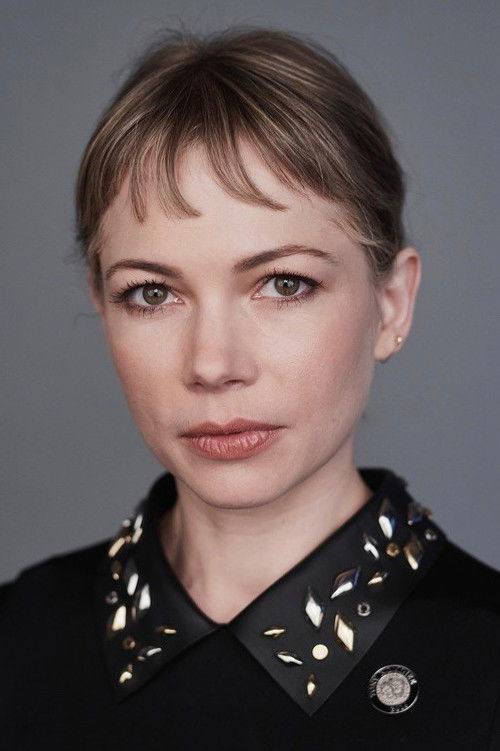
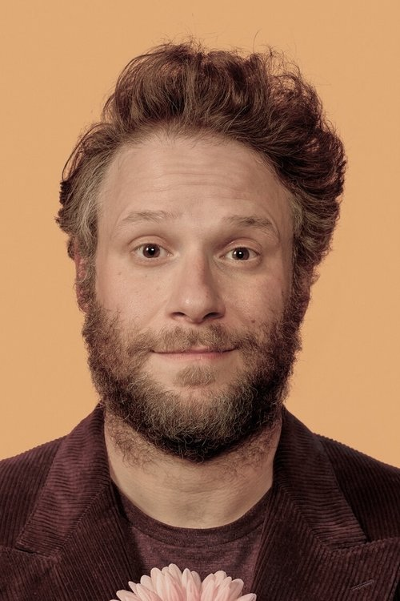
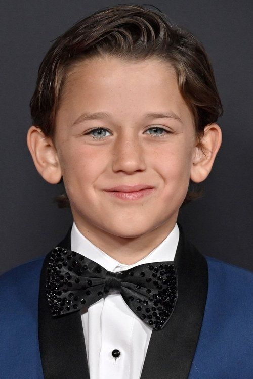
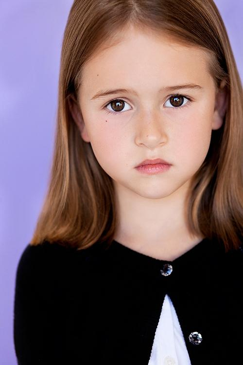
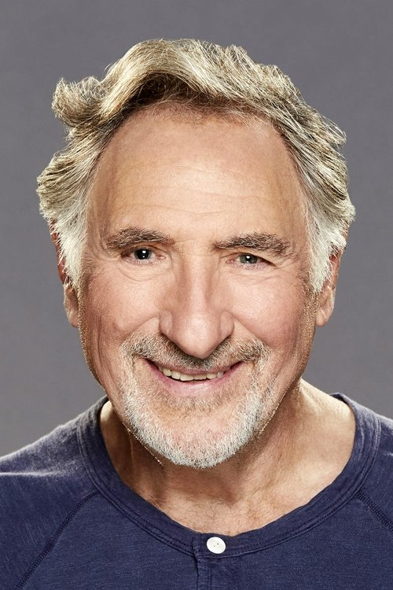
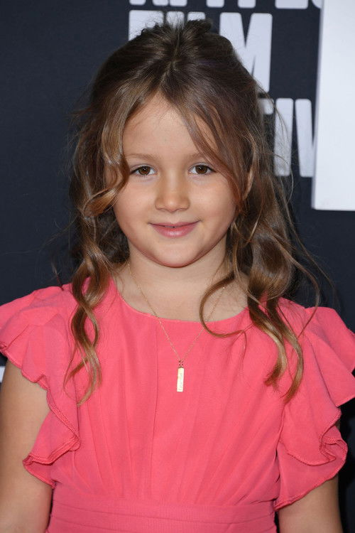



<nav class="films">
  

    <a href="../the-banshees-of-inisherin-2022"><i class="fa-solid fa-chevron-left fa-xs"></i> Previous</a>
  

  

    <a class="simple" href="../">92 / 100</a>
  

  

    <a href="../anatomy-of-a-fall-2023">Next <i class="fa-solid fa-chevron-right fa-xs"></i></a>
  

  

    
      Previous film:
      The Banshees of Inisherin
    
    
      Next film:
      Anatomy of a Fall
    
  

</nav>

<article class="film slug-the-fabelmans-2022">
  

    
    
  

  <h1>{{ film.title }} ({{ film | filmYear }})</h1>

  

    Language: {{ film.language }}.
    
  

  

    Directed by <strong>{{ film | directors }}</strong>
  

  
    <blockquote>
      {{ films.reviews[slug] | safe }} <em>—&nbsp;<a href="/bill">Bill</a></em>
    </blockquote>
  

  <section class="cast-grid">
  

    

  
  

    Michelle Williams
    Mitzi Fabelman
  

    

  
  

    Paul Dano
    Burt Fabelman
  

    

  
  

    Seth Rogen
    Benny Loewy
  

    

  
  

    Gabriel LaBelle
    Sammy Fabelman
  

    

  
  

    Mateo Zoryan Francis-DeFord
    Younger Sammy Fabelman
  

    

  
  

    Keeley Karsten
    Natalie Fabelman
  

    

  
  

    Alina Brace
    Young Natalie Fabelman
  

    

  
  

    Julia Butters
    Reggie Fabelman
  

    

  
  

    Birdie Borria
    Younger Reggie Fabelman
  

    

  
  

    Judd Hirsch
    Uncle Boris
  

    

  
  

    Sophia Kopera
    Lisa Fabelman
  

    

  
  

    Jeannie Berlin
    Hadassah Fabelman
  

  

</section>

  <section class="film-detail">
    

      

        

          <i class="fa-solid fa-masks-theater"></i>
          Cast
        

        <ul>
          
            <li>
              {{ cast.name }} as <em>{{ cast.character }}</em>
            </li>
          
        </ul>
      

      

        

          <i class="fa-solid fa-clapperboard"></i>
          Crew
        

        <ul>
          
            <li>
              {{ crew.name }} &mdash; <em>{{ crew.job }}</em>
            </li>
          
        </ul>
      

    

  </section>

  <section class="related-films">
  <h2>Related films</h2>
  <ul>
    <li><a href="../fight-club-1999">Fight Club</a> and <a href="../magnolia-1999">Magnolia</a> because of Ezra Buzzington</li>
<li><a href="../the-straight-story-1999">The Straight Story</a> and <a href="../lucky-2017">Lucky</a> because of David Lynch</li>
<li><a href="../uncut-gems-2019">Uncut Gems</a> because of Judd Hirsch</li>
<li><a href="../licorice-pizza-2021">Licorice Pizza</a> because of Isabelle Kusman and Paige Locke</li>
  </ul>
</section>

</article>
